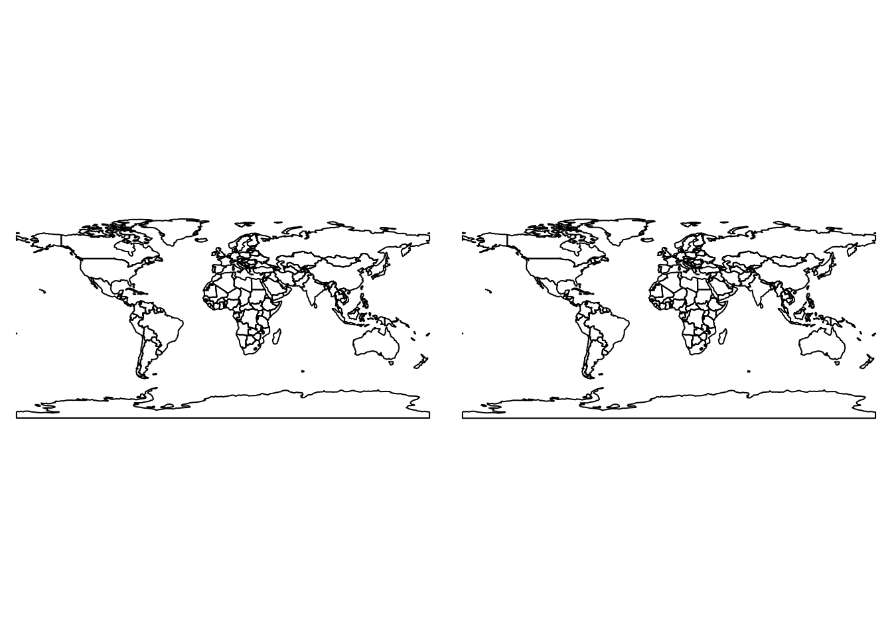
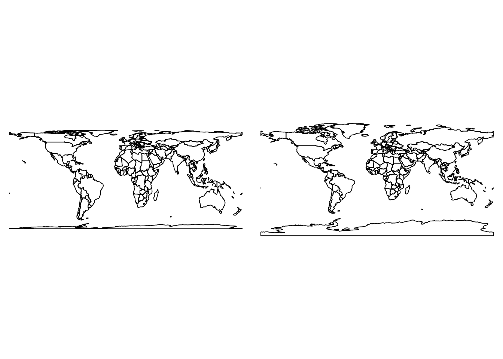

--- 
title: 'Geocomputation with R'
author:
- Robin Lovelace
- Jakub Nowosad
date: '2017-05-20'
knit: bookdown::render_book
site: bookdown::bookdown_site
documentclass: book
bibliography:
  - refs.bib
  - packages.bib
biblio-style: apalike
link-citations: yes
github-repo: Robinlovelace/geocompr
url: https\://bookdown.org/robinlovelace/geocompr/
---

# Welcome {-}

Welcome to the **geocompr** website, the online home of our forthcoming book with [CRC Press](https://www.crcpress.com/Chapman--HallCRC-The-R-Series/book-series/CRCTHERSER).

Inspired by the **bookdown** [R package](https://github.com/rstudio/bookdown) and book-hosting [website](https://github.com/rstudio/bookdown), we are developing this book in the open. We encourage contributions.

**bookdown** makes editing a book as easy as editing a wiki.
To do so, just click on the 'edit me' icon highlighted in the image below.
Which-ever chapter you are looking at, this will take you to the source [R Markdown](http://rmarkdown.rstudio.com/) file hosted on GitHub. If you have a GitHub account, you'll be able to make changes there and submit a pull request. If you do not, it's time to [sign-up](https://github.com/)! 

[](https://github.com/Robinlovelace/geocompr/edit/master/index.Rmd)

To raise an issue about the book's content (e.g. code not running) or make a feature request, check-out the [issue tracker](https://github.com/Robinlovelace/geocompr/issues).

## Prerequisites {-}

To reproduce the book, first install it as a github package:


```r
if(!require(devtools)) {
  install.packages("devtools")
}
devtools::install_github("robinlovelace/geocompr")
```

This should install all the necessary packages to run the code.
To build the book locally, clone or [download](https://github.com/Robinlovelace/geocompr/archive/master.zip) the repo and run the following line from the [project](https://github.com/Robinlovelace/geocompr/blob/master/geocompr.Rproj)'s root directory:


```r
bookdown::render_book("index.Rmd")
```

For further details see the book's GitHub page at [Robinlovelace/geocompr](https://github.com/Robinlovelace/geocompr#geocomputation-with-r).

## Acknowledgements {-}

<!-- -->


<!--chapter:end:index.Rmd-->


# Introduction {#intro}

This book exists at the intersection between Geography and R (Figure \@ref(fig:venn)).
Suggested titles were *Geography with R* and *R for GIS*, each of which has advantages.
The former conveys the message that it's not just about spatial data: 
non-spatial attribute data are inevitably interwoven with geometry data, and Geography is about more than where something is on the map.
The latter option communicates that this is a book about using R as a *Geographic Information System* (GIS), to perform spatial operations on *geographic data* [@bivand_applied_2013].
However, the term GIS has some negative connotations (see Table \@ref(tab:gdsl)) and fails to communicate one of R's greatest strengths:
its unparalleled ability to seamlessly switch between geographic and non-geographic data processing, modeling and visualization tasks.

<div class="figure" style="text-align: center">

<p class="caption">(\#fig:venn)Venn diagram of the intersection between Geography and R.</p>
</div>

The title was chosen because this book is about more than routine spatial data processing, something that is well captured by the term *geocomputation*.
What defines geocomputation as a development on previous work is the "creative and experimental use of GIS that it entails" [@longley_geocomputation:_1998].
With the right know-how, geographic data can be used in ways that would have been unthinkable to early practitioners of GIS.

Another advantage of geocomputation that it conveys the centrality of the concept of algorithms (which can be implemented in R functions) to advanced geographical research. Geocomputation is a relatively
young field^[Geocomputation
has a ~30 year history dating back to the first [conference](http://www.geocomputation.org/) on the subject in 1996 (at the University of Leeds where the concept for this book was dreamt up) which was followed by a flurry of subsequent
publications.]
but methods published under the geocomputational banner have influenced the direction of geographical research, as we will see in subsequent chapters.
Algorithms are powerful tools that can become highly complex.
However, all algorithms are composed of smaller, often modular parts.
By teaching these foundations we aim to empower you.
Creating your own solutions to geographic data problems can feel breaking free from the metaphorical 'glass ceiling' imposed by GUI-based proprietary geographic information systems (see Table \@ref(tab:gdsl) for a definition of GUI).

<!-- todo: what contributions, which will we use, where in the book? -->

While embracing recent developments in the field, we also wanted to pay respects the wider field of Geography, and its 2000 year history [@roller_eratosthenes_2010], of which geocomputation is a part.
Geography has played an important role in explaining and influencing humanity's relationship with the natural world and this book aims to be a part of the 'Geographic tradition'.
Geocomputation in this book therefore means more than simply analyzing geographic data on a computer.
It's about trying to make research which involves making geographic data more reproducible, scientific and socially beneficial.
This book is also part of the movement towards Geographic Data Science (GDS) which differs from GIS in several ways, some of which are outlined in Table \@ref(tab:gdsl).
Inspired by the emphasis of GDS research on reproducibility, this book aims teach how to do geocomputation rather than just think about it.


Table: (\#tab:gdsl)Differences in emphasis between the fields of Geographic Information Systems (GIS) and Geographic Data Science (GDS).

Attribute          GIS                        GDS                              
-----------------  -------------------------  ---------------------------------
Home disciplines   Geography                  Geography, Computing, Statistics 
Software focus     Graphical User Interface   Code                             
Reproduciblility   Minimal                    Maximal                          

## Why Geocomputation with R?

In this book we treat R as a 'tool for the trade'.
Early geographers used a variety of tools including rulers, compasses and sextants to advance knowledge about the world. 
<!--nowadays part-->
It is important to remember that while R is a powerful tool, especially when interfaced with other software such as [GDAL](http://www.gdal.org/) and [PostGIS](http://postgis.net/), other tools may be better for certain tasks.

R is characterised by its flexibility, enabling geographical software developers to extend it in multiple ways.
A good example of this is support for generating interactive maps thanks to **leaflet** and extended by **tmap** and **mapview**.
These packages help overcome the criticism that R has "limited interactive [plotting] facilities" [@bivand_applied_2013].
This is no longer true, as illustrated by the code below which generates Figure \@ref(fig:interactive).


```r
library(leaflet)
popup = c("Robin", "Jakub")
leaflet() %>%
  addProviderTiles("NASAGIBS.ViirsEarthAtNight2012") %>% 
  addAwesomeMarkers(lng = c(-3, 23), lat = c(52, 53), popup = popup)
```

<div class="figure" style="text-align: center">
preserveb8ce6f579ba0120f
<p class="caption">(\#fig:interactive)World at night imagery from NASA overlaid by the authors' approximate home locations to illustrate interactive mapping with R.</p>
</div>

It would be difficult to produce Figure \@ref(fig:interactive) with only 4 lines of code in another language, let alone embed the results in an interactive html page (the interactive version can be viewed at [bookdown.org/robinlovelace/geocompr/intro.html](https://bookdown.org/robinlovelace/geocompr/intro.html)), illustrating R's flexibility and power. 

<!-- Other reasons for using R for geocompuation include: -->

R provides a stable language that should behave consistently across multiple computers, free of charge.
The use of R code therefore enables teaching geocomputation with reference to reproducible examples such as that provided in \@ref(fig:interactive) rather than abstract concepts.
But before cracking-on with the action, a few introductory remarks are needed to explain the approach taken here and provide context.

## R's spatial ecosystem

<!-- Ideas here on the history please @nowosad! -->
<!-- short S story - an interface to Fortran and C -->
<!-- even shorter R story - it's rapid development -->
<!-- nowadays R - an interface to GIS (GIS libraries gdal, proj, geos; GIS software GRASS GIS, SAGA, QGIS, ArcGIS; GIS javascript libraries leaflet, etc.) -->

<!-- R spatial story (from spatstat, by maptools, sp, raster, leaflet, to sf) -->

The most important recent evolution in R's spatial ecosystem has without doubt been support for simple features thanks to the **sf** package, introduced below (see Chapter \@ref(spatial-class) for a detailed account of the `sf` class system).

<!-- 
- r, rstudio, gdal, proj4, geos, udunits 
- r packages sf, raster, etc.
- datasets 
-->

<!-- ## Introduction to GIS -->

<!-- 
- what's R
- what's GIS
- GIS data models (vector vs raster)
- coordinate reference system - CRS
- GIS data formats
- GDAL, GEOS, PROJ4
- GIS R package
- GIS beyond R 
-->

<!--chapter:end:01-introduction.Rmd-->


# Spatial classes {#spatial-class}


## Prerequisites {-}

<!--
- classes and methods in R
-->

## An introduction to Simple Features

Simple Features is an open standard data model developed and endorsed by the Open Geospatial Consortium ([OGC](http://portal.opengeospatial.org/files/?artifact_id=25355)) to describe how features with geographical and non-geographical features should be represented.
It is a hierarchical data model that simplifies geographic data by condensing the complex range of possible geographic forms (e.g., line, point, polygon, multipolygon forms) into a single geometry class.

<!-- (Figure \@ref(fig:sf-ogc)). -->

<!-- ```{r sf-ogc, fig.cap="The Simple Features class hierarchy, used with permission (on condition of linking to the source) from the Open Geospatial Consortium's document 06-103r4 (see http://www.opengeospatial.org/standards/sfa)", out.width="100%", echo=FALSE} -->
<!-- knitr::include_graphics("figures/simple-feature-class-hierarchy.png") -->
<!-- ``` -->

The R implementation of Simple Features is provided by the **sf** package [@R-sf].
**sf** incorporates the functionality of the 3 main packages of the **sp** paradigm (**sp** [@R-sp] for the class system, **rgdal** [@R-rgdal] for reading and writing data, **rgeos** [@R-rgeos] for spatial operations undertaken by GEOS) in a single, cohesive whole.
This is well-documented in **sf**'s [vignettes](http://cran.rstudio.com/package=sf):


```r
vignette("sf1") # for an introduction to the package
vignette("sf2") # for reading, writing and converting Simple Features
vignette("sf3") # for manipulating Simple Features
```

As the first vignette explains, simple feature objects in R are stored in a data frame, with geographical data occupying special column, a 'list-column'. This column is usually named 'geom' or 'geometry'.
Let's see how simple feature in R work, with reference to world boundary data from the **spData** package:


```r
library(sf)
#> Linking to GEOS 3.5.0, GDAL 2.1.0, proj.4 4.8.0
# devtools::install_github("nowosad/spData")
f = system.file("shapes/wrld.gpkg", package = "spData")
world = st_read(f)
```

This has loaded an object that is simultaneously of class `data.frame` and `sf`:


```r
class(world)
#> [1] "sf"         "data.frame"
```

The output of the preceding command shows that objects with class `sf` are also data frames. Thus, they can be treated like regular `data.frame`, making life easy if you are already used to working with data frames.

Let's look the first 2 rows and 3 columns of this object.
The output shows 2 major differences compared with a regular `data.frame`: the inclusion of additional geographical data (`geometry type`, `dimension`, `bbox` and CRS information - `epsg (SRID)`, `proj4string`), and the presence of final `geometry` column:


```r
world[1:2, 1:3]
#> Simple feature collection with 2 features and 3 fields
#> geometry type:  MULTIPOLYGON
#> dimension:      XY
#> bbox:           xmin: 11.6401 ymin: -17.93064 xmax: 75.15803 ymax: 38.48628
#> epsg (SRID):    4326
#> proj4string:    +proj=longlat +datum=WGS84 +no_defs
#>   iso_a2   name_long continent                           geom
#> 1     AF Afghanistan      Asia MULTIPOLYGON(((61.210817091...
#> 2     AO      Angola    Africa MULTIPOLYGON(((16.326528354...
```

All this may seem rather complex, especially for a class system that is supposed to be simple.
However, there are good reasons for organizing things this way and using **sf**.

### Exercises

What does the summary of the `geometry` column tell us about the `world` dataset, in terms of:

- The geometry type?
- How many countries there are?
- The coordinate reference system (CRS)?

## Why Simple Features?

There are many advantages of **sf** over **sp**, including:

- Faster reading and writing of data (more than 10 times faster in some cases)
- Better plotting performance
- **sf** objects can be treated as dataframes in most operations
- **sf** functions can be combined using `%>%` operator and works well with the [tidyverse](http://tidyverse.org/) collection of R packages
- **sf** function names are relatively consistent and intuitive (all begin with `st_`) compared with the function names and syntax of the **sp**, **rgdal** and **rgeos** packages that it supersedes.

A broader advantage is that simple features are so well supported by other software products, not least PostGIS, which has heavily influenced the design of **sf**.

A disadvantage you should be aware of, however, is that **sf** is not *feature complete* and that it continues to evolve.
The transition from **sp** to **sf** will likely take many years, and many spatial packages may never switch.
Even if you discover spatial data with R through the **sf** package, it is still worth at least being aware of **sp** classes, even if you rarely use them for everyday geospatial tasks.

Fortunately it is easy to translate between **sp** and **sf** using the `as()` function: 


```r
library(sp)
world_sp = as(object = world, Class = "Spatial")
```

## Basic map making {#basic-map}

Basic maps in **sf** can be created quickly with the base `plot()` function. Unlike **sp**, however, **sf** by default creates a faceted plot, one sub-plot for each variable, as illustrated in the left-hand image in Figure \@ref(fig:sfplot). 


```r
plot(world)
plot(world["pop"])
```

<div class="figure" style="text-align: center">

<p class="caption">(\#fig:sfplot)Plotting with sf, with multiple variables (left) and a single variable (right).</p>
</div>

As with **sp**, you can add layers to your maps created with `plot()`, with the argument `add = TRUE`^[In
fact, when you `plot()` an **sf** object, R is calling `sf:::plot.sf()` behind the scenes.
`plot()` is a generic method that behaves differently depending on the class of object being plotted.].
However, this only works if the initial plot has only 1 layer (result not shown):


```r
plot(world["pop"])
china = world[world$name_long == "China", ]
plot(china, add = TRUE, col = "red")
```

This can be very useful when quickly checking the geographic correspondence between two or more layers.
These plots work well for gaining a quick understanding of the data with few lines of code.
For more advanced map making we recommend using a dedicated visualisation package such as **tmap**, **ggplot2**, **mapview**, or **leaflet**.

<!-- 
- plot() function 
- map export 
-->

### Challenge

Using **sf**'s `plot()` command, create a map of Nigeria in context, like the one presented in figure \@ref(fig:nigeria). 

- Hint: this used the `lwd`, `main` and `col` arguments of `plot()`. 
- Bonus: make the country boundaries a dotted grey line.
- Hint: `border` is an additional argument of `plot()` for **sf** objects.

<div class="figure" style="text-align: center">

<p class="caption">(\#fig:nigeria)Map of Nigeria in context illustrating sf's plotting capabilities</p>
</div>

### Further work

**sf** makes R data objects more closely aligned to the data model used in GDAL and GEOS, in theory making spatial data operations faster.
The work here provides a taster of the way that **sf** operates but there is much more to learn (see Chapter \@ref(spatial-data-operations)).
There is a wealth of information that is available in the package's vignettes: these are highly recommended.

As a final exercise, we'll see how to do a spatial overlay in **sf** by first converting the countries of the world into centroids and then subsetting those in Africa:


```r
world_centroids = st_centroid(world)
#> Warning in st_centroid.sfc(st_geometry(x)): st_centroid does not give
#> correct centroids for longitude/latitude data
plot(world_centroids[1])
africa_centroids = world_centroids[africa,]
#> although coordinates are longitude/latitude, it is assumed that they are planar
plot(africa_centroids, add = TRUE, cex = 2)
```

<div class="figure" style="text-align: center">

<p class="caption">(\#fig:unnamed-chunk-8)Centroids in Africa</p>
</div>

Note: another way of acheiving the same result is with a GEOS function for identifying spatial overlay:


```r
sel_africa = st_covered_by(world_centroids, africa, sparse = FALSE)
#> although coordinates are longitude/latitude, it is assumed that they are planar
summary(sel_africa)
#>      V1              V2              V3              V4         
#>  Mode :logical   Mode :logical   Mode :logical   Mode :logical  
#>  FALSE:176       FALSE:176       FALSE:176       FALSE:176      
#>  TRUE :1         TRUE :1         TRUE :1         TRUE :1        
#>      V5              V6              V7              V8         
#>  Mode :logical   Mode :logical   Mode :logical   Mode :logical  
#>  FALSE:176       FALSE:176       FALSE:176       FALSE:176      
#>  TRUE :1         TRUE :1         TRUE :1         TRUE :1        
#>      V9             V10             V11             V12         
#>  Mode :logical   Mode :logical   Mode :logical   Mode :logical  
#>  FALSE:176       FALSE:176       FALSE:176       FALSE:176      
#>  TRUE :1         TRUE :1         TRUE :1         TRUE :1        
#>     V13             V14             V15             V16         
#>  Mode :logical   Mode :logical   Mode :logical   Mode :logical  
#>  FALSE:176       FALSE:176       FALSE:176       FALSE:176      
#>  TRUE :1         TRUE :1         TRUE :1         TRUE :1        
#>     V17             V18             V19             V20         
#>  Mode :logical   Mode :logical   Mode :logical   Mode :logical  
#>  FALSE:176       FALSE:176       FALSE:176       FALSE:176      
#>  TRUE :1         TRUE :1         TRUE :1         TRUE :1        
#>     V21             V22             V23             V24         
#>  Mode :logical   Mode :logical   Mode :logical   Mode :logical  
#>  FALSE:176       FALSE:176       FALSE:176       FALSE:176      
#>  TRUE :1         TRUE :1         TRUE :1         TRUE :1        
#>     V25             V26             V27             V28         
#>  Mode :logical   Mode :logical   Mode :logical   Mode :logical  
#>  FALSE:176       FALSE:176       FALSE:176       FALSE:176      
#>  TRUE :1         TRUE :1         TRUE :1         TRUE :1        
#>     V29             V30             V31             V32         
#>  Mode :logical   Mode :logical   Mode :logical   Mode :logical  
#>  FALSE:176       FALSE:176       FALSE:176       FALSE:176      
#>  TRUE :1         TRUE :1         TRUE :1         TRUE :1        
#>     V33             V34             V35             V36         
#>  Mode :logical   Mode :logical   Mode :logical   Mode :logical  
#>  FALSE:176       FALSE:176       FALSE:176       FALSE:176      
#>  TRUE :1         TRUE :1         TRUE :1         TRUE :1        
#>     V37             V38             V39             V40         
#>  Mode :logical   Mode :logical   Mode :logical   Mode :logical  
#>  FALSE:176       FALSE:176       FALSE:176       FALSE:176      
#>  TRUE :1         TRUE :1         TRUE :1         TRUE :1        
#>     V41             V42             V43             V44         
#>  Mode :logical   Mode :logical   Mode :logical   Mode :logical  
#>  FALSE:176       FALSE:176       FALSE:176       FALSE:176      
#>  TRUE :1         TRUE :1         TRUE :1         TRUE :1        
#>     V45             V46             V47             V48         
#>  Mode :logical   Mode :logical   Mode :logical   Mode :logical  
#>  FALSE:176       FALSE:176       FALSE:176       FALSE:176      
#>  TRUE :1         TRUE :1         TRUE :1         TRUE :1        
#>     V49             V50             V51         
#>  Mode :logical   Mode :logical   Mode :logical  
#>  FALSE:176       FALSE:176       FALSE:176      
#>  TRUE :1         TRUE :1         TRUE :1
```

This shows that there are 56 countries in Africa.
We can check if they are the same countries as follows:


```r
africa_centroids2 = world_centroids[sel_africa,]
identical(africa_centroids, africa_centroids2)
#> [1] FALSE
```

### Exercises

- Perform the same operations and map making for another continent of your choice.
- Bonus: Download some global geographic data and add attribute variables assigning them to the continents of the world.


## Vector data

<!-- 
sf data types:
- POINT
- LINESTRING
- POLYGON
- MULTIPOINT
- MULTILINESTRING
- MULTIPOLYGON
- GEOMETRYCOLLECTION
- CIRCULARSTRING
- COMPOUNDCURVE
- CURVEPOLYGON
- MULTICURVE
- MULTISURFACE
- CURVE
- SURFACE
- POLYHEDRALSURFACE
- TIN
- TRIANGLE

- what's sf, sfc, sfg
- methods(class = "sf")

-->

## Raster data

<!-- 
- raster data types 
- RasterLayer
- RasterStack
- RasterBrick
-->

<!--chapter:end:02-spatial-data.Rmd-->


# Attribute data operations {#attr}

## Prerequisites {-}

- This chapter requires **tidyverse**, **sf**, **units**, and **spData** packages:


```r
library(sf)
library(tidyverse)
library(units)
```

- You must have loaded the `world` data from the spData package:


```r
f = system.file("shapes/wrld.gpkg", package = "spData")
world = st_read(f)
```

## Introduction

Attribute data is non-geographical information associated with geographical data.
There is a strong overlap between geographical and non-geographical operations:
non-spatial subset, aggregate and join operations each have their geographical equivalents (see \@ref(spatial-data-operations)).

The non-spatial versions of these methods are common and easy to understand with R, so they are covered first.
The methods are largely cross-transferable to the trickier tasks of spatial data operations, so pay attention!

Simple features defined by the **sf** package make working with attribute data easy because objects of class `sf` are data frames.
This means that all the accumulated wisdom and functions accumulated in the R community for handling data frames can be applied to the non-geographic aspects of data, as illustrated below for the `world` object:


```r
class(world)
#> [1] "sf"         "data.frame"
```

This 'world' dataset contains 63 non-geographical variables (and one geometry column) with data for almost 200 countries, as can be ascertained using base functions for working with tabular data:


```r
dim(world) # it is a 2 dimensional object, with rows and columns
#> [1] 177  11
nrow(world) # how many rows?
#> [1] 177
ncol(world) # how many columns?
#> [1] 11
```

Extracting the attribute data of an `sf` object is the same as removing the geometry column:


```r
world_df = world
st_geometry(world_df) = NULL
class(world_df)
#> [1] "data.frame"
```

This can be useful if the geometry column causes problem, e.g. by occupying large amounts of RAM.
However, for most cases there is no harm in keeping the geometry column, as data frame operations on `sf` will only act on the attribute data.
For this reason, being good at working with attribute data in geographical data is the same being proficient at handling data frames in R.
For many applications, the most effective and intuitive way to work with data frames is with the **dplyr** package.

## Base vs data.table vs dplyr

Simple feature objects of class `sf` behave exactly the same as `data.frame` objects for most base R operations.
Unlike objects of class `Spatial` defined by the **sp** package, `sf` objects are also compatible with **dplyr** and **data.table** packages.
This is an advantage because they provide fast functions for data manipulation.

Which method you use is largely a matter of preference.
In this chapter the focus is largely on **dplyr** because of it's intuitive function names and its ability to perform multiple chained operations using the pipe operator.
The important thing is that you select a data processing paradigm of choice, and master it.

## Attribute subsetting


```r
world[1:6, ] # subset rows
```


```r
world[, 1:3] # subset columns
```

After each operation, the geometry column is preserved.

**dplyr** makes working with data frames easier and is compatible with `sf` objects, after the package has been loaded:

The `select()` function, for example, can be used to both subset and renames columns in a single line, for example:


```r
world_orig = world # create copy of world dataset for future reference
world1 = select(world_orig, name_long, continent, population = pop)
head(world1, n = 2)
#> Simple feature collection with 2 features and 3 fields
#> geometry type:  MULTIPOLYGON
#> dimension:      XY
#> bbox:           xmin: 11.6401 ymin: -17.93064 xmax: 75.15803 ymax: 38.48628
#> epsg (SRID):    4326
#> proj4string:    +proj=longlat +datum=WGS84 +no_defs
#>     name_long continent population                           geom
#> 1 Afghanistan      Asia   31627506 MULTIPOLYGON(((61.210817091...
#> 2      Angola    Africa   24227524 MULTIPOLYGON(((16.326528354...
```

This is more concises than the base R equivalent (which saves the result as an object called `world2` to avoid overriding the `world` dataset created previously):


```r
world2 = world_orig[c("name_long", "continent", "pop")] # subset columns by name
names(world2)[3] = "population" # rename column manually
```

The *pipe* operator (` %>% `), which passes the output of one function into the first argument of the next function, is commonly used in **dplyr** data analysis workflows.
This works because the fundamental **dplyr** functions (or 'verbs', like `select()`) all take a data frame object in and spit a data frame object out.
Combining many functions together with pipes is called *chaining* or *piping*.
The advantage over base R for complex data processing operations is that this approach prevents nested functions and is easy to read because there is a clear order and modularity to the work (a piped command can be commented out, for example).

The example below shows yet another way of creating the renamed `world` dataset, using the pipe operator:


```r
world3 = world_orig %>%
        select(name_long, continent)
```

The pipe operator can be used for many data processing tasks with attribute data:


```r
# todo - describe these: ==, !=, >, >=, <, <=, &, |
# Filtering attribute data with dplyr
world_few_rows = world %>% 
        filter(pop > 1e9)

head(world_few_rows)
#> Simple feature collection with 2 features and 10 fields
#> geometry type:  MULTIPOLYGON
#> dimension:      XY
#> bbox:           xmin: 68.17665 ymin: 7.965535 xmax: 135.0263 ymax: 53.4588
#> epsg (SRID):    4326
#> proj4string:    +proj=longlat +datum=WGS84 +no_defs
#>   iso_a2 name_long continent region_un     subregion              type
#> 1     CN     China      Asia      Asia  Eastern Asia           Country
#> 2     IN     India      Asia      Asia Southern Asia Sovereign country
#>   area_km2      pop lifeExp gdpPercap                           geom
#> 1  9409832 1.36e+09    75.8     12759 MULTIPOLYGON(((110.33918786...
#> 2  3142892 1.30e+09    68.0      5392 MULTIPOLYGON(((77.837450799...
```

This is equivalent to the following base R code ([note](https://github.com/Robinlovelace/geocompr/issues/28) NAs are forbidden for subsetting):


```r
# subsetting simple feature rows by values
world$pop[is.na(world$pop)] = 0 
world_few_rows = world[world$pop > 1e9,]
```

## Attribute data aggregation 


```r
# data summary (not shown)
summary(world)

# data summary by groups (not shown)
world_continents = world %>% 
        group_by(continent) %>% 
        summarise(continent_pop = sum(pop, na.rm = TRUE), country_n = n())
world_continents
```


```r
# sort variables
## by name
world_continents %>% 
        arrange(continent)
#> Simple feature collection with 8 features and 3 fields
#> geometry type:  GEOMETRY
#> dimension:      XY
#> bbox:           xmin: -180 ymin: -90 xmax: 180 ymax: 83.64513
#> epsg (SRID):    4326
#> proj4string:    +proj=longlat +datum=WGS84 +no_defs
#> # A tibble: 8 x 4
#>    continent continent_pop country_n              geom
#>       <fctr>         <dbl>     <int>  <simple_feature>
#> 1     Africa      1.15e+09        51 <MULTIPOLYGON...>
#> 2 Antarctica      0.00e+00         1 <MULTIPOLYGON...>
#> 3       Asia      4.31e+09        47 <MULTIPOLYGON...>
#> 4     Europe      7.39e+08        39 <MULTIPOLYGON...>
#> # ... with 4 more rows
## by population (in descending order)
world_continents %>% 
        arrange(-continent_pop)
#> Simple feature collection with 8 features and 3 fields
#> geometry type:  GEOMETRY
#> dimension:      XY
#> bbox:           xmin: -180 ymin: -90 xmax: 180 ymax: 83.64513
#> epsg (SRID):    4326
#> proj4string:    +proj=longlat +datum=WGS84 +no_defs
#> # A tibble: 8 x 4
#>       continent continent_pop country_n              geom
#>          <fctr>         <dbl>     <int>  <simple_feature>
#> 1          Asia      4.31e+09        47 <MULTIPOLYGON...>
#> 2        Africa      1.15e+09        51 <MULTIPOLYGON...>
#> 3        Europe      7.39e+08        39 <MULTIPOLYGON...>
#> 4 North America      5.65e+08        18 <MULTIPOLYGON...>
#> # ... with 4 more rows
```

## Attribute data joining 

<!-- left_join() -->
<!-- right_join() -->
<!-- inner_join() -->
<!-- full_join() -->
<!-- semi_join() -->
<!-- anti_join() -->
<!-- https://github.com/dgrtwo/fuzzyjoin -->

## Attribute data creation

## Removing spatial information

Most of the function from **sf** package do not drop a `geometry` column. To extract a data frame `st_geometry()` or `st_set_geometry()` function can be used.


```r
world_st = world
st_geometry(world_st) = NULL
class(world_st)
#> [1] "data.frame"

# OR

world_st2 = world
world_st2 = world_st2 %>% st_set_geometry(NULL)
class(world_st2)
#> [1] "data.frame"
```


<!-- 
- dplyr, tidyr, and purrr packages
- lubridate??
- pipes
-->

<!-- 
- view, add new rows/columns, subset, select, summarize 
-->

<!--chapter:end:03-attribute-operations.Rmd-->


# Spatial data operations

## Prerequisites {-}

- This chapter requires **tidyverse**, **sf**, **units**, and **spData** packages:


```r
library(sf)
library(tidyverse)
library(units)
```

- You must have loaded the `world` data from the spData package:


```r
f = system.file("shapes/wrld.gpkg", package = "spData")
world = st_read(f)
```

## Introduction

## Attribute subsetting

## Attribute data aggregation 

## Attribute data joining 

## Attribute data creation


```r
# add a new column
world$area = set_units(st_area(world), value = km^2)
world$pop_density = world$pop / world$area

# OR
world = world %>%
        mutate(area = set_units(st_area(.), value = km^2)) %>%
        mutate(pop_density = pop / area)
```

Note that this has created a attributes for the area and population density variables:


```r
attributes(world$area)
#> $units
#> $numerator
#> [1] "km" "km"
#> 
#> $denominator
#> character(0)
#> 
#> attr(,"class")
#> [1] "symbolic_units"
#> 
#> $class
#> [1] "units"
attributes(world$pop_density)
#> $units
#> $numerator
#> character(0)
#> 
#> $denominator
#> [1] "km" "km"
#> 
#> attr(,"class")
#> [1] "symbolic_units"
#> 
#> $class
#> [1] "units"
```

These can be set to `NULL` as follows:


```r
attributes(world$area) = NULL
attributes(world$pop_density) = NULL
```

<!--chapter:end:04-spatial-operations.Rmd-->


# Geographical data I/O {#read-write}

The previous chapters introduced this book and provided an overview of spatial data classes in R, with a focus on simple features.
This chapter is about getting spatial data onto your computer and then, perhaps after processing it with techniques described in this book, back out to the world.
We include a section (\@ref(visual-outputs)) on visualization because outputting data in a human (not just computer) readable enables non-programmers to benefit from your work.
If your aim is to use geocomputation to improve the world, e.g. by encouraging evidence-based policies, this final stage is vital.

I/O is short for "input/output" which means, in plain English, "reading and writing data".
We use the acronym instead of plain English not to confuse you or to make chapter names short, but because that's the term used in computer science and it is useful to think of data import and export from a computing perspective.^[
Concepts such as computational efficiency, hard disk space and 'idempotence' are useful when thinking about reading and writing geographical datasets, which can become large and difficult to handle.
Loading/saving data is yet another way of saying the same thing.
]

<!-- todo: check we mention computational efficiency, disk-space and 'idempotence' -->

<!-- Old intro to this chapter - can we salvage anything from this? -->
<!-- Reading, writing and plotting are 3 of the most important initial stages in geocomputation. -->
<!-- If you cannot load your data, it's not even worth starting. -->
<!-- If you cannot write your processed data, it will make it hard to collaborate with others. -->
<!-- Furthermore, an often-overlooked issue is that if you cannot create visuals of your spatial data, it will be hard to understand. -->
<!-- For this reason this introductory chapter also has a section on basic map making. -->

## Data Input (I)

To efficiently read data into R, it helps to have an understanding of what happens 'under the hood'.
Executing commands such as `sf::st_read` (the main function we use for loading spatial data, from the **sf** package) or `readr::read_csv` silently sets-off a chain of events that loads spatial objects.
"Loading" in this context means loading the data into R or, more precisely, assigning objects to your workspace, stored in RAM accessible from the `.GlobalEnv` of your current R session.
<!-- coud add a footnote here mentioning `.GlobalEnv` -->

Spatial data comes in a wide variety of file formats, and **sf** is adept at handling them, via the command `st_read`.
This function (also called `read_sf`) uses the power of the GDAL C/C++ library behind the scenes, allowing **sf** to read a very wide range of spatial data formats.
The first arguement of `st_read` is `file`, which should be a text string or an object containing a single text string:


```r
library(sf)
#> Linking to GEOS 3.5.0, GDAL 2.1.0, proj.4 4.8.0
f = system.file("shapes/wrld.gpkg", package = "spData")
world = st_read(f)
#> Reading layer `wrld.gpkg' from data source `/home/travis/R/Library/spData/shapes/wrld.gpkg' using driver `GPKG'
#> converted into: MULTIPOLYGON
#> Simple feature collection with 177 features and 10 fields
#> geometry type:  MULTIPOLYGON
#> dimension:      XY
#> bbox:           xmin: -180 ymin: -90 xmax: 180 ymax: 83.64513
#> epsg (SRID):    4326
#> proj4string:    +proj=longlat +datum=WGS84 +no_defs
```


A major advantage of **sf** is that it is fast at geographical data I/O, as illustrated in the benchmark below:


```r
library(microbenchmark)
bench_read = microbenchmark(times = 5,
        st_read(f),
        rgdal::readOGR(f)
)
```


```r
bench_read$time[1] / bench_read$time[2]
#> [1] 3.53
```

The results demonstrate that **sf** can be much faster (*4 times faster* in this case) than **rgdal** at reading-in the world countries shapefile.

The counterpart of `st_read()` is `st_write()`. This allows writing to a range of geographic vector file types, including the common formats `.geojson`, `.shp` and `.gpkg`. `st_read()` will decide which driver to use automatically, based on the file name, as illustrated in the benchmark below demonstrating write speeds for each format.


```r
system.time(st_write(world, "world.geojson", quiet = TRUE))
#>    user  system elapsed 
#>   0.068   0.000   0.068
system.time(st_write(world, "world.shp", quiet = TRUE)) 
#>    user  system elapsed 
#>   0.040   0.004   0.046
system.time(st_write(world, "world.gpkg", quiet = TRUE))
#>    user  system elapsed 
#>   0.024   0.008   0.033
```

The full range of file-types supported by **sf** is reported by `st_drivers()`, the first 2 of which are shown below:


```r
sf_drivers = st_drivers()
head(sf_drivers, n = 2)
#>          name                  long_name write  copy is_raster is_vector
#> PCIDSK PCIDSK       PCIDSK Database File  TRUE FALSE      TRUE      TRUE
#> netCDF netCDF Network Common Data Format  TRUE  TRUE      TRUE      TRUE
```

## Data output (O)

## File formats

## Visual outputs


<!-- ## Vector -->

<!-- 
- sf package 
- st_drivers
- st_read, read_sf
- st_write, write_sf
- text files 
- WKT, WKB, sp (st_as_sf)
-->

<!-- ## Raster -->

<!-- 
- raster package 
- raster
-->

<!--chapter:end:05-read-write-plot.Rmd-->


# Coordinate reference systems/reprojecting {#coord}

<!-- - crs - a heart of spatial data -->
<!-- - short history  -->
<!-- - types of crs (geographic vs cartesian; local vs regional vs global) -->
<!-- - objectives - 1/ to combine different datasets, 2/ area calculations, 3/ distance mesasurement, 4/ navigation, 5/ spatial data representations -->
<!-- - proj -->
<!-- - proj4 + epsg -->
<!-- - the most popular epsg -->

## Prerequisites {-}

- This chapter requires **tidyverse**, **sf**, and **spData** packages:


```r
library(sf)
library(tidyverse)
```

- You must have loaded the `world` data from the spData package:


```r
f = system.file("shapes/wrld.gpkg", package = "spData")
world = st_read(f)
```

## Introduction

<!--in most of the cases reproject vector, not raster-->

## Vector data

<!-- CRS assign -->

- In case when a coordinate reference system (CRS) is missing or the wrong CRS is set, `st_crs()` or `st_set_crs` function can be used:


```r
world_set3410 = st_set_crs(world, 3410)
st_crs(world_set3410)
#> $epsg
#> [1] 3410
#> 
#> $proj4string
#> [1] "+proj=cea +lon_0=0 +lat_ts=30 +x_0=0 +y_0=0 +a=6371228 +b=6371228 +units=m +no_defs"
#> 
#> attr(,"class")
#> [1] "crs"
```




<!-- Reprojection -->

- The `st_transform()` can be used to transform coordinates


```r
world_3410 = st_transform(world, 3410)
st_crs(world_3410)
#> $epsg
#> [1] 3410
#> 
#> $proj4string
#> [1] "+proj=cea +lon_0=0 +lat_ts=30 +x_0=0 +y_0=0 +a=6371228 +b=6371228 +units=m +no_defs"
#> 
#> attr(,"class")
#> [1] "crs"
```



<!--
- st_as_sf(x, coords = c("x","y"))
- st_crs(x)
- st_transform(x, crs)
- ==
- !st_is_longlat(x)
- st_set_crs(x, crs)
- st_proj_info
- st_bbox
-->

## Raster data

<!--
- projectRaster
-->

<!--chapter:end:06-coord.Rmd-->


# Working with vector data {#vector}

## Prerequisites {-}

<!--

- summary
- proj4string

## Attribute joins

- merge, cbind, rbind
- left_join, full_join, inner_join, etc

## Spatial relations I

- st_union
- st_difference
- st_intersection
- st_sym_difference

## Spatial relations II

- st_intersects, st_disjoint, st_touches, st_crosses, st_within, st_contains, st_overlaps, st_equals, st_covers, st_covered_by, st_equals_exact, st_is_within_distance

## Spatial joins

## Spatial transformation

- st_cast

## Spatial aggregation/disaggregation

- group_by and summarise
- st_simplify
- st_centroid
- st_convex_hull
- st_simplify
- st_triangulate
- st_polygonize
- st_centroid
- st_segmentize
- st_buffer
- st_boundary
- rmapshaper

## Spatial sampling

## Spatial properties

- area, distance, etc.
- st_distance(x,y)
- st_length
- st_area

-->

<!--chapter:end:07-vector.Rmd-->


# Working with raster data {#raster}

## Prerequisites {-}

<!-- 
- nrow, ncol, nlayers, dim, ncell, res, extent, crs
- crop, mask, merge
- aggregate, disaggregate, resample
- projectRaster
- reclass, cut
- focal, focalStack, focalNA, zonal
- overlay, calc
- area, distance
- clump
- mosaic
- cellStats
- stackApply
- getValues
- terrain, hillshade ?
-->

<!--chapter:end:08-raster.Rmd-->


# Raster-vector interaction {#raster-vector}

## Prerequisites {-}

<!-- 
- crop, mask
- extract

Raster-vector conversion

- rasterize, rasterToPoints, rasterToPolygons, rasterToContour
-->

<!--chapter:end:09-raster-vector.Rmd-->


# Point Pattern analysis and spatial interpolation

This chapter teaches the basics of point pattern analysis in R.
It is influenced by the chapter on Spatial Point Pattern Analysis [@bivand_applied_2013] and an [online tutorial](http://rspatial.org/analysis/rst/8-pointpat.html) on Point Pattern Analyis by Robert Hijmans.

We will use the **sp** package for this rather than the newer **sf** package, as point pattern analysis is more established for the former `Spatial` class system than the latter's `sf` classes. We will also use **raster** as it has concise and well-designed functions for spatial data:


```r
pkgs = c(
  "tmap",
  "raster",
  "mapview",
  "dismo",
  "gstat"
  )
i = pkgs[!pkgs %in% installed.packages()]
if(length(i) > 0)
  install.packages(i)
lapply(pkgs, library, character.only = TRUE)
```

## Data

This chapter uses two datasets on the spatial distribution and some attributes of cycle hire 'docking stations', one from OpenStreetMap and one from an on-line data feed.^[
Docking stations enable sustainable and fast mobility for people in central London.
They are automated bicycle parking facilities which allow people can borrow and return bicycles for a small fee.
The sturdy 3-speed bicycles they contain have become known as 'Boris bikes' and, among some Londoners, 'Sadiq cycles', after the past and present London Mayors Boris Johnson and Sadiq Khan, although their official name is 'Santander cycles'.
See `?cycle_hire` for further information about these datasets.
]
It also uses boundary data representing the 33 boroughs of London.
These datasets live in the **spData** package and can be loaded as follows:


```r
library(spData)
f = system.file("shapes/", package = "spData")
lnd = rgdal::readOGR(paste0(f, "lnd.geojson"))
cycle_hire = rgdal::readOGR(paste0(f, "cycle_hire.geojson"))
cycle_hire_osm = rgdal::readOGR(paste0(f, "cycle_hire_osm.geojson"))
```

We use the `Spatial` classes used by the **sp** dataset, as these are required by point pattern analysis functions used in the chapter.
The majority of the chapter will use only the official `cycle_hire` dataset.
Towards the end of the chapter we will compare the two point patterns to see how similar they are.
But first we focus only on the former dataset.
<!-- TODO: ensure we do this -->


## Basic point pattern analysis

Before undertaking more advanced analysis, it makes sense to start simple, with basic statistics and visualizations describing point patterns.
As with most analysis tasks this first stage involves visual inspection of the data.
This done in the code chunk below, which generates Figure
\@ref(fig:cycle-hire1):^[
Note the similarities and differences between **sp** and **sf** plotting code and results. Both extend the `plot()` command to create a simple static map, meaning that arguments used in base graphics such as `col` work. However, **sp**'s plot method does not create facets for multiple variables by default and therefore you do not have to specify columns to create a single map.
**sp** plots omit a colourscheme by default.
]


```r
plot(cycle_hire)
points(cycle_hire_osm, col = "red")
plot(lnd, add = TRUE)
```

<div class="figure" style="text-align: center">

<p class="caption">(\#fig:cycle-hire1)The spatial distribution of cycle hire points in London according to two datasets. One is from the cyclehireapp.com website (black); the other is from OpenStreetMap (red).</p>
</div>

It is immediately clear that the two datasets on cycle hire points are closely related (they have a high degree of spatial correlation) and have a distinctive pattern.
`cycle_hire` represents official data on cycle parking, and will be the main point dataset analysed.
`cycle_hire_osm` is the community contributed dataset on cycle hire locations, downloaded from OpenStreetMap.
Both sets of points overlay some of London's 33 boroughs, the central ones, and seem to follow the River Thames, especially along the north bank of the river.
But how to describe that information quantitatively, and extrapolate the values from the plotted location to other areas?

It is the purpose of this chapter to provide the know-how to answer such questions, that should be extensible to many applications that involve point data.

## Point density

A basic statistic to compute on points within a polygon is the number of points per polygon, and the related statistic of point density.
Let's first compute that for London overall, before doing a zone-by-zone breakdown:


```r
nrow(cycle_hire)
#> [1] 742
lnd_area = sum(area(lnd)) / 1e6
```

The results show that there are 742 cycle hire points and that London covers an area of just over one-and-a-half thousand square kilometres (1 km^2^ = 1000000 m^2^ = 1e6 m^2^ in scientific notation).
That represents on average roughly one cycle parking rental space per 2 square kilometers, or half a rental point per square kilometer, as revealed by the results of the calculation below:


```r
nrow(cycle_hire) / lnd_area
#> [1] 0.471
```

This is not a good indicator of the density of the bike hire scheme overall, because they are so concentrated in central London.
A more representative result can be found by calculating the average point density *within the extent of the bike hire scheme*.
We can coerce the bounding box (or extent in **raster** terminology) of the stations into a polygon whose area can be measured with the following commands:


```r
bb_hire = as(extent(cycle_hire), "SpatialPolygons")
crs(bb_hire) = crs(lnd)
c_area = area(bb_hire) / 1e6
c_area
#> [1] 158
```

### Exercises

- What is the average point density of cycle hire points within the scheme's bounding box?

<!-- ```{r} -->
<!-- c_area = area(bb_hire) / 1e6 -->
<!-- nrow(cycle_hire) / c_area -->
<!-- ``` -->

- Why did we add the second line of code in the previous code chunk?
- Why are there two `crs()` calls?
- The above chunk uses **raster** functions. How would you write the above code using **sp** code?

### Challenges

- Reproduce the result using **sp** code.
- Reproduce the results using **sf** code.

## Points in polygons and raster cells

A useful level of analysis at which to analyse the geographical distribution of points is the zone-level.
We can aggregate the points per zone and provide summary statistics.
Starting with the number of points per polygon, this would calculated as follows:


```r
crs(lnd) = crs(cycle_hire)
cycle_hire_ag = aggregate(cycle_hire["id"], lnd, FUN = "length")
```

### Exercises

Based on an analysis of the `cycle_hire_ag`:

- How many zones contain no cycle hire points?
- What is the average number of cycle hire points per zone?

### Challenge

Find the average density of cycle hire points per zone in London.

- Plot the result in an attractive map (e.g. as shown below).
- Find which zone has the highest density of cycle hire points.

<!-- ```{r zonedense} -->
<!-- lnd_areas = area(lnd) / 1e6 -->
<!-- lnd$`cycle_hire_density` = cycle_hire_ag$id / lnd_areas -->
<!-- library(tmap) -->
<!-- bb = tmaptools::bb(cycle_hire, 2) -->
<!-- ft = "Cycle hire density\n(per square km)" -->
<!-- # tmap_mode("view") -->
<!-- (m = qtm(lnd, "cycle_hire_density", fill.title = ft, bbox = bb)) -->
<!-- # save_tmap(tm = m, filename = "figure/cyle-hire-lnd.png", width = 600) -->
<!-- lnd$NAME[which.max(lnd$cycle_hire_density)] -->
<!-- ``` -->


A problem with the zonal representation of point density is that the results are dependent on the somewhat arbitrary shapes and sizes of the zones in which the points are aggregated.
To overcome this problem we can create a raster representation of the points:


```r
r = raster(bb_hire, ncol = 16, nrow = 10)
rc = rasterize(cycle_hire@coords, r, fun = "count")
plot(rc)
points(cycle_hire)
plot(lnd, add = TRUE)
```


This is already very useful.
The results show that there are 5 clusters of cycle parking with much higher density than the surrounding areas.
We can visualise these clusters using a static plot as follows:


```r
plot(rc)
```


```r
plot(rc > 12)
```


More useful, in terms of characterising the geographical characteristics of each cluster, would be to plot these 5 clusters interactively.
Do this with **mapview**:


```r
library(mapview)
mapview(rc > 12) +
  mapview(cycle_hire)
```

preserve972a55052258022f

The resulting interactive plot draws attention to the areas of high point density, such as the area surrounding Victoria station, illustrated below.


### Exercises

- Explore the interactive map created by **mapview** above.
- Try to explain the location of the high density clusters: what are they near?
- Where would you suggest building more cycle hire points? 

## Point distance analysis

Another important characteristic of point patterns is the distances between points, which can be calculated using **raster**'s `dist()` function:


```r
d = spDists(cycle_hire, longlat = TRUE)
dm = as.matrix(d)
dm[1:3, 1:5]
#>      [,1] [,2] [,3] [,4] [,5]
#> [1,] 0.00 6.91 1.97 0.77 5.16
#> [2,] 6.91 0.00 8.21 6.31 2.92
#> [3,] 1.97 8.21 0.00 2.71 5.92
```

The results show the distance, in km, form every point to every other.
The `dm` object is known as a distance matrix: note the diagonal of zero values.
This distance matrix is very useful for various types of analysis, a couple of which we'll explore below.

To find the minimum distance of each point to every other, we can use the `apply` function, for each row, and then select the top 5:


```r
diag(dm) = NA
dmin = apply(X = dm, MARGIN = 1, FUN = min, na.rm = TRUE)
sel_isolated = order(dmin, decreasing = TRUE)[1:5]
qtm(cycle_hire, col = "grey", main = "Isolated points") +
qtm(cycle_hire[sel_isolated,], symbols.col = "red", symbols.size = 2) + tm_scale_bar()
```


Another plot that is useful is that of the 'G function' for exploring the extent to which points cluster or separate compared with what would be expected from a random distribution [@bivand_applied_2013]:


```r
distance = sort(unique(round(dmin, digits = 3)))
Gd = sapply(distance, function(x) sum(dmin < x))
Gd = Gd / length(dmin)
plot(distance, Gd)
```


## Spatial interpolation

Spatial interpolation refers to methods of estimating the value of something in one place, based on measurements taken elsewhere.
It depends on spatial autocorrelation, defined in Waldo Tobler's 'first law of Geography' as follows [@miller_toblers_2004]: 

> Everything  is
related  to  everything  else,  but  near  things  are
more  related  than  distant  thing

Building on the example of cycle hire points in London, we can ask the question: what is the expected number of bikes for a stand in location x, given knowledge of the existing data.

Thus spatial interpolation requires a dependent variable, which is summarised numerically and visually below:


```r
summary(cycle_hire$nbikes)
#>    Min. 1st Qu.  Median    Mean 3rd Qu.    Max. 
#>     0.0     3.0    11.0    12.2    19.0    51.0
tm_shape(cycle_hire) +
  tm_symbols(col = "nbikes", palette = "YlOrRd", alpha = 0.6, style = "quantile")
```


There is a clear spatial pattern to this: there are more bikes parked in the outer docking stations. We can say that verbally, but how to we represent that on the map?

A first port of call would be to rasterise the result, using the the raster representation of the study area contained in the object `r` to find the mean per cell:


```r
rnbikes = rasterize(cycle_hire, r, field = "nbikes", fun = mean)
plot(rnbikes)
```


What about estimating the values of cells outside the current network area?
We can use **raster**'s `focal()` function to estimate that.


```r
w = matrix(1, nc = 9, nr = 9)
r_interp1 = focal(x = rnbikes, w = w, fun = mean, NAonly = TRUE, na.rm = TRUE, pad = TRUE)
plot(r_interp1)
points(cycle_hire)
```


### Exercises

- Experiment with different matrix sizes of `w` in the above code block. What difference does the size make?
- Note that the 9x9 cell focal point leads to an 'over smoothing' of the results. Find a way to include only values from touching cells in the results.

## Voronoi polygon interpolation

The raster cell method of spatial interpolation was fun, but not that sophisticated or spatially precise, with a resolution of around 1 km.

The next simplest solution is to break the area up into pieces and assign the value of the entire area to the value of the point it contains:


```r
library(dismo)
v = voronoi(cycle_hire)
v = intersect(v, r)
#> Warning in intersect(x, y): non identical CRS
tm_shape(v) +
  tm_fill("nbikes", palette = "YlOrRd", style = "quantile") +
  qtm(cycle_hire, symbols.size = 0.2)
```


### Exercises

- Create a point at a random location on the map and plot it prominently on top of the previously plotted layers.
- What would be it's estimated 'nbikes' a) from the voronoi polygon interpolation and b) from the raster interpolation.
- Which do you think is most accurate?

## Interpolation with the gstat package

**gstat** provides a number of functions for spatial prediction and interpolation using a range of models.
The most basic of these, and a workhorse for spatial interpolation is Inverse Distance Weighting (IDW):


```r
library(gstat)
gs = gstat(formula = nbikes~1, locations = cycle_hire)
crs(r) = crs(lnd)
r_idw = interpolate(r, gs)
#> [inverse distance weighted interpolation]
plot(r_idw)
```


### Exercises

- Look at the original data - what could explain the spatial distribution of the `nbikes` variable?
- Experiment with the spatial resolution - we're using 1 km grid cells which are huge!
- Try using other methods described in Robert Hijman's [tutorial](http://rspatial.org/analysis/rst/4-interpolation.html) on spatial interpolation.
- Try cross-validating the results. Which performs best?

<!--chapter:end:10-point-pattern.Rmd-->


# References

<!--chapter:end:references.Rmd-->

