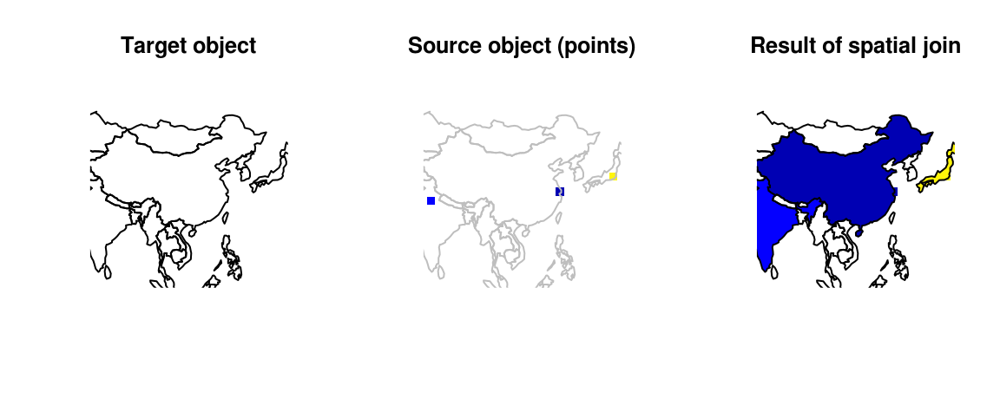

--- 
title: 'Geocomputation with R'
author: 'Robin Lovelace, Jakub Nowosad, Jannes Muenchow'
date: '2017-09-21'
knit: bookdown::render_book
site: bookdown::bookdown_site
documentclass: book
bibliography:
  - refs.bib
  - packages.bib
biblio-style: apalike
link-citations: yes
description: "Forthcoming book on geographical data with R."
github-repo: "Robinlovelace/geocompr"
url: 'http\://robinlovelace.net/geocompr'
---


# Welcome {-}

Welcome to **geocompr**, the [website](http://robinlovelace.net/geocompr) of our forthcoming book with [CRC Press](https://www.crcpress.com/Chapman--HallCRC-The-R-Series/book-series/CRCTHERSER).

## Development {-}

Inspired by the **bookdown** [R package](https://github.com/rstudio/bookdown) we are developing this book in the open.
We decided to make the book open source to encourage contributions, ensure reproducibility and provide access to the material as it evolves.

We're developing the book in 3 main phases.
We're in phase 1 and focussed on the first 5 main chapters, which we aim to be complete by September.
Drafts of other chapters will be added to this website as the project progresses.

The latest version is hosted at [robinlovelace.net/geocompr](http://robinlovelace.net/geocompr).
This website is kept up-to-date thanks to Travis, a continuous integration (CI) service.
Travis automatically rebuilds the book and finds bugs by reporting the 'build status' after every update.
Currently the build is:

[](https://travis-ci.org/Robinlovelace/geocompr) 

The version of the book you are reading now was built on 2017-09-21 and was built on [Travis](https://travis-ci.org/Robinlovelace/geocompr).
**bookdown** makes editing a book as easy as editing a wiki.
To do so, just click on the 'edit me' icon highlighted in the image below.
Which-ever chapter you are looking at, this will take you to the source [R Markdown](http://rmarkdown.rstudio.com/) file hosted on GitHub. If you have a GitHub account, you'll be able to make changes there and submit a pull request. If you do not, it's time to [sign-up](https://github.com/)! 

[](https://github.com/Robinlovelace/geocompr/edit/master/index.Rmd)

To raise an issue about the book's content (e.g. code not running) or make a feature request, check-out the [issue tracker](https://github.com/Robinlovelace/geocompr/issues).

## Reproducibility {-}

To reproduce the book, you need a recent version of [R](https://cran.r-project.org/) and up-to-date packages.
The following code should install the required packages:


```r
if(!require(devtools)) {
  install.packages("devtools")
}
devtools::install_github("robinlovelace/geocompr")
```

To build the book locally, clone or [download](https://github.com/Robinlovelace/geocompr/archive/master.zip) the repo and run the following line from the [project](https://github.com/Robinlovelace/geocompr/blob/master/geocompr.Rproj)'s root directory:


```r
bookdown::render_book("index.Rmd") # to build the book
browseURL("_book/index.html") # to view it
```

For further details see the book's GitHub page at [Robinlovelace/geocompr](https://github.com/Robinlovelace/geocompr#geocomputation-with-r).

<!-- ## Acknowledgements {-} -->
<!-- add list of people who helped with this book -->

<!--chapter:end:index.Rmd-->


# Introduction {#intro}

This book is about harnessing the power of modern computers to *do things* with geographic data.
It teaches a range of spatial skills, including: reading, writing and manipulating geographic data; making static and interactive maps; and modeling geographic phenomena.
By demonstrating how various spatial operations can be linked, in the reproducible 'code chunks' that intersperse the prose, the book also shows how these skills support a transparent and thus scientific workflow.
Learning how to use the wealth of geospatial 'tools' this computational approach enables can be exciting and liberating.
However, it is even more liberating to create new tools.
By the end of the book you should be able to create new tools in the form of shareable R functions.

Over the last few decades a huge amount of work has gone into developing open source software for handling geographic data (see [foss4g.org](http://foss4g.org/)).
This means that spatial data analysis is no longer the preserve of those who can afford expensive programs, and the hardware to run them.
Anyone can now download high performance spatial libraries on their computer.
However, despite the growth of geospatial software that is *open source*, much of it remains *inaccessible*, in a form that is scriptable and therefore easily reproducible and 'computational'.
Open source Geographic Information Systems (GIS) such as QGIS (see [qgis.org](http://qgis.org/en/site/)) have greatly reduced the 'barrier to entry', but the emphasis of such programs on a Graphical User Interface (GUI) can discourage reproducibility and an emphasis on the code that the Geocomputational approach requires, as discussed in Chapter 13.

A major aim of this book is to make geographical data analysis more accessible as part of a reproducible workflow.
R is a flexible language that allows access to many spatial software libraries (see section \@ref(why-geocomputation-with-r)).
Before going into the details of the software, however, it is worth taking a step back and thinking about what we mean by geocomputation.

## What is geocomputation?

Geocomputation is a relatively young field with a ~30 year history, dating back to the first conference on the subject in 1996.^[The conference took place at the University of Leeds, where one of the authors (Robin) is currently based and where the 21^st^ GeoComputation was hosted in 2017 (see
[geocomputation.org](http://www.geocomputation.org/)).]
<!-- todo: which chapters? -->
What distinguishes geocomputation from the older quantitative geography, is its emphasis on "creative and experimental" GIS applications [@longley_geocomputation:_1998].
Additionally, it is also about developing new, research-driven methods [@openshaw_geocomputation_2000]:

> GeoComputation is about using the various different types of geodata and about
developing relevant geo-tools within the overall context of a 'scientific'
approach.

But geocomputation and this book teach more than just methods and code: they are about *doing* "practical work that is beneficial or useful" [@openshaw_geocomputation_2000].
Of course, reading this book will give you a solid *knowledge* of geocomputational methods, and how to use them via the reproducible examples implemented in the code chunks in each chapter.
But there is much more.
This book aims to teach how to do geocomputation rather than just to think about it.
Hence, you should be also able to apply the learned methods and mastered skills to real-world data, for evidence-based analysis in your own areas of interest.
Moreover, throughout the book we encourage you to make geographic research more reproducible, scientific and socially beneficial. 

This book is also part of the movement towards Geographical Information Science (GDS), a more recent concept which incorporates elements of 'data science' into GIS.
Like Geocomputation, GSD can be defined in terms of its relation with GIS, some of which are outlined in Table \@ref(tab:gdsl).
The focus on reproducibility and a command-line interface in this book is aligned with GDS.


Table: (\#tab:gdsl)Differences in emphasis between the fields of Geographic Information Systems (GIS) and Geographic Data Science (GDS).

Attribute          GIS                        GDS                              
-----------------  -------------------------  ---------------------------------
Home disciplines   Geography                  Geography, Computing, Statistics 
Software focus     Graphical User Interface   Code                             
Reproduciblility   Minimal                    Maximal                          

While embracing recent developments in the field, we also wanted to pay respects to the wider field of Geography, with its 2000 history [@roller_eratosthenes_2010], and the narrower field of *Geographic Information System* (GIS) [@neteler_open_2008].
Geography has played an important role in explaining and influencing humanity's relationship with the natural
world^[A good example of this is Alexander von Humboldt's travels to South America, which laid the foundations for physical and plant geography [@wulf_invention_2015].
]
and this book aims to contribute to this so-called 'Geographic Tradition' [@livingstone_geographical_1992].
GIS has become almost synonymous with handling spatial data on a computer, and provides a basis for excellent open source tools which can be accessed from R, as we will see in Chapter 13.
<!-- todo - add dynamic reference to c13-->

The book's links to older disciplines were reflected in suggested titles for the book: *Geography with R* and *R for GIS*.
Each has advantages.
The former conveys the message that it comprises much more than just spatial data: 
non-spatial attribute data are inevitably interwoven with geometry data, and Geography is about more than where something is on the map.
The latter communicates that this is a book about using R as a GIS, to perform spatial operations on *geographic data* [@bivand_applied_2013].
However, the term GIS conveys some connotations (see Table \@ref(tab:gdsl)) which simply fail to communicate one of R's greatest strengths:
its console-based ability to seamlessly switch between geographic and non-geographic data processing, modeling and visualization tasks.
By contrast, the term geocomputation implies reproducible and creative programming.
Of course, (geocomputational) algorithms are powerful tools that can become highly complex.
However, all algorithms are composed of smaller parts.
By teaching you its foundations and underlying structure, we aim to empower you to create your own innovative solutions to geographic data problems.

## Why Geocomputation with R?

Early geographers used a variety of tools including rulers, compasses and sextants to advance knowledge about the world. 
However, until John Harrison invented the marine chronometer in the 18th century it had been impossible to determine the exact longitude at sea ('the longitude problem').
Prior to his invention ships followed for centuries a line of constant latitude making each journey much longer, more expensive and often also more dangerous.
Nowadays this seems unimaginable with every smartphone having a GPS receiver at its disposal.
And there are a multitude of other sensors measuring the world in real-time (satellites, radar, autonomous cars, citizens, etc.).
For instance, an autonomous car could create 100 GB or more per day (see e.g., this [article](https://www.economist.com/news/science-and-technology/21696925-building-highly-detailed-maps-robotic-vehicles-autonomous-cars-reality)).
Equally, earth observation data (satellite imagery) has become so big that it is impossible to analyze the corresponding data with a single computer (see [http://r-spatial.org/2016/11/29/openeo.html](http://r-spatial.org/2016/11/29/openeo.html)).
Hence, we need computational power, software and related tools to handle and extract the most interesting patterns of this ever-increasing amount of (geo-)data.
(Geo-)Databases help with data management, storing and querying such large amounts of data.
Through interfaces we can access subsets of these data for further analysis, information extraction and visualization.
In this book we treat R as a 'tool for the trade' for the latter.

R is a multi-platform, open source language for statistical computing and graphics ([https://www.r-project.org/](https://www.r-project.org/)).
With a wide range of packages R also supports advanced geospatial statistics, modeling and visualization.^[The integrated development environment (IDE) [RStudio](https://www.rstudio.com/) deserves mention here from a user perspective as it has made the interactive use of R more accessible].
At its core R is an object-oriented, [functional programming language](http://adv-r.had.co.nz/Functional-programming.html) [@wickham_advanced_2014], and was specifically designed as an interactive interface to other software [@chambers_extending_2016]. 
The latter also includes many 'bridges' to a treasure trove of GIS software, geolibraries and functions.
<!-- todo - add this reference to ref(gis) -->
It is thus ideal for quickly creating 'geo-tools', without needing to master lower level languages (compared to R) such as C, FORTRAN and Java (see section \@ref(software-for-geocomputation)). 
This can feel like breaking free from the metaphorical 'glass ceiling' imposed by GUI-based proprietary geographic information systems (see Table \@ref(tab:gdsl) for a definition of GUI).
What is more, advanced users might even extend R with the power of other languages (e.g., C++ through **Rcpp** or Python through **reticulate**; see also section \@ref(software-for-geocomputation)).

An example showing R's flexibility with regard to geographic software development is its support for generating interactive maps thanks to **leaflet** [@R-leaflet].
The packages **tmap** and **mapview** [@R-tmap; @R-mapview] are built on and extend **leaflet**.
These packages help overcome the criticism that R has "limited interactive [plotting] facilities" [@bivand_applied_2013]. 
The code below illustrates this by generating Figure \@ref(fig:interactive).


```r
library(leaflet)
popup = c("Robin", "Jakub", "Jannes")
leaflet() %>%
  addProviderTiles("NASAGIBS.ViirsEarthAtNight2012") %>% 
  addAwesomeMarkers(lng = c(-3, 23, 11),
                    lat = c(52, 53, 49), 
                    popup = popup)
```

<div class="figure" style="text-align: center">
preserve22f4a61d8403b348
<p class="caption">(\#fig:interactive)World at night imagery from NASA overlaid by the authors' approximate home locations to illustrate interactive mapping with R.</p>
</div>

It would have been difficult to produce Figure \@ref(fig:interactive) using R a few years ago, let alone embed the results in an interactive html page (the interactive version can be viewed at [robinlovelace.net/geocompr](http://robinlovelace.net/geocompr/intro.html)).
This illustrates R's flexibility and how, thanks to developments such as **knitr** and **leaflet**, it can be used as an interface to other software, a theme that will recur throughout this book.
The use of R code, therefore, enables teaching geocomputation with reference to reproducible examples such as that provided in \@ref(fig:interactive) rather than abstract concepts.

## Software for geocomputation

R is a powerful tool for geocomptation.
However, other languages can be used and it is useful to be aware of these for historical context and to help understand the wider open source geospatial programming ecosystem, of which R is a part.
With this motivation in mind the section briefly introduces the languages [C++](https://isocpp.org/), [Java](https://www.oracle.com/java/index.html) and [Python](https://www.python.org/) for geocomputation, with reference to R.

A natural choice for geocomputation would be C++ since major GIS packages (e.g., [GDAL](http://www.gdal.org/), [QGIS](www.qgis.org), [GRASS](https://grass.osgeo.org/), [SAGA](www.saga-gis.org), and even [ArcGIS](https://www.arcgis.com/)) often rely in great parts on it.
This is because well-written C++ can be blazzingly fast, which makes it a good choice for performance-critical applications such as the processing of large spatial data.
Usually, people find it harder to learn than Python or R.
It is also likely that you have to invest a lot of time to code things that are readily available in R.
Therefore, we would recommend to learn R, and subsequently to learn C++ through **Rcpp** if a need for performance optimization arises.
Subsequently, you could even implement geoalgorithms you are missing from the most common desktop GIS with the help of **Rcpp**^[Though, in that case we would recommend to contribute the C++ code to one of the open-source GIS packages since this would make the geoalgorithm available to a wider audience.
In turn, you could access the GIS software via one of the available R-GIS interfaces. <!--(ref(gis))-->].

Java is another important (and versatile) language used in GIScience.
For example, the open-source desktop GIS [gvSig](http://www.gvsig.com/en/products/gvsig-desktop), [OpenJump](http://openjump.org/) and [uDig](http://udig.refractions.net/) are written in Java.
There are also many open source add-on libraries available for Java, including [GeoTools](http://docs.geotools.org/) and the [Java Topology Suite](https://www.locationtech.org/projects/technology.jts).^[Please note, that GEOS is a C++ port of the Java Topology Suite.]
Furthermore, many server-based applications use Java including among others [Geoserver/Geonode](http://geonode.org/), [deegree](http://www.deegree.org/) and [52°North WPS](http://52north.org/communities/geoprocessing/wps/).

Java's object-oriented syntax is similar to C++, however, its memory management is much simpler.
Still, it is rather unforgiving regarding class, object and variable declarations forcing you to think about a well-designed programming structure.
This is especially useful in large projects with thousands of lines of codes placed in numerous files.
Following the *write once, run anywhere* principle, Java is platform-independent (which is unusual for a compiled programming language).
Overall, Java's compiled language has an excellent performance on large-scale systems making it a suitable candidate for complex architecture projects such as programming a desktop GIS.
However, Java is probably less suitable for statistical modeling and visualization compared to Python or R.
First and foremost, though you can do data science with Java [@brzustowicz_data_2017], Java offers much fewer statistical libraries especially when compared with R.
Secondly, interpreted languages (such as R and Python) are often easier to write (at the prize of lower performance) than compiled languages (such as Java and C++).
Moreover, interpreted languages allow a faster and interactive (line-by-line) code implementation.
Finally, R's native support of data types such as data frames and matrices is especially advantageous when it comes to analyzing data.

Lastly, we will introduce Python for geocomputation
Many people believe that R and Python are battling for supremacy in the field of data science.
This is accompanied by a partly offensive as much as often rather subjective discussion on what to learn or what to use.
We believe that both languages have their merits, and in the end it is about doing geocomputation and communicating the corresponding results regardless of the chosen software.
Moreover, both languages are object-oriented, and have lots of further things in common.
Learning one language should give you a headstart when choosing to learn the other as well.
R's major advantage is that statisticians wrote hundreds of statistical packages (unmatched by Python) explicitly for other statisticians.
By contrast, Python's major advantage is that it is (unlike R) a multi-purpose language thereby bringing together people from diverse fields which also explains Python's bigger user base compared to R's.
So if you like Python better or you think it better suits your needs (for example because you are also interested in web and GUI development), go for it.
In fact, we often advise our students to start with Python just because the major GIS software packages provide Python libraries that lets the user access its geoalgorithms from the Python command line^[`grass.script` for GRASS (https://grasswiki.osgeo.org/wiki/GRASS_and_Python), `saga-python` for SAGA-GIS (http://saga-python.readthedocs.io/en/latest/), `processing` for QGIS and `arcpy` for ArcGIS.
].
However, when the teaching moves on to statistical geoprocessing and spatial predictive modeling we guide them towards R where they can take advantage of the concepts already learned through Python.
Nevertheless, you can also use Python for the most common statistical learning techniques (though R tends to be more on the bleeding edge regarding new statistical development including those in the geostatistical community).
In addition, Python also offers excellent support for spatial data analysis and manipulation (see packages **osgeo**, **Shapely**, **NumPy**, **osgeo**, **PyGeoProcessing**). 
We refer you to @garrard_geoprocessing_2016 for an introduction to geoprocessing with Python.

## R's spatial ecosystem

Before cracking-on with the action, a few introductory remarks are needed to explain the approach taken here and provide context.
<!-- paragraphs (with references to chapters in the book): -->
<!-- 1. this book focus -> sf + raster/stars + leaflet/mapview (the recent state of spatial R); the history of R spatial is way longer -->

There are many ways to handle spatial data in R, with dozens of packages in the area.^[An overview of R's spatial ecosystem can be found in the CRAN Task View on the Analysis of Spatial Data
(see [cran.r-project.org/web/views/Spatial.html](https://cran.r-project.org/web/views/Spatial.html)).]
In this book we endeavor to teach the state-of-the-art in the field whilst ensuring that the methods are future-proof.
Like many areas of software development, R's spatial ecosystem is rapidly evolving.
Because R is open source, these developments can easily build on previous work, by 'standing on the shoulders of giants', as Isaac Newton put it in [1675](http://digitallibrary.hsp.org/index.php/Detail/Object/Show/object_id/9285).
This approach is advantageous because it encourages collaboration and avoids 'reinventing the wheel'.
The package **sf** (covered in Chapter \@ref(spatial-class)), for example, builds on its predecessor **sp**.

A surge in development time (and interest) in 'R-Geo' has followed the award of a grant by the R Consortium for the development of support for Simple Features, an open-source standard and model to store and access vector geometries. 
This resulted in the **sf** package (covered in \@ref(intro-sf)).
Multiple places reflect the immense interest in **sf**. This is especially true for the [R-sig-Geo Archives](https://stat.ethz.ch/pipermail/r-sig-geo/), a long-standing open access email list containing much R-spatial wisdom accumulated over the years.
Many posts on the list now discuss **sf** and related packages, suggesting that R's spatial software developers are using the package and, therefore, it is here to stay.

We even propose that the release of **sf** heralds a new era for spatial data analysis and geocomputation in R.
This era ^[We refrain from labeling it the **geoverse** with any seriousness awaiting a better name!] clearly has the wind in its sails, and is set to dominate future developments in R's spatial ecosystem for years to come.
So time invested in learning the 'new ways' of handling spatial data and, hopefully, reading this book, is well spent!

<div class="figure" style="text-align: center">

<p class="caption">(\#fig:cranlogs)The popularity of spatial packages in R. The y-axis shows the average number of downloads, within a 30-day rolling window, of R's top 5 spatial packages, defined as those with the highest number of downloads within the last 30 days.</p>
</div>

It is noteworthy that shifts in the wider R community, as exemplified by the data processing package **dplyr** (released in [2014](https://cran.r-project.org/src/contrib/Archive/dplyr/)) influenced shifts in R's spatial ecosystem. 
Alongside other packages that have a shared style and emphasis on 'tidy data' (including e.g., **ggplot2**), **dplyr** was placed in the **tidyverse** 'metapackage' in late [2016](https://cran.r-project.org/src/contrib/Archive/tidyverse/).
The **tidyverse** approach, with its focus on long-form data and fast, intuitively named functions, has become immensely popular.
This has led to a demand for 'tidy spatial data' which has been partly met by **sf** and other approaches such as the GitHub package [**tabularaster**](https://hypertidy.github.io/tabularaster/).
An obvious feature of the **tidyverse** is the tendency for packages to work in harmony.
Although an equivalent **geoverse** is presently missing, there is an on-going discussion of harmonizing R's many spatial packages.^[
See the [r-spatial](https://github.com/r-spatial/) organisation and conversations in the [discussion](https://github.com/r-spatial/discuss/issues/11) repo for more on this.
] and a growing number of actively developed packages which are designed to work in harmony with **sf** (Table \@ref(tab:revdep)) and 


Table: (\#tab:revdep)The top 5 most downloaded packages that depend on sf, in terms of average number of downloads per day over the previous month. As of 2017-09-16 there are 26 packages which import sf.

package       Downloads
-----------  ----------
plotly             1672
leaflet             455
geojsonio           234
mapview             152
rmapshaper          132

## R's spatial history

There are many benefits of using recent packages such as **sf**, with the caveat that they are generally less stable than mature packages such as its predecessor, the **sp**-package.

The saying "if you live on the cutting edge you risk getting hurt" captures this well, meaning that older packages may be more appropriate for applications requiring stability and backwards-compatibility with other mature packages.
Another reason for knowing about the history of geocomputation with R is that there is a wealth of functions, use-cases and teaching material written using older packages in R's spatial ecosystem, which can still be useful today if you know where to look.

The beginnings of spatial capabilities in R are closely connected with its predecessor - the S language [@bivand_implementing_2000].
The 1990s saw the development of numerous S scripts and a handful of packages for spatial statistics.
Some of these, including **spatial**, **sgeostat** and **splancs**, eventually became R packages [@rowlingson_splancs:_1993; @rowlingson_splancs:_2017;@venables_modern_2002; @university_sgeostat:_2016].

Volume 1/2 of R News (the predecessor of The R Journal) contained an overview of spatial statistical software in R at the time, much of which was based on previous code written for S/S-PLUS [@ripley_spatial_2001].
This overview described packages for spatial smoothing and interpolation (e.g., **akima**, **spatial**, **sgeostat** and **geoR**) and point pattern analysis [**splancs** and **spatstat**; @akima_akima:_2016; @rowlingson_splancs:_2017; @jr_geor:_2016].
<!-- there is something wrong with the citation: Jr and Diggle 2016 (@jr_geor:_2016)-->
While all these are still available on CRAN, **spatstat** stands out among them, as it remains dominant in the field of spatial point pattern analysis [@baddeley_spatial_2015].

The following R News issue (Volume 1/3) put spatial packages in the spotlight again, with an introduction to **splancs** and a commentary on future prospects regarding spatial statistics [@bivand_more_2001].
Additionally, the issue introduced two packages for testing spatial autocorrelation that eventually became part of **spdep** [@bivand_spdep:_2017].
Notably, the commentary mentions the need for standardization of spatial interfaces, efficient mechanisms for exchanging data with GIS, and handling of spatial metadata such as coordinate reference systems (CRS).

**maptools** [written by Nicholas Lewin-Koh; @bivand_maptools:_2017] is another important package from this time.
Initially, **maptools** just contained a wrapper around [shapelib](http://shapelib.maptools.org/), and permitted the reading of ESRI Shapefiles into geometry nested lists. 
The corresponding and nowadays obsolete S3 class called "Map" stored this list alongside an attribute data frame. 
The work on the "Map" class representation was nevertheless important since it directly fed into **sp** prior to its publication on CRAN.

In 2003, Hornik et al. [-@hornik_approaches_2003] published an extended review of spatial packages. 
Around this time the development of R's spatial capabilities increasingly supported interfaces to external libraries, especially to GDAL and PROJ.4.
These interfaces facilitated geographic data I/O (covered in chapter \@ref(read-write)) and CRS transformations, respectively.
@hornik_approaches_2003 proposed a spatial data class system, including support for points, lines, polygons and grids based on GDAL's support for a wide range of spatial data formats.
All these ideas contributed to the packages **rgdal** and **sp**, which became the foundational packages for spatial data analysis with R [@bivand_applied_2013].

**rgdal** provided GDAL bindings for R which greatly extended R's spatial capabilities in terms of access to previously unavailable spatial data formats.
Initially, Tim Keitt released it in 2003 with support for raster drivers.
But soon, **rgdal** also enabled storing information about coordinate reference system (building on top of the PROJ.4 library), allowed map projections, datum transformations and OGR vector reading. 
Many of these additional capabilities were thanks to Barry Rowlingson who folded them into the **rgdal** codebase in March 2006.^[A presentation at the 2003 DSC conference in Vienna gives the background as he saw it then [@rowlingson_rasp:_2003]; see also his announcement of the **Rmap** package on [R-help](https://stat.ethz.ch/pipermail/r-help/2003-January/028413.html) in early 2003.]

**sp**, released in 2005, overcame R's inability to distinguish spatial and non-spatial objects.
It grew from a [workshop](http://spatial.nhh.no/meetings/vienna/index.html) before, and a session at the 2003 DSC conference in Vienna, gathering input from most interested package developers. 
At the same time, [sourceforge](https://sourceforge.net/) was chosen for development collaboration (migrated to [R-Forge](https://r-forge.r-project.org) five years later) and the [R-sig-geo mailing list](https://stat.ethz.ch/mailman/listinfo/r-sig-geo) was started.

Prior to 2005, spatial coordinates were generally treated as any other number. 
This changed with **sp** as it provided generic classes and methods for spatial data.
The sophisticated class system supported points, lines, polygons and grids, with and without attribute data. 

<!--???-->
<!-- points, multipoints, pixels, full grid, line, lines, spatial lines, polygon, polygons, spatial polygons -->
Making use of the S4 class system, **sp** stores each piece of 'spatially specific' information (such as bounding box, coordinate reference system, attribute table) in slots, which are accessible via the `@` symbol.
For instance, **sp**-classes store attribute data in the `data` slot as a `data.frame`.
This enables non-spatial data operations to work alongside spatial operations (covered in chapters \@ref(attr) and \@ref(spatial-data-operations), respectively).
Additionally, **sp** implemented generic methods for spatial data types for well-known functions such as `summary()` and `plot()` .

In the following, **sp** classes rapidly became the go-to standard for spatial data in R, resulting in a proliferation of packages that depended on it from around 20 in 2008 and over 100 in 2013 [@bivand_applied_2013].
Now more than 200 packages rely on **sp**, making it an important part of the R ecosystem. 
<!-- https://github.com/Robinlovelace/geocompr/issues/58 -->
<!-- https://github.com/edzer/sfr/issues/387#issuecomment-308949140 -->

Prominent R packages using **sp** include: **gstat**, for spatial and spatio-temporal geostatistics; **geosphere**, for spherical trigonometry; and **adehabitat** used for the analysis of habitat selection by animals [@R-gstat; @calenge_package_2006; @hijmans_geosphere:_2016].

While **rgdal** and **sp** solved many spatial issues, R was still lacking geometry calculation abilities.
Therefore, Colin Rundel started to develop a package that interfaces GEOS, an open-source geometry library, during a Google Summer of Coding project in 2010.
The resulting **rgeos** package [first released in 2010; @R-rgeos] brought geometry calculations to R by allowing functions and operators from the GEOS library to manipulate **sp** objects.
Another limitation of **sp** was its limited support of raster data.
The **raster**-package [first released in 2010; @R-raster] overcame this by providing a `raster` class and functions for creating, reading and writing raster data.
A key feature of **raster** is its ability to work with datasets that are too large to fit into the main memory (RAM), thereby overcoming one of R's major limitations when working on raster data.^[The
**raster** package also provided tools for raster algebra, general raster functions and the development of more additional raster functions.]

In parallel with or partly even preceding the development of spatial classes and methods came the support for R as an interface to dedicated GIS software.
The **GRASS** package [@bivand_using_2000] and follow-on packages **spgrass6** and **rgrass7** (for GRASS GIS 6 and 7, respectively) were prominent examples in this direction [@bivand_spgrass6:_2016;@bivand_rgrass7:_2016].
Other examples of bridges between R and GIS include **RSAGA** [@R-RSAGA, first published in 2008], **ArcGIS** [@brenning_arcgis_2012, first published in 2008], and **RQGIS** [@R-RQGIS, first published in 2016].
<!-- More information about interfaces between R and GIS software could be find in ref(gis). -->

Map making was not a focus of R's early spatial capabilities.
But soon **sp** provided methods for advanced map making using both the base and lattice plotting system. 
Despite this, a demand for the layered grammar of graphics was growing especially after the release of **ggplot2** in 2007.
**ggmap** extended **ggplot2**'s spatial capabilities [@kahle_ggmap:_2013].
However, its main purpose was the easy access of several APIs to automatically download map tiles (among others, Google Maps and OpenStreetmap) and subsequent plotting of these as a basemap. 
<!--Additionally, *ggmap** lets you use (mainly Google's) geocoding and routing services.-->
Though **ggmap** facilitated map-making with **ggplot2**, one main limitation remained.
To make spatial data work with the **ggplot2** system, one needed to `fortify` spatial objects.
Basically, this means, you need to combine the coordinates and attribute slots of a spatial class object into one data frame.
While this works well in the case of points, it duplicates the same information over and over again in the case of polygons, since each coordinate (vertex) of a polygon receives the attribute data of the polygon.
This is especially disadvantageous if you need to deal with tens of thousands of polygons.
With the introduction of simple features to R this limitation disappears, and it seems likely that this will make **ggplot2** the standard tool for the visualization of vector data. 
This might be different regarding the visualization of raster data. Raster visualization methods received a boost with the release of **rasterVis** [@lamigueiro_displaying_2014] which builds on top of the lattice system.
More recently, new packages aim at easing the creation of complex, high-quality maps with minimal code.
The **tmap** package (released in 2014) might serve as an archetype for this kind of development [@R-tmap].
It facilitates the user-friendly creation of thematic maps with an intuitive command-line interface (see also [**mapmisc**](https://cran.r-project.org/package=mapmisc)) . 
<!-- ADD THIS LATTER -->
<!-- CITE the paper Tennekes, M. (2017) tmap: Thematic Maps in R. Forthcoming in the Journal
of Statistical Software http://von-tijn.nl/tijn/research/presentations/tmap_user2017.pdf-->
**tmap** is a sophisticated yet user friendly mapping package which works in harmony with the **leaflet** package (released in 2015) for interactive map making [@R-leaflet]. 
Similarly, the **mapview** package builds also on top of **leaflet** [@R-mapview] for interactive mapping based on **sp** or **sf** objects. **mapview** allows the access of a wide range of background maps, scale bars and more.

However, it is noteworthy that among all the recent developments described above, the support for simple features [**sf**; @R-sf] has been without doubt the most important evolution in R's spatial ecosystem.
Naturally, this is the reason why we will describe **sf** in detail in Chapter \@ref(spatial-class).

<!-- ## How to read this book -->

## Exercises

1. Think about the terms 'GIS', 'GDS' and 'Geocomputation' described above. Which is your favorite, and why?

2. Provide three reasons for using a scriptable language such as R for geocomputation instead of using an established GIS program such as QGIS.

3. Name two advantages and two disadvantages of using mature packages compared with 'cutting edge' packages for spatial data (for example **sp** vs **sf**).


<!--chapter:end:01-introduction.Rmd-->


# Geographic data in R {#spatial-class}

## Prerequisites {-}

This is the first practical chapter of the book, and therefore it comes with some software requirements.
We assume that you have installed on your computer a recent version of R and that you are comfortable using it at the command line, e.g., via an integrated development environment (IDE) such as RStudio (recommended).
R/RStudio works on all major operating systems.
You can install and set up both in a few minutes on most modern computers, as described in [section 2.3](https://csgillespie.github.io/efficientR/set-up.html#r-version) and [section 2.5](https://csgillespie.github.io/efficientR/set-up.html#rstudio) of @gillespie_efficient_2016 (other guides are available).

If you are not a regular R user, we recommend that you familiarize yourself with the language before proceeding with this chapter.
You can do so using resources such as @gillespie_efficient_2016, @grolemund_r_2016 as well as online interactive guides such as [DataCamp](https://www.datacamp.com/courses/free-introduction-to-r).
It is also worth to spend time to establish an efficient programming workflow, for example with the help of an RStudio '[project](https://csgillespie.github.io/efficientR/set-up.html#project-management)'.
Subsequently, you can use the RStudio project provided in the root directory of the [`geocompr`](https://github.com/Robinlovelace/geocompr) GitHub repository.
This will make it easier to run this book's worked examples on your computer.

* * *

After having successfully installed R, you have to install and load add-on packages to handle spatial data.
On Mac and Linux operating systems there are a few additional requirements: see the [README](https://github.com/r-spatial/sf) of the **sf** package for instructions.
The **sf**, **raster**, **spData**, and **spDataLarge** packages used in this chapter can be installed and loaded with the following commands:


```r
install.packages("sf")
install.packages("raster")
install.packages("spData")
library(sf)
library(raster)
library(spData)
install.packages("spDataLarge")
library(spDataLarge)
```

This chapter will provide brief explanations of the fundamental geographic data models: vector and raster.
We will introduce briefly the theory behind both data models, and then move quickly towards how these are implemented in R.
Vector and raster models are vital to geospatial analysis [@longley_geographic_2015].
The vector data model represents the world using points, lines and polygons.
This means, it supports data with discrete, well-defined borders.
Generally, vector datasets have a high level of precision (but not necessarily accuracy as we will see in \@ref(units)).
On the other hand, the raster data model is good at representing continuous phenomena such as elevation or rainfall with the help of grid cell  that break the surface up into a cells of constant size (*resolution*).
Rasters, therefore, aggregate spatially specific features to a given resolution resulting in small features being blurred or lost.
<!-- todo: add figure(s) showing raster data and blurring? -->
Naturally, it depends on your discipline if you more often user raster or vector data:

- Vector data tends to dominate the social sciences because human settlements and boundaries have discrete borders.
- By contrast, raster data often dominates the environmental sciences because these often use remotely sensed imagery. 

However, there is a substantial level of overlap:
ecologists and demographers, for example, commonly use both vector and raster data.
We, therefore, strongly recommend learning about each data model before proceeding to understand how to manipulate them in subsequent chapters.
This book uses **sf** and **raster** packages to work with vector data and raster datasets respectively.

## Vector data

The geographic vector model is based on points that are located on a Cartesian (or geographic) coordinate system.^[Please do not confuse the geographic data vector model with R's `vector` class.
The latter is a data format in R such as `data.frame` and `matrix`. 
However, we can represent spatial coordinates, which are part of the geographic vector data model, using R's `vector` class.]
Typically, a point consists of an x and a y value. 
These two numbers simply represent the distance from the $origin$ along the $x$ (horizontal) and $y$ (vertical) axis in Euclidean space.^[In 3 dimensional coordinate systems three numbers are needed for each of the three axes, $x$, $y$ and $z$.]
In mathematical notation these points are typically represented as numbers separated by commas and enclosed by a pair of brackets: 
$(1, 3)$ for example, represents a point located one unit to the right and three units above the origin.
Instead of creating these points manually, one would commonly read-in data with functions such as `read_csv()` from the **tidyverse** or `read_sf()` from the **sf** package (see chapter \@ref(read-write)).
To generate new data (e.g., for testing), one can use the command `c()` (think of 'c' for 'combine'), as illustrated
below:^[Other methods for generating numbers include with the `seq()` function (short for 'sequence') for generating regular sequences or `runif()`, `rnorm()` and other functions generating random numbers following some kind of probability distribution.
The **mapedit** package can be used to create spatial data manually on an interactive map.
]


```r
p = c(1, 3)
```

Now this can be plotted in Cartesian space, as illustrated in figure \@ref(fig:cartesian):


```r
plot(x = p[1], y = p[2], xlim =  c(0, 5), ylim = c(0, 5))
```

<div class="figure" style="text-align: center">

<p class="caption">(\#fig:cartesian)Illustration of vector point data in base R.</p>
</div>

### An introduction to simple features {#intro-sf}

Simple features is an open standard developed and endorsed by the Open Geospatial Consortium ([OGC](http://portal.opengeospatial.org/files/?artifact_id=25355)) to represent a wide range of geographical information.
It is a hierarchical data model that simplifies geographic data by condensing a complex range of geographic forms into a single geometry class.
Only 7 out of 68 possible types of simple feature are currently used in the vast majority of GIS operations (Figure \@ref(fig:sf-ogc)).
The R package **sf** [@R-sf] fully supports all of these (including plotting methods etc.).^[
The full OGC standard includes rather exotic geometry types including 'surface' and 'curve' geometry types, which currently have limited application in real world applications.
All 68 types can be represented in R, although (at the time of writing) all methods, such as plotting, are only supported for the 7 types that are used.
]

<div class="figure" style="text-align: center">

<p class="caption">(\#fig:sf-ogc)The subset of the Simple Features class hierarchy supported by sf. Figure based on the Open Geospatial Consortium document [06-103r4](http://www.opengeospatial.org/standards/sfa).</p>
</div>

**sf** can represent all common vector geometry types (raster data classes are not supported by **sf**): points, lines, polygons and their respective 'multi' versions (which group together features of the same type into a single feature).
**sf** also supports geometry collections, which can contain multiple geometry types in a single object.
Given the breadth of geographic data forms, it may come as a surprise that a class system to support all of them is provided in a single package, which can be installed from CRAN:^[The
development version, which may contain new features, can be installed with `devtools::install_github("r-spatial/sf").`
]
**sf** incorporates the functionality of the three main packages of the **sp** paradigm (**sp** [@R-sp] for the class system, **rgdal** [@R-rgdal] for reading and writing data, **rgeos** [@R-rgeos] for spatial operations undertaken by GEOS) in a single, cohesive whole.
This is well-documented in **sf**'s [vignettes](http://cran.rstudio.com/package=sf):


```r
vignette("sf1") # for an introduction to the package
vignette("sf2") # for reading, writing and converting Simple Features
vignette("sf3") # for manipulating Simple Features
```

As the first vignette explains, simple feature objects in R are stored in a data frame, with geographic data occupying a special column, a 'list-column'. This column is usually named 'geom' or 'geometry'.
Let us load a 'real world' example, here the `world` dataset, with the help of the **spData** package:


```r
library(spData)
```

**spData** silently loaded the `world` dataset (and many other spatial datasets - see [the spData website](https://nowosad.github.io/spData/) for a full list).
This dataset contains spatial and non-spatial information, as shown by the function `names()`, which reports the column headings in data frames. 
Please note that the last column contains the geographic information:


```r
names(world)
#>  [1] "iso_a2"    "name_long" "continent" "region_un" "subregion"
#>  [6] "type"      "area_km2"  "pop"       "lifeExp"   "gdpPercap"
#> [11] "geom"
```

It is the contents of this modest-looking `geom` column that gives `sf` objects their spatial powers.
This so-called list-column contains all the coordinates.
**sf**'s `plot()` method uses these coordinates to create a map (Figure \@ref(fig:world-all)).


```r
library(sf) # must be loaded to plot sf objects
#> Linking to GEOS 3.5.0, GDAL 2.1.0, proj.4 4.8.0
plot(world)
#> Warning: plotting the first 9 out of 10 attributes; use max.plot = 10 to
#> plot all
```

<div class="figure" style="text-align: center">

<p class="caption">(\#fig:world-all)A spatial plot of the world using the sf package, with a facet for each attribute.</p>
</div>

Note that instead of creating a single map, as most GIS programs would, the `plot()` command has created multiple maps, one for each variable in the `world` datasets.
This behavior can be useful for exploring the spatial distribution of different variables and is discussed further in \@ref(basic-map) below.

Being able to treat spatial objects as regular data frames with spatial powers has many advantages, especially if you are already used to working with data frames.
The commonly used `summary()` function, for example, provides a useful overview of the variables within the `world` object.


```r
summary(world["lifeExp"])
#>     lifeExp                geom    
#>  Min.   :48.9   MULTIPOLYGON :177  
#>  1st Qu.:64.3   epsg:4326    :  0  
#>  Median :72.8   +proj=long...:  0  
#>  Mean   :70.6                      
#>  3rd Qu.:77.1                      
#>  Max.   :83.6                      
#>  NA's   :9
```

Although we have only selected one variable for the `summary` command, it also outputs an report on the geometry (we explore such 'attribute operations' in more depth in Chapter \@ref(attr)).
This is due to the sticky behavior of the geometry columns of **sf** objects (see Chapter \@ref(attr)).
Hence, the result provides a quick summary of both the non-spatial and spatial data contained in `world`: the average life expectancy is 73 years (ranging from less than 50 to more than 80 years) across all countries which are represented in the form of `MULTIPOLYGON`s.
`MULTIPOLYGON`s allow more than one polygon per row (here: country).
This representation is necessary for countries with many islands such as Indonesia and Greece. 

<!-- TODO: cross-reference section covering CRSs. -->
It is worth taking a deeper look at the basic behavior and contents of this simple feature object, which can usefully be thought of as a '**S**patial data**F**rame).

`sf` objects are easy to subset.
The code below shows its first two rows and three columns.
The output shows two major differences compared with a regular `data.frame`: the inclusion of additional geographic data (`geometry type`, `dimension`, `bbox` and CRS information - `epsg (SRID)`, `proj4string`), and the presence of final `geometry` column:


```r
world[1:2, 1:3]
#> Simple feature collection with 2 features and 3 fields
#> geometry type:  MULTIPOLYGON
#> dimension:      XY
#> bbox:           xmin: 11.6401 ymin: -17.93064 xmax: 75.15803 ymax: 38.48628
#> epsg (SRID):    4326
#> proj4string:    +proj=longlat +datum=WGS84 +no_defs
#>   iso_a2   name_long continent                           geom
#> 1     AF Afghanistan      Asia MULTIPOLYGON (((61.21081709...
#> 2     AO      Angola    Africa MULTIPOLYGON (((16.32652835...
```

All this may seem rather complex, especially for a class system that is supposed to be simple.
However, there are good reasons for organizing things this way and using **sf**.

<!-- It's a `MULTIPOLYGON` with 177 features and a geographical (longitude/latidue) coordinate reference system (CRS) with an EPSG code of `4326`. -->

### Why Simple Features?

There are many advantages of **sf** over **sp**, including:

- Faster reading and writing of data (more than 10 times faster in some cases)
- Better plotting performance
- **sf** objects can be treated as data frames in most operations
- **sf** functions can be combined using `%>%` operator and works well with the [tidyverse](http://tidyverse.org/) collection of R packages
- **sf** function names are relatively consistent and intuitive (all begin with `st_`) compared with the function names and syntax of the **sp**, **rgdal** and **rgeos** packages that it supersedes.

A broader advantage is that simple features are so well-supported by other software products, not least PostGIS, which has heavily influenced the design of **sf**.

A disadvantage you should be aware of, however, is that **sf** is not *feature complete* and that it continues to evolve.
The transition from **sp** to **sf** will likely take many years, and many spatial packages may never switch.
Even if you discover spatial data with R through the **sf** package, it is still worth at least being aware of **sp** classes, even if you rarely use them for everyday geospatial tasks.

Fortunately it is easy to translate between **sp** and **sf** using the `as()` function: 


```r
library(sp)
world_sp = as(object = world, Class = "Spatial")
```

@bivand_applied_2013 provides an excellent introduction to **sp**.

### Basic map making {#basic-map}

You can quickly create basic maps in **sf** with the base `plot()` function. By default, **sf** creates a multi-panel plot (like **sp**'s `spplot()`), one sub-plot for each variable (see left-hand image in Figure \@ref(fig:sfplot)). 


```r
plot(world[3:4])
plot(world["pop"])
```

<div class="figure" style="text-align: center">

<p class="caption">(\#fig:sfplot)Plotting with sf, with multiple variables (left) and a single variable (right).</p>
</div>

As with **sp**, you can add further layers to your maps using the `add = TRUE`-argument of the `plot()` function .^[In
fact, when you `plot()` an **sf** object, R is calling `sf:::plot.sf()` behind the scenes.
`plot()` is a generic method that behaves differently depending on the class of object being plotted.]
To illustrate this, and prepare for content covered in chapters \@ref(attr) and \@ref(spatial-data-operations) on attribute and spatial data operations, we will subset and combine countries in the `world` object, which creates a single object representing Asia:


```r
asia = world[world$continent == "Asia", ]
asia = st_union(asia)
```

We can now plot the Asian continent over a map of the world.
Note, however, that this only works if the initial plot has only one layer:


```r
plot(world["pop"])
plot(asia, add = TRUE, col = "red")
```

<div class="figure" style="text-align: center">

<p class="caption">(\#fig:asia)A plot of Asia added as a layer on top of countries worldwide.</p>
</div>

This can be very useful for quickly checking the geographic correspondence between two or more layers: 
the `plot()` function is fast to execute and requires few lines of code, but does not create interactive maps with a wide range of options.
For more advanced map making we recommend using a dedicated visualization package such as **tmap**, **ggplot2**, **mapview**, or **leaflet**.
<!-- TODO: cross reference advanced mapping chapter -->

<!-- 
- plot() function 
- map export 
-->

<!-- Maybe show also somewhere that `world[0]` produces only a plot of the geometry which is rather useful if you do not want to plot a specific attribute. This way, you can for example dismiss the col = "white"-argument in your Nigeria example.
Sorry for commenting on this again but just to clarify africa[0] selects zero columns but since the geometry column is sticky it won't be dismissed. Neverthess, to be more explicit one should probably use plot(st_geometry(africa))-->


#### Further work

**sf** simplifies spatial data objects compared with **sp** and provides a near-direct interface to GDAL and GEOS C++ functions.
In theory this should make **sf** faster than **sp**/**rgdal**/**rgeos**, something that is tested in Chapter 5 for data I/O.
This section introduces **sf** classes in preparation for subsequent chapters which deal with vector data (in particular Chapter \@ref(spatial-data-operations)).

As a final exercise, we will see one way of how to do a spatial overlay in **sf**.
First, we convert the countries of the world into centroids, and then subset those in Asia. Finally, the `summary`-command tells us how many centroids (countries) are part of Asia (43) and how many are not (134).


```r
world_centroids = st_centroid(world)
#> Warning in st_centroid.sfc(st_geometry(x), of_largest_polygon =
#> of_largest_polygon): st_centroid does not give correct centroids for
#> longitude/latitude data
sel_asia = st_intersects(world_centroids, asia, sparse = FALSE)
#> although coordinates are longitude/latitude, it is assumed that they are planar
summary(sel_asia)
#>      V1         
#>  Mode :logical  
#>  FALSE:134      
#>  TRUE :43
```

Note: `st_intersects()` uses [GEOS](https://trac.osgeo.org/geos/) in the background for the spatial overlay operation (see also Chapter \@ref(spatial-data-operations)).

Since **sf**'s `plot()` function builds on base plotting methods, you may also use its many optional arguments (see `?plot` and `?par`).
This provides powerful but not necessarily intuitive functionality.
For instance, in order to make the diameter of a circle proportional to a country's population, we provide the `cex` argument with the result of a calculation (see Figure \@ref(fig:africa), and the code below).


```r
plot(world["continent"])
plot(world_centroids, add = TRUE, cex = world$pop / 1e8, lwd = 3)
```

<div class="figure" style="text-align: center">

<p class="caption">(\#fig:africa)Centroids representing country population, diameter being proportional to population.</p>
</div>

<!-- More appropriate for subsequent chapters. -->
<!-- This shows that there are 43 countries in Asia -->
<!-- We can check if they are the same countries as follows: -->

<!-- ```{r} -->
<!-- africa_centroids2 = world_centroids[sel_africa, ] -->
<!-- identical(africa_centroids, africa_centroids2) -->
<!-- ``` -->

### Simple feature classes {#sf_classes}

To understand new data formats in depth, it often helps to build them from the ground up.
This section walks you through vector spatial classes step-by-step, from the elementary simple feature geometry to simple feature objects of class `sf` representing complex spatial data.
Before describing each geometry type that the **sf** package supports, it is worth taking a step back to understand the building blocks of `sf` objects. 
As stated in section \@ref(intro-sf), simple features are simply data frames with at least one special column that makes it spatial.
These spatial columns are often called `geom` or `geometry` and can be like non-spatial columns: `world$geom` refers to the spatial element of the `world` object described above.
These geometry columns are 'list columns' of class `sfc`: they are simple feature collections.
In turn, `sfc` objects are composed of one or more objects of class `sfg`: simple feature geometries.

To understand how the spatial components of simple features work, it is vital to understand simple feature geometries.
For this reason we cover each currently supported `sfg` type in the next subsections before moving on to describe how these can be combined to form `sfc` and eventually full `sf` objects.

#### Simple feature geometry types {#geometry}

<!-- This section demonstrates how the full range of geometry types supported by the **sf** package can be created, combined and plotted. -->
Geometries are the basic building blocks of simple features.
Simple features in R can take on one of the 17 geometry types supported by the **sf** package.
In this chapter we will focus on the seven most commonly used types: `POINT`, `LINESTRING`, `POLYGON`, `MULTIPOINT`, `MULTILINESTRING`, `MULTIPOLYGON` and `GEOMETRYCOLLECTION`.<!--FIG-->
Find the whole list of possible feature types in [the PostGIS manual ](http://postgis.net/docs/using_postgis_dbmanagement.html).

Generally, well-known binary (WKB) or well-known text (WKT) are the standard encoding for simple feature geometries.
WKB representations are usually hexadecimal strings easily readable for computers.
This is why, GIS and spatial databases use WKB to transfer and store geometry objects.
WKT, on the other hand, is a human-readable text markup description of simple features. 
Both formats are exchangeable, and if we present one, we will naturally choose the WKT representation.

The basis for each geometry type is the point. 
A point is simply a coordinate in 2D, 3D or 4D space (see `vignette("sf1")` for more information) such as:

- `POINT (5 2)`


A linestring is a sequence of points with a straight line connecting the points, for example:

- `LINESTRING (1 5, 4 4, 4 1, 2 2, 3 2)`


A polygon is a sequence of points that form a closed, non-intersecting ring.
Closed means that the first and the last point of a polygon have the same coordinates. 
By definition, a polygon has one exterior boundary (outer ring) and can have zero or more interior boundaries (inner rings), also known as holes.

- Polygon without a hole - `POLYGON ((1 5, 2 2, 4 1, 4 4, 1 5))`


- Polygon with one hole - `POLYGON ((1 5, 4 4, 4 1, 2 2, 1 5), (2 4, 3 4, 3 3, 2 3, 2 4))`


So far, our geometry types have just included one feature.
To represent multiple features in one object, we can use the "multi"-version of each geometry type:

- Multipoint - `MULTIPOINT (5 2, 1 3, 3 4, 3 2)`
- Multistring - `MULTILINESTRING ((1 5, 4 4, 4 1, 2 2, 3 2), (1 2, 2 4))`
- Multipolygon - `MULTIPOLYGON ((1 5, 4 4, 4 1, 2 2, 1 5), (0 2, 1 2, 1 3, 0 3, 0 2))`


Finally, a geometry collection might contain any combination of geometry types:

- Geometry collection - `GEOMETRYCOLLECTION (MULTIPOINT (5 2, 1 3, 3 4, 3 2), LINESTRING (1 5, 4 4, 4 1, 2 2, 3 2)))`


#### Simple feature geometry (sfg) objects {#sfg}

In R, the `sfg` class represents the different simple feature geometry types: (multi-)point, (multi-)linestring, (multi-)polygon or geometry collection.

Usually you are spared the tedious task of creating geometries on your own since you can simply import an already existing spatial file.
However, there are a set of function to create simple feature geometry objects (`sfg`) from scratch if needed.
The names of these functions are simple and consistent, as they all start with the `st_`  prefix and end with the name of the geometry type in lowercase letters:

- A point - `st_point()`
- A linestring - `st_linestring()`
- A polygon - `st_polygon()`
- A multipoint - `st_multipoint()`
- A multilinestring - `st_multilinestring()`
- A multipolygon - `st_multipolygon()`
- A geometry collection - `st_geometrycollection()`

In R, you create `sfg` objects with the help of three native data types:

1. A numeric vector - a single point
2. A matrix - a set of points, where each row contains a point - a multipoint or linestring
3. A list - any other set, e.g. a multilinestring or geometry collection

To create point objects, we use the `st_point()` function in conjunction with a numeric vector:


```r
# note that we use a numeric vector for points
st_point(c(5, 2)) # XY point
#> POINT (5 2)
st_point(c(5, 2, 3)) # XYZ point
#> POINT Z (5 2 3)
st_point(c(5, 2, 1), dim = "XYM") # XYM point
#> POINT M (5 2 1)
st_point(c(5, 2, 3, 1)) # XYZM point
#> POINT ZM (5 2 3 1)
```

<!-- is this really important? -->
XY, XYZ and XYZM types of points are automatically created based on the length of a numeric vector. 
Only the XYM type needs to be specified using a `dim` argument.

By contrast, use matrices in the case of multipoint (`st_multipoint()`) and linestring (`st_linestring()`) objects:


```r
# the rbind function simplifies the creation of matrices
## MULTIPOINT
multipoint_matrix = rbind(c(5, 2), c(1, 3), c(3, 4), c(3, 2))
st_multipoint(multipoint_matrix)
#> MULTIPOINT (5 2, 1 3, 3 4, 3 2)

## LINESTRING
linestring_matrix = rbind(c(1, 5), c(4, 4), c(4, 1), c(2, 2), c(3, 2))
st_linestring(linestring_matrix)
#> LINESTRING (1 5, 4 4, 4 1, 2 2, 3 2)
```

Finally, use lists for the creation of multilinestrings, (multi-)polygons and geometry collections:


```r
## POLYGON
polygon_list = list(rbind(c(1, 5), c(2, 2), c(4, 1), c(4, 4), c(1, 5)))
st_polygon(polygon_list)
#> POLYGON ((1 5, 2 2, 4 1, 4 4, 1 5))
```


```r
## POLYGON with a hole
polygon_border = rbind(c(1, 5), c(2, 2), c(4, 1), c(4, 4), c(1, 5))
polygon_hole = rbind(c(2, 4), c(3, 4), c(3, 3), c(2, 3), c(2, 4))
polygon_with_hole_list = list(polygon_border, polygon_hole)
st_polygon(polygon_with_hole_list)
#> POLYGON ((1 5, 2 2, 4 1, 4 4, 1 5), (2 4, 3 4, 3 3, 2 3, 2 4))
```


```r
## MULTILINESTRING
multilinestring_list = list(rbind(c(1, 5), c(4, 4), c(4, 1), c(2, 2), c(3, 2)), 
                            rbind(c(1, 2), c(2, 4)))
st_multilinestring((multilinestring_list))
#> MULTILINESTRING ((1 5, 4 4, 4 1, 2 2, 3 2), (1 2, 2 4))
```


```r
## MULTIPOLYGON
multipolygon_list = list(list(rbind(c(1, 5), c(2, 2), c(4, 1), c(4, 4), c(1, 5))),
                         list(rbind(c(0, 2), c(1, 2), c(1, 3), c(0, 3), c(0, 2))))
st_multipolygon(multipolygon_list)
#> MULTIPOLYGON (((1 5, 2 2, 4 1, 4 4, 1 5)), ((0 2, 1 2, 1 3, 0 3, 0 2)))
```


```r
## GEOMETRYCOLLECTION
gemetrycollection_list = list(st_multipoint(multipoint_matrix),
                              st_linestring(linestring_matrix))
st_geometrycollection(gemetrycollection_list)
#> GEOMETRYCOLLECTION (MULTIPOINT (5 2, 1 3, 3 4, 3 2), LINESTRING (1 5, 4 4, 4 1, 2 2, 3 2))
```

<!-- table -->
<!-- figure - image/fig1.jpg -->
<!-- they are interconnected - points could create mulitpoints or lines; -->
<!-- lines could create mutlilines or polygons, etc. -->
<!-- https://r-spatial.github.io/sf/articles/sf1.html -->

#### Simple feature collections {#sfc}

One `sfg` object contains only a single simple feature geometry. 
A simple feature collection (`sfc`) is a list of `sfg` objects and can additionally contain information about the coordinate reference system in use.
For instance, to combine two simple features into one object with two features, we can use the `st_sfc()` function. 
This is important since this collection represents the geometry column in **sf** data frames:


```r
# sfc POINT
point1 = st_point(c(5, 2))
point2 = st_point(c(1, 3))
st_sfc(point1, point2)
#> Geometry set for 2 features 
#> geometry type:  POINT
#> dimension:      XY
#> bbox:           xmin: 1 ymin: 2 xmax: 5 ymax: 3
#> epsg (SRID):    NA
#> proj4string:    NA
#> POINT (5 2)
#> POINT (1 3)
```

In most cases, an `sfc` object contains objects of the same geometry type.
Therefore, when we convert `sfg` objects of type polygon into a simple feature collection, we would also end up with an `sfc` object of type polygon. 
Equally, a collection of multilinestrings would result in an `sfc` object of type multilinestring:


```r
# sfc POLYGON
polygon_list1 = list(rbind(c(1, 5), c(2, 2), c(4, 1), c(4, 4), c(1, 5)))
polygon1 = st_polygon(polygon_list)
polygon_list2 = list(rbind(c(0, 2), c(1, 2), c(1, 3), c(0, 3), c(0, 2)))
polygon2 = st_polygon(polygon_list2)
st_sfc(polygon1, polygon2)
#> Geometry set for 2 features 
#> geometry type:  POLYGON
#> dimension:      XY
#> bbox:           xmin: 0 ymin: 1 xmax: 4 ymax: 5
#> epsg (SRID):    NA
#> proj4string:    NA
#> POLYGON ((1 5, 2 2, 4 1, 4 4, 1 5))
#> POLYGON ((0 2, 1 2, 1 3, 0 3, 0 2))
```


```r
# sfc MULTILINESTRING
multilinestring_list1 = list(rbind(c(1, 5), c(4, 4), c(4, 1), c(2, 2), c(3, 2)), 
                            rbind(c(1, 2), c(2, 4)))
multilinestring1 = st_multilinestring((multilinestring_list1))
multilinestring_list2 = list(rbind(c(2, 9), c(7, 9), c(5, 6), c(4, 7), c(2, 7)), 
                            rbind(c(1, 7), c(3, 8)))
multilinestring2 = st_multilinestring((multilinestring_list2))
st_sfc(multilinestring1, multilinestring2)
#> Geometry set for 2 features 
#> geometry type:  MULTILINESTRING
#> dimension:      XY
#> bbox:           xmin: 1 ymin: 1 xmax: 7 ymax: 9
#> epsg (SRID):    NA
#> proj4string:    NA
#> MULTILINESTRING ((1 5, 4 4, 4 1, 2 2, 3 2), (1 ...
#> MULTILINESTRING ((2 9, 7 9, 5 6, 4 7, 2 7), (1 ...
```

It is also possible to create an `sfc` object from `sfg` objects with different geometry types:


```r
# sfc GEOMETRY
st_sfc(point1, multilinestring1)
#> Geometry set for 2 features 
#> geometry type:  GEOMETRY
#> dimension:      XY
#> bbox:           xmin: 1 ymin: 1 xmax: 5 ymax: 5
#> epsg (SRID):    NA
#> proj4string:    NA
#> POINT (5 2)
#> MULTILINESTRING ((1 5, 4 4, 4 1, 2 2, 3 2), (1 ...
```

<!-- if you want to use it - st_cast() to a proper geometry type -->
<!-- or st_is to select only one geometry type -->
<!-- http://r-spatial.org/r/2017/01/12/newssf.html -->
<!-- methods(class = "sfc") -->

As mentioned before, `sfc` objects can additionally store information on the coordinate reference systems (CRS).
<!-- What's CRS -->
To specify a certain CRS, we can use the `epsg (SRID)` or `proj4string` attributes of an `sfc` object.
The default value of `epsg (SRID)` and `proj4string` is `NA` (*Not Available*):


```r
st_sfc(point1, point2)
#> Geometry set for 2 features 
#> geometry type:  POINT
#> dimension:      XY
#> bbox:           xmin: 1 ymin: 2 xmax: 5 ymax: 3
#> epsg (SRID):    NA
#> proj4string:    NA
#> POINT (5 2)
#> POINT (1 3)
```

Of course, all geometries in an `sfc` object must have the same CRS. 

We can add coordinate reference system as a `crs` argument of `st_sfc()`. 
This argument accepts either an integer with the `epsg` code (e.g., `4326`)  or a `proj4string` character string (e.g., `"+proj=longlat +datum=WGS84 +no_defs"`) (see section \@ref(crs-intro)). 


```r
# EPSG definition
st_sfc(point1, point2, crs = 4326)
#> Geometry set for 2 features 
#> geometry type:  POINT
#> dimension:      XY
#> bbox:           xmin: 1 ymin: 2 xmax: 5 ymax: 3
#> epsg (SRID):    4326
#> proj4string:    +proj=longlat +datum=WGS84 +no_defs
#> POINT (5 2)
#> POINT (1 3)
```


```r
# PROJ4STRING definition
st_sfc(point1, point2, crs = "+proj=longlat +datum=WGS84 +no_defs")
#> Geometry set for 2 features 
#> geometry type:  POINT
#> dimension:      XY
#> bbox:           xmin: 1 ymin: 2 xmax: 5 ymax: 3
#> epsg (SRID):    4326
#> proj4string:    +proj=longlat +datum=WGS84 +no_defs
#> POINT (5 2)
#> POINT (1 3)
```

For example, we can set the UTM Zone 11N projection with `epsg` code `2955`:


```r
st_sfc(point1, point2, crs = 2955)
#> Geometry set for 2 features 
#> geometry type:  POINT
#> dimension:      XY
#> bbox:           xmin: 1 ymin: 2 xmax: 5 ymax: 3
#> epsg (SRID):    2955
#> proj4string:    +proj=utm +zone=11 +ellps=GRS80 +towgs84=0,0,0,0,0,0,0 +units=m +no_defs
#> POINT (5 2)
#> POINT (1 3)
```

As you can see above, the `proj4string` definition was automatically added.
Now we can try to set the CRS using `proj4string`:


```r
st_sfc(point1, point2, crs = "+proj=utm +zone=11 +ellps=GRS80 +towgs84=0,0,0,0,0,0,0 +units=m +no_defs")
#> Geometry set for 2 features 
#> geometry type:  POINT
#> dimension:      XY
#> bbox:           xmin: 1 ymin: 2 xmax: 5 ymax: 3
#> epsg (SRID):    NA
#> proj4string:    +proj=utm +zone=11 +ellps=GRS80 +towgs84=0,0,0,0,0,0,0 +units=m +no_defs
#> POINT (5 2)
#> POINT (1 3)
```

However, the `epsg` string of our result remained empty. 
This is because there is no general method to convert from `proj4string` to `epsg`.

<!-- precision -->
<!-- plots can be made -->

#### Simple feature objects {#sf}

So far, we have only dealt with the pure geometries.
Most of the time, however, these geometries come with a set of attributes describing them. 
These attributes could represent the name of the geometry, measured values, groups to which the geometry belongs, and many more.
For example, we measured a temperature of 25°C on Trafalgar Square in London on June 21^th^ 2017. 
Hence, we have a specific point in space (the coordinates), the name of the location (Trafalgar Square), a temperature value, the date of the measurement.
Other attributes might include a urbanity category (city or village), or a remark if the measurement was made using an automatic station.

The simple feature class, `sf`, is a combination of an attribute table (`data.frame`) and a simple feature geometry collection (`sfc`).
Simple features are created using the `st_sf()` function:


```r
# sfg objects
london_point = st_point(c(0.1, 51.5))
ruan_point = st_point(c(-9, 53))

# sfc object
our_geometry = st_sfc(london_point, ruan_point, crs = 4326)

# data.frame object
our_attributes = data.frame(name = c("London", "Ruan"),
                            temperature = c(25, 13),
                            date = c(as.Date("2017-06-21"), as.Date("2017-06-22")),
                            category = c("city", "village"),
                            automatic = c(FALSE, TRUE))

# sf object
sf_points = st_sf(our_attributes, geometry = our_geometry)
```

The above example illustrates the components of `sf` objects. 
Firstly, coordinates define the geometry of the simple feature geometry (`sfg`).
Secondly, we can combine the geometries in a simple feature collection (`sfc`) which also stores the CRS.
Subsequently, we store the attribute information on the geometries in a `data.frame`.
Finally, the `st_sf()` function combines the attribute table and the `sfc` object in an `sf` object.


```r
sf_points
#> Simple feature collection with 2 features and 5 fields
#> geometry type:  POINT
#> dimension:      XY
#> bbox:           xmin: -9 ymin: 51.5 xmax: 0.1 ymax: 53
#> epsg (SRID):    4326
#> proj4string:    +proj=longlat +datum=WGS84 +no_defs
#>     name temperature       date category automatic         geometry
#> 1 London          25 2017-06-21     city     FALSE POINT (0.1 51.5)
#> 2   Ruan          13 2017-06-22  village      TRUE    POINT (-9 53)
```


```r
class(sf_points)
#> [1] "sf"         "data.frame"
```

The result shows that `sf` objects actually have two classes, `sf` and `data.frame`.
Simple features are simply data frames (square tables), but with spatial attributes (usually stored in a special `geom` list-column in the data frame).
This duality is central to the concept of simple features:
most of the time a `sf` can be treated as and behaves like a `data.frame`.
Simple features are, in essence, data frames with a spatial extension.

<!-- methods -->
<!-- methods(class = "sf") -->
<!-- plots -->
<!-- https://r-spatial.github.io/sf/articles/sf1.html#how-attributes-relate-to-geometries -->

## Raster data

<div class="figure" style="text-align: center">

<p class="caption">(\#fig:raster-intro-plot)Raster data: A - a grid representation; B - numbers of the cells; C - values of the cells; D - a final raster map.</p>
</div>

The geographic raster data model consists of a raster header and a matrix (with rows and columns) representing equally spaced cells (often also called pixels; Figure \@ref(fig:raster-intro-plot):A).
The raster header defines the coordinate reference system, the extent and the origin.
The origin (or starting point) is frequently the coordinate of the lower-left corner of the matrix (the **raster** package, however, uses the upper left corner, by default (Figure  \@ref(fig:raster-intro-plot):B)).
The header defines the extent via the number of columns, the number of rows and the cell size resolution.
Hence, starting from the origin, we can easily access and modify each single cell by either using the ID of a cell  (Figure  \@ref(fig:raster-intro-plot):B) or by explicitly specifying the rows and columns.
This matrix representation avoids storing explicitly the coordinates for the four corner points (in fact it only stores one coordinate, namely the origin) of each cell corner as would be the case for rectangular vector polygons.
This and matrix algebra makes raster processing much more efficient and faster than vector data processing.
However, in contrast to vector data, a raster cell can only hold a single value.
The value might be numeric or categorical (Figure  \@ref(fig:raster-intro-plot):C).
You can also specify a no-data value in the header of a raster, frequently -9999 (in R we often use `NA`).
Raster maps usually represent continuous phenomena such as elevation, temperature, population density or spectral data (Figure \@ref(fig:raster-intro-plot2)).
Of course, we can represent discrete features such as soil or landcover classes also with the help of a raster data model (Figure \@ref(fig:raster-intro-plot2)).
Consequently, the discrete borders of these features become blurred, and depending on the spatial task a vector representation might be more suitable.

<div class="figure" style="text-align: center">

<p class="caption">(\#fig:raster-intro-plot2)Examples of continuous (left) and categorical (right) raster.</p>
</div>

### An introduction to raster

The **raster** package supports raster objects in R. 
It provides an extensive set of functions to create, read, export, manipulate and process raster datasets.
Aside from general raster data manipulation, **raster** provides many low level functions that can form the basis to develop more advanced raster functionality.
**raster** also lets you work on large raster datasets that are too large to fit into the main memory. 
In this case, **raster** provides the possibility to divide the raster into smaller chunks (rows or blocks), and processes these iteratively instead of loading the whole raster file into RAM (for more information, please refer to `vignette("functions", package = "raster")`.

For the illustration of the **raster** concepts, we will use datasets from the **spDataLarge** package.
It consists of a few raster and one vector datasets covering an area of the Zion National Park (Utah, USA).
For example, `srtm.tif` is a digital elevation model of this area (for more details - see its documentation `?srtm`)
First of all, we would like to create a `RasterLayer` object named `new_raster`:


```r
library(spDataLarge)
library(raster)
raster_filepath = system.file("raster/srtm.tif", package = "spDataLarge")
new_raster = raster(raster_filepath)
```

Typing the name of the raster into the console, will print out the raster header (extent, dimensions, resolution, CRS) and some additional information (class, data source name, summary of the raster values): 


```r
new_raster
#> class       : RasterLayer 
#> dimensions  : 463, 459, 212517  (nrow, ncol, ncell)
#> resolution  : 73.7, 92.5  (x, y)
#> extent      : 301929, 335757, 4111262, 4154089  (xmin, xmax, ymin, ymax)
#> coord. ref. : +proj=utm +zone=12 +ellps=GRS80 +towgs84=0,0,0,0,0,0,0 +units=m +no_defs 
#> data source : /home/travis/R/Library/spDataLarge/raster/srtm.tif 
#> names       : srtm 
#> values      : 1050, 2895  (min, max)
```

To access individual header information, you can use following commands:


```r
# dimensions (number of rows, number of columns, number of cells)
dim(new_raster)
#> [1] 463 459   1
```


```r
# spatial resolution
res(new_raster)
#> [1] 73.7 92.5
```


```r
# spatial extent
extent(new_raster)
#> class       : Extent 
#> xmin        : 301929 
#> xmax        : 335757 
#> ymin        : 4111262 
#> ymax        : 4154089
```


```r
# coordinate reference system
crs(new_raster)
#> CRS arguments:
#>  +proj=utm +zone=12 +ellps=GRS80 +towgs84=0,0,0,0,0,0,0 +units=m
#> +no_defs
```

<!--CRSargs(CRS("+init=epsg:4326"))-->
Note that in contrast to the **sf** package, **raster** only accepts the `proj4string` representation of the coordinate reference system.

<!--
You can also summarize and plot raster cell values in a non-spatial fashion using base R functions such as `summary()` and `hist()`.


```r
# numerical summary of the data
summary(new_raster)
#> Warning in .local(object, ...): summary is an estimate based on a sample of 1e+05 cells (47.06% of all cells)
#>         srtm
#> Min.    1050
#> 1st Qu. 1544
#> Median  1840
#> 3rd Qu. 2121
#> Max.    2895
#> NA's       0
```


```r
# histogram of the values
hist(new_raster)
#> Warning in .hist1(x, maxpixels = maxpixels, main = main, plot = plot, ...):
#> 47% of the raster cells were used. 100000 values used.
```


`getValues()` extracts the values of a raster as a numerical vector.
To only select specific rows, use the `row` parameter.


```r
new_raster_values = getValues(new_raster)
head(new_raster_values)
#> [1] 1743 1739 1730 1721 1715 1709
```

The new vector, `new_raster_values`, can serve as input for subsequent statistical operations.
-->

Sometimes it is important to know if all values of a raster are currently in memory or on disk.
Find out with the `inMemory()` function:


```r
inMemory(new_raster)
#> [1] FALSE
```

`help(package = "raster", topic = "raster-package")` returns a full list of all available **raster** functions.

### Basic map making

Similar to the **sf** package, **raster** also provides `plot()` methods for its own classes.


```r
plot(new_raster)
```


Moreover, it is possible to plot a raster and overlay it with vector data.
For this purpose, we need to read-in a vector dataset:


```r
vector_filepath = system.file("vector/zion.gpkg", package="spDataLarge")
new_vector = st_read(vector_filepath)
```

Our new object, `new_vector`, is a polygon representing the borders of Zion National Park (`?zion`).
We can add the borders to the elevation map using the `add` argument of the `plot()`:


```r
plot(new_raster)
plot(new_vector, add = TRUE)
```


There are several different approaches to plot raster data in R:

- You can use `spplot()` to visualize several (such as spatiotemporal) layers at once. You can also do so  with the **rasterVis** package which provides more advanced methods for plotting raster objects.
- Packages such as **tmap**, **mapview** and **leaflet** facilitate especially interactive mapping of both raster and vector objects. 
<!-- TODO: cross reference advanced mapping chapter -->

### Raster classes {#raster-classes}

The `RasterLayer` class represents the simplest form of a raster object, and consists of only one layer.
The easiest way to create a raster object in R is to read-in a raster file from disk or from a server.


```r
raster_filepath = system.file("raster/srtm.tif", package = "spDataLarge")
new_raster = raster(raster_filepath)
```

The **raster** package support numerous drivers with the help of **rgdal**.
To find out which drivers are available on your system, run `raster::writeFormats()` and `rgdal::gdalDrivers()`.

Aside from reading in a raster, you can also create one from scratch.
Running `raster()` creates an empty `RasterLayer`.
Here, however, we will create manually a very simple raster.
This should make it easy to understand how raster and related operations work.
Our raster should consist of just three rows and columns centered around the null meridian and the equator (see xmn, xmx, ymn and ymx parameters).
Additionally, we define a resolution of 0.5, which here corresponds to 0.5 degrees since the default proj4string of a raster object is WGS84.
Finally, we set the values with the vals argument.
Here, we just number the cells, that means we assign 1 to cell 1, 2 to cell 2, and finally 36 to cell 36.
We know that there are 36 cells by multiplying six (rows) by six (columns).
As we have seen above, setting raster values in R corresponds to a rowwise cell filling starting at the upper left corner.
Consequently, the upper first row contains the values 1 to 6, the second row 7 to 12, and the last row 31 to 36.


```r
# creation of the RasterLayer object with a given number of columns and rows, and extent
new_raster2 = raster(nrow = 6, ncol = 6, res = 0.5, 
                     xmn = -1.5, xmx = 1.5, ymn = -1.5, ymx = 1.5,
                     vals = 1:36)
```

For still further ways of creating a raster object have a look at the help file - `?raster`.
<!--
There are several ways to add new values to the `Raster*` objects.
Values for the whole object could be add with `setValues()`:


```r
# adding random values to the raster object
new_random_values = sample(seq_len(ncell(new_raster4)))
setValues(new_raster4, new_random_values)
```


It is also possible to replace cell values by specifying cell numbers, or row and column numbers:


```r
# change the value of 15th cell to 826
new_raster4[15] = 826
# change the value of the cell in the second row and forth column to 826
new_raster4[2, 4] = 826 
```
-->

Aside from `RasterLayer`, there are two additional classes: `RasterBrick` and `RasterStack`.
Both can handle multiple layers, but differ regarding the number of supported file formats, type of internal representation and processing speed.

A `RasterBrick` consists of multiple layers, which typically correspond to a multispectral satellite file. 
The `brick()` function creates a `RasterBrick` object.
Usually, you provide it with a filename to a multilayer raster file but might also use another raster object and other spatial objects (see its help page for all supported formats).


```r
multilayer_raster_filepath = system.file("raster/landsat.tif", package="spDataLarge")
r_brick = brick(multilayer_raster_filepath)
r_brick
#> class       : RasterBrick 
#> dimensions  : 1428, 1128, 1610784, 4  (nrow, ncol, ncell, nlayers)
#> resolution  : 30, 30  (x, y)
#> extent      : 301905, 335745, 4111245, 4154085  (xmin, xmax, ymin, ymax)
#> coord. ref. : +proj=utm +zone=12 +datum=WGS84 +units=m +no_defs +ellps=WGS84 +towgs84=0,0,0 
#> data source : /home/travis/R/Library/spDataLarge/raster/landsat.tif 
#> names       : landsat.1, landsat.2, landsat.3, landsat.4 
#> min values  :      7550,      6404,      5678,      5252 
#> max values  :     19071,     22051,     25780,     31961
```

The `nlayers` function retrieves the number of layers stored in a `Raster*` object:


```r
nlayers(r_brick)
#> [1] 4
```

A `RasterStack` is similar to a `RasterBrick` in the sense that it consists also of multiple layers.
More specifically, a `RasterStack` is a list of `RasterLayer` objects with the same extent and resolution. 
Hence, one way to create it is with the help of spatial objects already existing in R's global environment. 
And again, one can simply specify a path to a file stored on disk.
The possibility to create a `RasterStack` from a file stored on disk and an object residing in R's global environment is one of the main differences compared to a `RasterBrick`.


```r
raster_on_disk = raster(r_brick, layer = 1)
raster_in_memory = raster(xmn = 301905, xmx = 335745, ymn = 4111245, ymx = 4154085, res = 30)
values(raster_in_memory) = sample(1:ncell(raster_in_memory))
crs(raster_in_memory) = crs(raster_on_disk)
```


```r
r_stack <- stack(raster_in_memory, raster_on_disk)
r_stack
#> class       : RasterStack 
#> dimensions  : 1428, 1128, 1610784, 2  (nrow, ncol, ncell, nlayers)
#> resolution  : 30, 30  (x, y)
#> extent      : 301905, 335745, 4111245, 4154085  (xmin, xmax, ymin, ymax)
#> coord. ref. : +proj=utm +zone=12 +datum=WGS84 +units=m +no_defs +ellps=WGS84 +towgs84=0,0,0 
#> names       :   layer, landsat.1 
#> min values  :       1,      7550 
#> max values  : 1610784,     19071
```

Another difference is that the processing time for `RasterBrick` objects should be usually shorter than for `RasterStack` objects.
Note that operations on `RasterBrick` and `RasterStack` objects will typically return a `RasterBrick`.

## Coordinate Reference Systems {#crs-intro}

Vector and raster spatial data types share concepts intrinsic to spatial data.
Perhaps the most important of these is the Coordinate Reference System (CRS), which defines how the spatial elements of the data relate to the surface of the Earth (or other bodies).
Coordinate system could be either projected or geographic (Figures \@ref(fig:vector-crs) and \@ref(fig:raster-crs)).

Geographic coordinate systems identify any location on the Earth's surface using two values - longitude and latitude. 
The first one is an angle from the prime meridian plan and the second one is an angle from the equatorial plane to this location.
Therefore, units of geographic coordinate systems are degrees.

<!-- ellipsoid, geoid, datum -->

Projected coordinate systems are based on Cartesian coordinates and represent any area on a flat surface. 
Projected coordinate system needs to have an origin, x and y axes, and a linear unit of measure.

<!-- projection types, e.g. cylindrical -->

<!-- spatial distortion: area, direction, distance, shape -->

Two main ways to describe CRS in R is an `epsg` code or a `proj4string` definition.
Both of these approaches have advantages and disadvantages. 
An `epsg` code is usually shorter, and therefore easier to remember. 
The code also refers to only one, well-defined coordinate reference system. 
On the other hand, a `proj4string` definition allows you more flexibility when it comes to specifying different parameters such as the projection type, the datum and the ellipsoid. 
This way you can specify many different projections, and modify existing ones.
This makes the `proj4string` approach also more complicated^[In the background, `sf` and `raster` use the [PROJ.4](http://proj4.org/) software, which enables transformations between different projections].
`epsg` always points to exactly one particular CRS.
Correspondingly, there is also only one possible `proj4string` for a specific `epsg`-code.

In **sf** the CRS of an object can be retrieved using `st_crs()`:


```r
old_crs = st_crs(new_vector) # get CRS
old_crs # print CRS
#> $epsg
#> [1] NA
#> 
#> $proj4string
#> [1] "+proj=utm +zone=12 +ellps=GRS80 +towgs84=0,0,0,0,0,0,0 +units=m +no_defs"
#> 
#> attr(,"class")
#> [1] "crs"
```

In cases when a coordinate reference system (CRS) is missing or the wrong CRS is set, the `st_set_crs()` function can be used:


```r
new_vector = st_set_crs(new_vector, 4326) # set CRS
#> Warning: st_crs<- : replacing crs does not reproject data; use st_transform
#> for that
```

The warning message informs us that the `st_set_crs()` function do not transform data from one CRS to another.
However, it can be done using `st_transform()`.
More on that in chapter \@ref(coord).

<div class="figure" style="text-align: center">

<p class="caption">(\#fig:vector-crs)Examples of projected (left) and geographic (right) coordinate systems for a vector data type.</p>
</div>

The `projection()` function can be use to access a CRS information from the `Raster*` object: 


```r
projection(new_raster)
#> [1] "+proj=utm +zone=12 +ellps=GRS80 +towgs84=0,0,0,0,0,0,0 +units=m +no_defs"
```

<div class="figure" style="text-align: center">

<p class="caption">(\#fig:raster-crs)Examples of projected (left) and geographic (right) coordinate systems for a raster data type</p>
</div>

<!-- reference to the 6th chapter -->
<!--(see Chapter \@ref(coord) for more on CRSs)-->

## Units

<!-- https://cran.r-project.org/web/packages/units/vignettes/measurement_units_in_R.html -->
An important feature of CRSs is that they contain information about spatial units.
Clearly it is vital to know whether a house's measurements are in feet or meters, and the same applies to maps.
It is good cartographic practice to add a *scale bar* onto maps to demonstrate the relationship between distances on the page or screen and distances on the ground.
Likewise, it is important to formally specify the units in which the geometry data or pixels are measured to provide context, and ensure that subsequent calculations are done in context.

A novel feature of geometry data in `sf` objects is that they have *native support* for units.
This means that distance, area and other geometric calculations in **sf** return values that come with a `units` attribute, defined by the **units** package [@pebesma_measurement_2016].
This is advantageous because it prevents confusion caused by the fact that different CRSs use different units (most use meters, some use feet).
Furthermore, it also provides information on dimensionality, as illustrated by the following calculation which reports the area of Nigeria:


```r
nigeria = world[world$name_long == "Nigeria", ]
```


```r
st_area(nigeria)
#> 9.05e+11 m^2
```

The result is in units of square meters (m^2^), showing a) that the result represents two-dimensional space and b) and that Nigeria is a large country!
This information, stored as an attribute (which interested readers can discover with `attributes(st_area(nigeria))`) is advantageous for many reasons, for example it could feed into subsequent calculations such as population density.
Reporting units prevents confusion.
To take the Nigeria example, if the units remained unspecified, one could incorrectly assume that the units were in km^2^.
To translate the huge number into a more digestible size, it is tempting to divide the results by a million (the number of square meters in a square kilometer):


```r
st_area(nigeria) / 1e6
#> 905072 m^2
```

However, the result is incorrectly given again as square meters.
The solution is to set the correct units with the **units** package:


```r
units::set_units(st_area(nigeria), km^2)
#> 905072 km^2
```

<!-- Is that right? I mean, the units DESCRIPTION says "Support for measurement units in R vectors, matrices and arrays". Since raster datasets are just matrices, units might be easily used with them?-->
Units are of equal importance in the case of raster data.
However, so far **sf** is the only spatial package that supports units, meaning that people working on raster data should approach changes in the units of analysis (e.g., converting pixel widths from imperial to decimal units) with care.
The `new_raster` object (see above) uses a UTM projection with meters as units.
Consequently, its resolution is also given in meters but you have to know it, since the `res()` function simply returns a numeric vector.


```r
res(new_raster)
#> [1] 73.7 92.5
```

If we used the WGS84 projection, the units would change.


```r
library(rgdal)
repr = projectRaster(new_raster, crs = "+init=epsg:4326")
res(repr)
#> [1] 0.000831 0.000833
```

Again, the `res()` command gives back a numeric vector without any unit, forcing us to know that the unit of the WGS84 projection is decimal degrees.

<!-- Something about when units are not set: -->
<!-- ```{r} -->
<!-- st_distance(sf_point1, sf_point2) -->
<!-- ``` -->

<!-- ## Precision -->

## Exercises

<!-- vector exercises -->
1. What does the summary of the `geometry` column tell us about the `world` dataset, in terms of:
    - The geometry type?
    - How many countries there are?
    - The coordinate reference system (CRS)?

2. Using **sf**'s `plot()` command, create a map of Nigeria in context, building on the code that creates and plots Asia above (see Figure \@ref(fig:asia) for an example of what this could look like). 
    - Hint: this used the `lwd`, `main` and `col` arguments of `plot()`. 
    - Bonus: make the country boundaries a dotted grey line.
    - Hint: `border` is an additional argument of `plot()` for **sf**  objects.

3. What does the `lwd` argument do in the `plot()` code that generates Figure \@ref(fig:africa). Perform the same operations and map making for another continent of your choice.
    - Bonus: Download some global geographic data and add attribute variables assigning them to the continents of the world.

<!-- raster exercises -->
4. Read the `raster/nlcd2011.tif` file from the **spDataLarge** package. 
What kind of information can you get about the properties of this file?
<!-- (crs, ncols, nrow, ncells, bbox, navalues) -->
5. Create an empty `RasterLayer` object called `my_raster` with 10 columns and 10 rows, and resolution of 10 units.
Assign random values between 0 and 10 to the new raster and plot it.
<!-- crs exercises -->
<!-- 1. pros and cons of the projection types -->
<!-- 1. what's the difference between vector and raster transformation -->
<!-- units exercises -->
<!-- 1. ?? -->

<!--chapter:end:02-spatial-data.Rmd-->


# Attribute data operations {#attr}

## Prerequisites {-}

- This chapter requires the packages **tidyverse**, **sf** and **raster**:


```r
library(sf)
library(raster)
library(tidyverse)
```

- It also relies on **spData**, which loads `world`, `worldbank_df` and `us_states` datasets:


```r
library(spData)
```

## Introduction

Attribute data is non-spatial information associated with geographic (geometry) data.
A bus stop provides a simple example.
In a spatial vector object its position would typically be represented by latitude and longitude coordinates (geometry data), in addition to its name.
The name is an *attribute* of the feature (to use Simple Features terminology) that bears no relation to its geometry.
<!-- idea: add an example of a bus stop (or modify a previous example so it represents a bus stop) in the previous chapter  -->

Another example is the elevation value (attribute) for a specific grid cell in raster data.
Unlike vector data, the raster data model stores the coordinate of the grid cell only indirectly:
There is a less clear distinction between attribute and spatial information in raster data.
Say, we are in the 3^rd^ row and the 4^th^ column of a raster matrix.
To derive the corresponding coordinate, we have to move from the origin three cells in x-direction and four cells in y-direction with the cell resolution defining the distance for each x- and y-step.
The raster header gives the matrix a spatial dimension which we need when plotting the raster or when we want to combine two rasters, think, for instance, of adding the values of one raster to another (see also next Chapter).
<!-- should we somewhere add a table comparing advantages/disadvantages of using the vector or raster data model, would fit nicely into chapter 2 -->

This chapter focuses on non-geographical operations on vector and raster data.
For vector data, we will introduce subsetting, aggregating and joining attribute data in the next section.
Note that the corresponding functions also have a geographical equivalent.
Sometimes you can even use the same functions for attribute and spatial operations.
This is the case for subsetting as base R's `[` and tidyverse's `filter()` let you also subset spatial data based on the spatial extent of another spatial object (see Chapter \@ref(spatial-data-operations)).
Therefore the skills you learn here are cross-transferable which is also why this chapter lays the foundation for the next chapter (Chapter \@ref(spatial-data-operations)) which extends the here presented methods to the spatial world.

Raster attribute data operations are covered in Section \@ref(manipulating-raster-objects), which covers the creating continuous and categorical raster layers and extracting cell values from one layer and multiple layers (raster subsetting). 
Section \@ref(summarizing-raster-objects) provides an overview of 'global' raster operations which can be used to characterize entire raster datasets.

## Vector attribute manipulation

Simple features, described in the previous chapter, store attribute data in a data frame, with each column corresponding to a variable (such as 'name') and each row to one observation (such as an individual bus station).
In addition, a special column, usually named `geom` or `geometry`, stores the geometry data of **sf** objects.
For a bus station, that would likely be a single point representing its coordinate of the bus station.
By contrast, a line or a polygon consist of multiple points.
Still, these points only correspond to one row in the attribute table.
This works since **sf** stores the geometry in the form of a list. 
The list elements correspond to the number of observations in the attribute table.
But each list element can contain more than one coordinate if required or even another list as it is the case for polygons with holes (see previous sections).
This structure enables multiple columns to represent a range of attributes for thousands of features (one row per feature).

**sf** provides support for attribute data associated with vector geometries.
Chapter \@ref(spatial-class) demonstrated how `sf` versions of *generic methods* such as `plot()` and `summary()` could be used to explore the basics of vector datasets, of class `sf`.
**sf** also provides methods that allow `sf` objects to behave like regular data frames:


```r
methods(class = "sf") # methods for sf objects, first 12 shown
```


```r
#>  [1] aggregate             cbind                 coerce               
#>  [4] initialize            merge                 plot                 
#>  [7] print                 rbind                 [                    
#> [10] [[<-                  $<-                   show                 
```


Many of these functions, including `rbind()` (for binding rows of data together) and `$<-` (for creating new columns) were developed for data frames.
A key feature of `sf` objects is that they store spatial and non-spatial data in the same way, as columns in a `data.frame` (the geometry column is typically called `geometry`).
`sf` objects also support `tibble` and `tbl` classes used in the tidyverse, allowing 'tidy' data analysis workflows to apply for spatial data.
Thus **sf** enables the full power of R's data analysis capabilities to be unleashed on geographic data.
Before using these capabilities it's worth re-capping how to discover the basic properties of vector data objects.
Let's start by using base R functions for to get a measure of the `world` dataset:


```r
dim(world) # it is a 2 dimensional object, with rows and columns
#> [1] 177  11
nrow(world) # how many rows?
#> [1] 177
ncol(world) # how many columns?
#> [1] 11
```

Our dataset contains ten non-geographical columns (and one geometry list-column) with almost 200 rows representing the world's countries.

Extracting the attribute data of an `sf` object is the same as removing its geometry:


```r
world_df = st_set_geometry(world, NULL)
class(world_df)
#> [1] "data.frame"
```

This can be useful if the geometry column causes problems, e.g., by occupying large amounts of RAM, or to focus the attention on the attribute data.
For most cases, however, there is no harm in keeping the geometry column because non-spatial data operations on `sf` objects only change an object's geometry when appropriate (e.g. by disolving borders between adjacent polygons following aggregation).
This means that proficiency with attribute data in `sf` objects equates to proficiency with data frames in R.
For many applications, the tidyverse package **dplyr** offers the most effective and intuitive approach of working with data frames, hence the focus on this approach in this section.^[
Unlike objects of class `Spatial` of the **sp** package, `sf` objects are also compatible with the **tidyverse** packages **dplyr** and **ggplot2**.
The former provides fast and powerful functions for data manipulation (see [Section 6.7](https://csgillespie.github.io/efficientR/data-carpentry.html#data-processing-with-data.table) of @gillespie_efficient_2016), and the latter provides powerful plotting capabilities.
]

###  Vector attribute subsetting

Base R subsetting functions include `[`, `subset()` and  `$`.
**dplyr** subsetting functions include `select()`, `filter()`, and `pull()`.
Both sets of functions preserve the spatial components of attribute data in `sf` objects.

The `[` operator can subset both rows and columns. 
You use indices to specify the elements you wish to extract from an object, e.g., `object[i, j]`, with `i` and `j` typically being numbers or logical vectors --- `TRUE`s and `FALSE`s --- representing rows and columns (they can also be character strings, indicating row or column names).
<!-- you can also use `[`(world, 1:6, 1) -->
Leaving `i` or `j` empty returns all rows or columns, so `world[1:5, ]` returns the first five rows and all columns.
The examples below demonstrate subsetting with base R.
The results are not shown; check the results on your own computer:


```r
world[1:6, ] # subset rows by position
```


```r
world[, 1:3] # subset columns by position
```


```r
world[, c("name_long", "lifeExp")] # subset columns by name
```

A demonstration of the utility of using `logical` vectors for subsetting is shown in the code chunk below.
This creates a new object, `small_countries`, containing nations whose surface area is smaller than 100,000 km^2^:


```r
sel_area = world$area_km2 < 10000
summary(sel_area) # a logical vector
#>    Mode   FALSE    TRUE 
#> logical     170       7
small_countries = world[sel_area, ]
```

The intermediary `sel_object` is a logical vector that shows that only seven countries match the query.
A more concise command, that omits the intermediary object, generates the same result:


```r
small_countries = world[world$area_km2 < 10000, ]
```

Another the base R function `subset()` provides yet another way to achieve the same result:


```r
small_countries = subset(world, area_km2 < 10000)
```

You can use the `$` operator to select a specific variable by its name. The result is a vector:


```r
world$name_long
```

<!-- , after the package has been loaded: [or - it is a part of tidyverse] -->
Base R functions are essential, and we recommend that you have a working knowledge of them.
However, **dplyr** can make working with data frames more intuitive, and can lead to faster code due to its C++ backend and ability to interface with data bases (important when working with big data).
The main **dplyr** subsetting functions are `select()`, `slice()`, `filter()` and `pull()`.

<div class="rmdnote">
<p>Both <strong>raster</strong> and <strong>dplyr</strong> packages have a function called <code>select()</code>. If both packages are loaded, this can generate error messages containing the text: <code>unable to find an inherited method for function ‘select’ for signature ‘&quot;sf&quot;’</code>. To avoid this error message, and prevent ambiguity, we use the long-form function name, prefixed by the package name and two colons (usually omitted from R scripts for concise code): <code>dplyr::select()</code>.</p>
</div>

`select()` selects columns by name or position.
For example, you could select only two columns, `name_long` and `pop`, with the following command (note the `geom` column remains):


```r
world1 = dplyr::select(world, name_long, pop)
names(world1)
#> [1] "name_long" "pop"       "geom"
```

`select()` also allows subsetting of a range of columns with the help of the `:` operator: 


```r
# all columns between name_long and pop (inclusive)
world2 = dplyr::select(world, name_long:pop)
```

Omit specific columns with the `-` operator:


```r
# all columns except subregion and area_km2 (inclusive)
world3 = dplyr::select(world, -subregion, -area_km2)
```

Conveniently, `select()` lets you subset and rename columns at the same time, for example:


```r
world4 = dplyr::select(world, name_long, population = pop)
names(world4)
#> [1] "name_long"  "population" "geom"
```

This is more concise than the base R equivalent:


```r
world5 = world[, c("name_long", "pop")] # subset columns by name
names(world5)[2] = "population" # rename column manually
```

`select()` also works with 'helper functions' for advanced subsetting operations, including `contains()`, `starts_with()` and `num_range()` (see the help page with `?select` for details).

`slice()` is the row-equivalent of `select()`.
The following code chunk, for example, selects the 3^rd^ to 5^th^ rows:


```r
slice(world, 3:5)
```

`filter()` is **dplyr**'s equivalent of base R's `subset()` function.
It keeps only rows matching given criteria, e.g., only countries with a very high average of life expectancy:


```r
# Countries with a life expectancy more than 82 years
world6 = filter(world, lifeExp > 82)
```

The standard set of comparison operators can be used in the `filter()` function, as illustrated in Table \@ref(tab:operators): 


Table: (\#tab:operators)Table of comparison operators that result in boolean (TRUE/FALSE) outputs.

Symbol      Name                            
----------  --------------------------------
`==`        Equal to                        
`!=`        Not equal to                    
`>, <`      Greater/Less than               
`>=, <=`    Greater/Less than or equal      
`&, |, !`   Logical operators: And, Or, Not 

<!-- describe these: ==, !=, >, >=, <, <=, &, | -->
<!-- add warning about = vs == -->
<!-- add info about combination of &, |, ! -->

A benefit of **dplyr** is its ease of use, which is enhanced by its compatibility with the *pipe* operator ` %>% ` (from **magrittr**, which takes its name from the Unix pipe `|`).
Despite its strange form (it points 'forward'), its behaviour is simple, 'piping' the output of a previous command into the first argument of the next function.
Many functions can be combined in this way in a process called *chaining* because the fundamental functions (or 'verbs', like `select()`) of **dplyr** take a `data.frame` their first argument and also return one.^[If you want **dplyr** to return a vector, use `pull`.]
This is illustrate below, in which the `world` dataset is subset by columns (`name_long` and `continent`) and the first five rows (result not shown).


```r
world7 = world %>%
  dplyr::select(name_long, continent) %>%
  slice(1:5)
```

The above chunk shows how the pipe operator allows commands to be written in a clear order:
the above run from top to bottom (line-by-line) and left to right.
Without `%>%` one would be forced to create intermediary objects or use nested function calls, e.g.:


```r
world8 = dplyr::select(
  slice(world, 1:5),
  name_long, continent)
```

This generates the same result --- verify this with `identical(world7, world8)` --- in the same number of lines of code, but in a much more confusing way, starting with the function that is called last!

\BeginKnitrBlock{rmdnote}<div class="rmdnote">The 'right arrow' `->` operator can be used to make the result be assigned at the end of a chaining process.</div>\EndKnitrBlock{rmdnote}

There are additional advantages of pipes from a communication perspective: they encourage adding comments to self-contained functions and allow single lines *commented-out* without breaking the code.

### Vector attribute aggregation

Aggregation operations summarize datasets by a grouping variable, which can be either another attribute column or a spatial object (see Chapter \@ref(spatial-attribute-operations)).
Imagine we would like to calculate the number of people per continent. 
Fortunately, our `world` dataset has the necessary ingredients, with the `pop` column containing the population per country and the grouping variable `continent`.
In base R this can be done with `aggregate()` as follows:


```r
aggregate(pop ~ continent, FUN = sum, data = world, na.rm = TRUE)
```

The result is a non-spatial data frame with eight rows, one per continent, and two columns (see Table \@ref(tab:continents) with results for the top 3 most populous continents).

`summarize()` is the **dplyr** equivalent of `aggregate()`, which uses the function `group_by()` to create the grouping variable.
The tidy equivalent of the `aggregate()` method is as follows:


```r
group_by(world, continent) %>%
  summarize(pop = sum(pop, na.rm = TRUE))
```

This approach is flexible, allowing the resulting columns to be named.
Further, omitting the grouping variable puts everything on in one group.
This means `summarize()` can be used to calculate Earth's total population (~7 billion) and number of countries:


```r
world %>% 
  summarize(pop = sum(pop, na.rm = TRUE), n_countries = n())
```


```
#>        pop n_countries
#> 1 7.21e+09         177
```

The result is a spatial data frame of class `sf` (only the non-spatial results are shown): the aggregation procedure dissolves boundaries within continental land masses.

Aggregating with **dplyr** functions requires understanding of the syntax.
The above code chunk the `pop =` and `n_countries =` arguments names the columns in the resulting data frame.
`sum()` and `n()` were the the aggregating functions.
More details are provided in the help pages (which can be accessed via `?summarize` and `vignette(package = "dplr")` and Chapter 5 of [R for Data Science](http://r4ds.had.co.nz/transform.html#grouped-summaries-with-summarize). 


Table: (\#tab:continents)The top 3 most populous continents, and the number of countries in each.

iso_a2   name_long       continent       region_un   subregion          type                 area_km2        pop   lifeExp   gdpPercap
-------  --------------  --------------  ----------  -----------------  ------------------  ---------  ---------  --------  ----------
CN       China           Asia            Asia        Eastern Asia       Country               9409832   1.36e+09      75.8       12759
IN       India           Asia            Asia        Southern Asia      Sovereign country     3142892   1.30e+09      68.0        5392
US       United States   North America   Americas    Northern America   Country               9510744   3.19e+08      78.9       51775

`sf` objects are well-integrated with the **tidyverse**, as illustrated by the fact that the aggregated objects preserve the geometry of the original `world` object.
Here, we even had to make some efforts to prevent a spatial operation.
When `aggregate()`ing the population we have just used the population vector. 
Had we used the spatial object (world[, "population"]), `aggregate()` would have done a spatial aggregation of the polygon data. 
The same would have happened, had we not dismissed the geometry prior to using the `summarize()` function.
We will explain this so-called 'dissolving polygons' in more detail in the the next chapter.

<!-- Todo (optional): add exercise exploring similarities/differences with `world_continents`? -->

<!-- should it stay or should it go (?) aka should we present the arrange function?: -->
<!-- Jannes: I would suggest to leave the arrange function as an exercise to the reader. -->

<!-- ```{r} -->
<!-- # sort variables -->
<!-- ## by name -->
<!-- world_continents %>%  -->
<!--   arrange(continent) -->
<!-- ## by population (in descending order) -->
<!-- world_continents %>%  -->
<!--   arrange(-pop) -->
<!-- ``` -->

###  Vector attribute joining

<!-- https://github.com/dgrtwo/fuzzyjoin -->
<!-- http://r4ds.had.co.nz/relational-data.html -->
<!-- non-unique keys -->

Combining data from different sources is one of the most common tasks in data preparation. 
Joins are methods to combine pair of tables based on a shared key variable.
The **dplyr** package has a set of verbs to easily join `data.frames` - `left_join()`, `right_join()`,  `inner_join()`, `full_join`, `semi_join()` and `anti_join()`.
These function names follow conventions used in the database language SQL, as explained in [Chapter 13](http://r4ds.had.co.nz/relational-data.html) of *R for Data Science* [@grolemund_r_2016].

Working with spatial data, however, usually involves a connection between spatial data (`sf` objects) and tables (`data.frame` objects).
Fortunately, the **sf** package has all of the **dplyr** join functions adapted to work with `sf` objects.
The only important difference between combining two `data.frames` and combining `sf` and `data.frame` objects is the special `sf` column storing the geometry information.
Therefore, the result of data joins can be either an `sf` or `data.frame` object.

Most joins involving spatial data will have an `sf` object as the first argument and a `data.frame` object as the second argument, resulting in a new `sf` object (the reverse order is also possible and will return a `data.frame`).
We will focus on the commonly used left and inner joins, which use the same syntax as the other join types [see @grolemund_r_2016 for more join types].

The easiest way to understand the concept of joins is to show how they work with a smaller dataset. 
We will use an `sf` object `north_america` with country codes (`iso_a2`), names and geometries, as well as a `data.frame` object `wb_north_america` containing information about urban population and unemployment for three countries.
Note that `north_america` contains data about Canada, Greenland and the United States but the World Bank dataset (`wb_north_america`) contains information about Canada, Mexico and the United States:


```r
north_america = world %>%
  filter(subregion == "Northern America") %>%
  dplyr::select(iso_a2, name_long)
north_america$name_long
#> [1] "Canada"        "Greenland"     "United States"
```


```r
wb_north_america = worldbank_df %>% 
  filter(name %in% c("Canada", "Mexico", "United States")) %>%
  dplyr::select(name, iso_a2, urban_pop, unemploy = unemployment)
```

We will use a left join to combine the two datasets.
Left joins are the most commonly used operation for adding attributes to spatial data, as they return all observations from the left object (`north_america`) and the matched observations from the right object (`wb_north_america`) in new columns.
Rows in the left object without matches in the right (`Greenland` in this case) result in `NA` values.

To join two objects we need to specify a key.
This is a variable (or a set of variables) that uniquely identifies each observation (row). 
The `by` argument of **dplyr**'s join functions lets you identify the key variable. 
In simple cases, a single, unique variable exist in both objects like the `iso_a2` column in our example (you may need to rename columns with identifying information for this to work):


```r
left_join1 = north_america %>% 
  left_join(wb_north_america, by = "iso_a2")
```

This has created a spatial dataset with the new variables added.
The utility of this is shown in Figure \@ref(fig:unemploy), which shows the unemployment rate (a World Bank variable) across the countries of North America.

<div class="figure" style="text-align: center">

<p class="caption">(\#fig:unemploy)The unemployment rate (taken from World Bank statistics) in Canada and the United States to illustrate the utility of joining attribute data on to spatial datasets.</p>
</div>

It is also possible to join objects by different variables.
Both of the datasets have variables with names of countries, but they are named differently.
The `north_america` has a `name_long` column and the `wb_north_america` has a `name` column.
In these cases, we can use a named vector to specify the connection, e.g. `c("name_long" = "name")`:


```r
left_join2 = north_america %>% 
  left_join(wb_north_america, by = c("name_long" = "name"))
left_join2
#> Simple feature collection with 3 features and 5 fields
#> geometry type:  MULTIPOLYGON
#> dimension:      XY
#> bbox:           xmin: -171.7911 ymin: 18.91619 xmax: -12.20855 ymax: 83.64513
#> epsg (SRID):    4326
#> proj4string:    +proj=longlat +datum=WGS84 +no_defs
#>   iso_a2.x     name_long iso_a2.y urban_pop unemploy
#> 1       CA        Canada       CA  29022137     6.91
#> 2       GL     Greenland     <NA>        NA       NA
#> 3       US United States       US 259740511     6.17
#>                             geom
#> 1 MULTIPOLYGON (((-63.6645 46...
#> 2 MULTIPOLYGON (((-46.76379 8...
#> 3 MULTIPOLYGON (((-155.54211 ...
```

The new object `left_join2`, however, contains two duplicated variables - `iso_a2.x` and `iso_a2.y` because both of the input tables possessed a variable named `iso_a2`.
To solve this problem we should specify all the keys:


```r
left_join3 = north_america %>% 
  left_join(wb_north_america, by = c("iso_a2", "name_long" = "name"))
left_join3
#> Simple feature collection with 3 features and 4 fields
#> geometry type:  MULTIPOLYGON
#> dimension:      XY
#> bbox:           xmin: -171.7911 ymin: 18.91619 xmax: -12.20855 ymax: 83.64513
#> epsg (SRID):    4326
#> proj4string:    +proj=longlat +datum=WGS84 +no_defs
#>   iso_a2     name_long urban_pop unemploy                           geom
#> 1     CA        Canada  29022137     6.91 MULTIPOLYGON (((-63.6645 46...
#> 2     GL     Greenland        NA       NA MULTIPOLYGON (((-46.76379 8...
#> 3     US United States 259740511     6.17 MULTIPOLYGON (((-155.54211 ...
```

It is also possible to use our objects in the reverse order, where a `data.frame` object is the first argument and a `sf` object is the second argument.
This would keep the geometry column but drop the `sf` class, and result in a `data.frame` object.


```r
# keeps the geom column, but drops the sf class
left_join4 = wb_north_america %>%
  left_join(north_america, by = c("iso_a2"))
left_join4
#>            name iso_a2 urban_pop unemploy     name_long
#> 1        Canada     CA  29022137     6.91        Canada
#> 2        Mexico     MX  99018446     5.25          <NA>
#> 3 United States     US 259740511     6.17 United States
#>                             geom
#> 1 MULTIPOLYGON (((-63.6645 46...
#> 2                           NULL
#> 3 MULTIPOLYGON (((-155.54211 ...
class(left_join4)
#> [1] "data.frame"
```

`left_join4` has only one class - `data.frame`, however it is possible to add spatial `sf` class using the `st_as_sf()` function: 


```r
left_join4_sf = st_as_sf(left_join4)
left_join4_sf
#> Simple feature collection with 3 features and 5 fields (with 1 geometry empty)
#> geometry type:  MULTIPOLYGON
#> dimension:      XY
#> bbox:           xmin: -171.7911 ymin: 18.91619 xmax: -52.6481 ymax: 83.23324
#> epsg (SRID):    4326
#> proj4string:    +proj=longlat +datum=WGS84 +no_defs
#>            name iso_a2 urban_pop unemploy     name_long
#> 1        Canada     CA  29022137     6.91        Canada
#> 2        Mexico     MX  99018446     5.25          <NA>
#> 3 United States     US 259740511     6.17 United States
#>                             geom
#> 1 MULTIPOLYGON (((-63.6645 46...
#> 2             MULTIPOLYGON EMPTY
#> 3 MULTIPOLYGON (((-155.54211 ...
class(left_join4_sf)
#> [1] "sf"         "data.frame"
```

On the other hand, it is also possible to remove the geometry column of `left_join4` using base R functions or `dplyr`.
Here, this is this simple because the geometry column is just another `data.frame` column and no longer the sticky geometry column of an `sf` object (see also Chapter \@ref(spatial-class)):


```r
# base R
left_join4_df = subset(left_join4, select = -geom)
# or dplyr
left_join4_df = left_join4 %>% dplyr::select(-geom)
left_join4_df
#>            name iso_a2 urban_pop unemploy     name_long
#> 1        Canada     CA  29022137     6.91        Canada
#> 2        Mexico     MX  99018446     5.25          <NA>
#> 3 United States     US 259740511     6.17 United States
class(left_join4_df)
#> [1] "data.frame"
```

In contrast to the left join, the `inner_join()` keeps only observations from the left object (`north_america`) where there are matching observations in the right object (`wb_north_america`). 
Additionally, all columns from the left and right object are kept:


```r
inner_join1 = north_america %>% 
  inner_join(wb_north_america, by = c("iso_a2", "name_long" = "name"))
inner_join1
#> Simple feature collection with 2 features and 4 fields
#> geometry type:  MULTIPOLYGON
#> dimension:      XY
#> bbox:           xmin: -171.7911 ymin: 18.91619 xmax: -52.6481 ymax: 83.23324
#> epsg (SRID):    4326
#> proj4string:    +proj=longlat +datum=WGS84 +no_defs
#>   iso_a2     name_long urban_pop unemploy                           geom
#> 1     CA        Canada  29022137     6.91 MULTIPOLYGON (((-63.6645 46...
#> 2     US United States 259740511     6.17 MULTIPOLYGON (((-155.54211 ...
```

### Creating attributes and removing spatial information
<!-- lubridate? -->

Often, we would like to create a new column based on already existing columns.
For example, we want to calculate population density for each country.
For this we need to divide a population column, here `pop`, by an area column , here `area_km2` with unit area in square km.
Using base R, we can type:


```r
data("world")
world_new = world # do not overwrite our original data
world_new$pop_dens = world_new$pop / world_new$area_km2
```

Alternatively, we can use one of **dplyr** functions - `mutate()` or `transmute()`.
`mutate()` adds new columns at the penultimate position in the `sf` object (the last one is reserved for the geometry):


```r
world %>% 
  mutate(pop_dens = pop / area_km2)
```

The difference between `mutate()` and `transmute()` is that the latter skips all other existing columns (except for the sticky geometry column):


```r
world %>% 
  transmute(pop_dens = pop / area_km2)
```

Existing columns could be also paste together using `unite()`. 
For example, we want to stick together `continent` and `region_un` columns into a new `con_reg` column.
We could specify a separator to use between values and if input columns should be removed:

<!-- todo: set eval = TRUE when travis issue resolved -->


```r
world_unite = world %>%
  unite("con_reg", continent:region_un, sep = ":", remove = TRUE)
```

The `separate()` function is the complement of the `unite()` function.
Its role is to split one column into multiple columns using either a regular expression or character position.


```r
world_separate = world_unite %>% 
  separate(con_reg, c("continent", "region_un"), sep = ":")
```


Two helper functions, `rename()` and `set_names` can be used to change columns names.
The first one, `rename()` replace an old name with a new one.
For example, we want to change a name of column from `name_long` to `name`:


```r
world %>% 
  rename(name = name_long)
```

`set_names` can be used to change names of many columns. 
In this function, we do not need to provide old names: 


```r
new_names = c("ISO_A2", "Name", "Continent", "Region", "Subregion", 
              "Country_type", "Area_in_km2", "Population", "Life_Expectancy",
              "GDP_per_capita", "geom")
world %>% 
  set_names(new_names)
```

It is important to note that the attribute data operations preserve the geometry of the simple features.
As mentioned at the outset of the chapter, however, it can be useful to remove the geometry.
Do do this, you have to explicitly remove it because `sf` explicitly makes the geometry column sticky.
This behavior ensures that data frame operations do not accidentally remove the geometry column.
Hence, an approach such as `select(world, -geom)` will be unsuccessful instead use `st_set_geometry()`^[Note that
`st_geometry(world_st) = NULL`
also works to remove the geometry from `world` but overwrites the original object.
].


```r
world_data = world %>% st_set_geometry(NULL)
class(world_data)
#> [1] "data.frame"
```

## Manipulating raster objects

In contrast to simple features (vector data), raster data represents continuous surfaces.
In this section we will use a raster object created *from scratch*, building on section \@ref(an-introduction-to-raster).
Raster data has a fundamentally different structure than vector data, so subsetting and other operations work in a different way, as demonstrated in section \@ref(raster-subsetting).

Let us start with manually recreating the raster dataset of Chapter \@ref(raster-classes).
This should make it easy to understand how **raster** and related operations work (Figure \@ref(fig:cont-cate-rasters)).
Here, we create a raster which should represent elevations, therefore, we name it accordingly `elev`.


```r
library(raster)
elev = raster(nrow = 6, ncol = 6, res = 0.5,
              xmn = -1.5, xmx = 1.5, ymn = -1.5, ymx = 1.5,
              vals = 1:36)
```

Note that a raster object can also contain categorical data.
For this, we can use either Boolean or factor variables in R.
For instance, we can create a raster representing grain sizes (Figure \@ref(fig:cont-cate-rasters)):


```r
grain_size = c("clay", "silt", "sand")
grain = raster(nrow = 6, ncol = 6, res = 0.5, 
               xmn = -1.5, xmx = 1.5, ymn = -1.5, ymx = 1.5,
               vals = factor(sample(grain_size, 36, replace = TRUE), 
                             levels = grain_size))
grain
#> class       : RasterLayer 
#> dimensions  : 6, 6, 36  (nrow, ncol, ncell)
#> resolution  : 0.5, 0.5  (x, y)
#> extent      : -1.5, 1.5, -1.5, 1.5  (xmin, xmax, ymin, ymax)
#> coord. ref. : +proj=longlat +datum=WGS84 +ellps=WGS84 +towgs84=0,0,0 
#> data source : in memory
#> names       : layer 
#> values      : 1, 3  (min, max)
#> attributes  :
#>  ID VALUE
#>   1  clay
#>   2  silt
#>   3  sand
```

The **raster** package represents Boolean and factor variables as integers.
Hence, `grain[1, 1]` returns an integer instead of "sand", "silt" or "clay".
These integers in turn represent unique identifiers. 
The raster object stores the corresponding look-up table or "Raster Attribute Table" (RAT) as a data frame in a new slot named `attributes` which you see when you print a so-called 'ratified' raster to the console (see the help page of the `ratify()` command for more information).
Use `levels()` to just retrieve the attribute table.
We can even add further columns to this attribute table:


```r
levels(grain)[[1]] =  cbind(levels(grain)[[1]], wetness = c("wet", "moist", "dry"))
levels(grain)
#> [[1]]
#>   ID VALUE wetness
#> 1  1  clay     wet
#> 2  2  silt   moist
#> 3  3  sand     dry
```

This is really interesting since we have learned that each raster cell can only possess one value.
In fact, the raster cells themselves still consist of only one value, namely an integer which represents a unique identifier.
This identifier can then be used to look up the attributes in the corresponding attribute table (stored in a slot named `attributes`).
Say, we would like to know the grain size and the wetness of cell IDs 1, 12 and 36, we can run:


```r
factorValues(grain, grain[c(1, 12, 36)])
#>   VALUE wetness
#> 1  sand     dry
#> 2  clay     wet
#> 3  silt   moist
```


<div class="figure" style="text-align: center">

<p class="caption">(\#fig:cont-cate-rasters)Raster with numberic values (left) and a raster with categorical values (right).</p>
</div>

### Raster subsetting
We can subset raster datasets with the help of `[` which accepts different types of input.

- row-column indexing
- cell IDs
- coordinates
- another raster object

The latter two represent already spatial subsetting (see next chapter).
Here, we demonstrate the first two subsetting options in the two commands below.
Both return the value of the top left pixel in the raster object `elev` (results not shown):


```r
# row 1, column 1
elev[1, 1]
# cell ID 1
elev[1]
```

To extract all values or complete rows, you can use `values()` and `getValues()`
In case you apply subsetting to a raster stack or brick, this will return the cell value(s) for each single layer.
For example, `stack(elev, grain)[1]` returns a matrix with one row and two columns - one for each layer.
In this example we have used cell ID subsetting, of course, you can also use row-column or coordinate indexing.
On the other hand, the `raster::subset()` command lets you extract a specific or several layers from a raster stack or brick.
For the same operation, you can also use the `[[` operator.
If you only want to extract a single layer, you might also use the `$` operator.

To modify a single cell value, we overwrite existing values with the help of subsetting operations (see above).
For instance, let us replace the upper left cell of `elev`, which is 1, by 0:


```r
elev[1, 1] = 0
elev[]
#>  [1]  0  2  3  4  5  6  7  8  9 10 11 12 13 14 15 16 17 18 19 20 21 22 23
#> [24] 24 25 26 27 28 29 30 31 32 33 34 35 36
```

Leaving the square brackets empty is a shortcut version of `values()` for retrieving all values of a raster.
Of course, one can use indexing to modify multiple cells or even blocks.

### Summarizing raster objects
In R we can easily derive descriptive statistics for entire rasters.
Printing the raster object to the console already returns the minimum and maximum values of a raster.
You can also use the `summary()` function for the most common descriptive statistics (minimum, maximum, interquartile range and number of `NA`s).
If we are interested in further summary operations such as the standard deviation (see below) or if we want to define our own summary functions, we can do so with the `cellStats` command. 

```r
cellStats(elev, sd)
```

Note: if you provide the `summary()` and `cellStats()` functions with a raster stack or brick object, they will summarize each layer separately.
Try `summary(brick(elev, grain))`. 
Nothing stops us from visualizing descriptive raster statistics.
We can manually retrieving raster values with the help of the `values()` and `getValues()` function, and putting their output into any `plot()` function we like.
Or we can make use of the `boxplot()`, `density()`, `hist()` and `pairs()` methods for raster objects.

Descriptive raster statistics belong to the so-called global raster operations.
These and other typical raster processing operations are part of the map algebra scheme which we will get to know better in the next chapter.

<div class="rmdnote">
<p>Some function names clash between packages (e.g., <code>select</code>, as discussed in a previous note). In addition to not loading packages by referring to functions verbosely (e.g., <code>dplyr::select()</code>) another way to prevent function names clashes is by unloading the offending package with <code>detach()</code>. The following command, for example, unloads the <strong>raster</strong> package (this can also be done in the <em>package</em> tab in the right-bottom pane in RStudio): <code>detach(&quot;package:raster&quot;, unload = TRUE, force = TRUE)</code>. The <code>force</code> argument makes sure that the package will be detached even if other packages depend on it. This, however, may lead to a restricted usability of packages depending on the detached package, and is therefore not recommended.</p>
</div>

## Exercises

For these exercises we will use the `us_states` and `us_states_df` datasets from the **spData** package:


```r
library(spData)
data(us_states)
data(us_states_df)
```

`us_states` is a spatial object (of class `sf`), containing geometry and a few attributes (including name, region, area, and population) of states within the contiguous United States.
`us_states_df` is a data frame (of class `data.frame`) containing the name and additional variables (including median income and poverty level, for years 2010 and 2015) of US states, including Alaska, Hawaii and Puerto Rico.
The data comes from the US Census Bureau, and is documented in `?us_states` and `?us_states_df`.

<!-- Attribute subsetting -->
1. Create a new object called `us_states_name` that contains only the `NAME` column from the `us_states` object. 
What is the class of the new object? <!--why there is a "sf" part? -->
2. Select columns from the `us_states` object which contain population data.
Obtain the same result using a different command (bonus: try to find three ways of obtaining the same result).
Hint: try to use helper functions, such as `contains` or `starts_with` from **dplyr** (see `?contains`).
3. Find all states with the following characteristics (bonus find *and* plot them):
    - belong to the Midwest region.
    - belong to the West region, have an area below 250,000 km^2^ *and* in 2015 a population greater than 5,000,000 residents (hint: you may need to use the function `units::set_units()` or `as.numeric()`).
    - belong to the South region, had an area larger than 150,000 km^2^ or a total population in 2015 larger than 7,000,000 residents.
<!-- Attribute aggregation -->
4. What was the total population in 2015 in the `us_states` dataset?
What was the minimum and maximum total population in 2015?
5. How many states are there in each region?
6. What was the minimum and maximum total population in 2015 in each region?
What was the total population in 2015 in each region?
<!-- Attribute joining -->
7. Add variables from `us_states_df` to `us_states`, and create a new object called `us_states_stats`.
What function did you use and why?
Which variable is the key in both datasets?
What is the class of the new object?
8. `us_states_df` has two more variables than `us_states`.
How you can find them? (hint: try to use the `dplyr::anti_join` function)
<!-- Attribute creation -->
9. What was the population density in 2015 in each state?
What was the population density in 2010 in each state?
10. How much has population density changed between 2010 and 2015 in each state?
Calculate the change in percentages and map them.
11. Change the columns names in `us_states` to lowercase. (Hint: helper functions - `tolower()` and `colnames()` may help).
<!-- Mixed exercises -->
<!-- combination of use of select, mutate, group_by, summarize, etc  -->
12. Using `us_states` and `us_states_df` create a new object called `us_states_sel`.
The new object should have only two variables - `median_income_15` and `geometry`.
Change the name of the `median_income_15` column to `Income`.
13. Calculate the change in median income between 2010 and 2015 for each state.
Bonus: what was the minimum, average and maximum median income in 2015 for each region?
What is the region with the largest increase of the median income?
<!-- Raster exercises -->
14. Create a raster from scratch with nine rows and columns and a resolution of 0.5 decimal degrees (WGS84).
Fill it with random numbers.
Extract the values of the four corner cells. 
15. What is the most common class of our example raster `grain` (hint: `modal()`)?
16. Plot the histogram and the boxplot of the `data(dem, package = "RQGIS")` raster. 
17. Now attach also `data(ndvi, package = "RQGIS")`. 
Create a raster stack using `dem` and `ndvi`, and make a `pairs()` plot

<!--chapter:end:03-attribute-operations.Rmd-->


# Spatial data operations

## Prerequisites {-}

- This chapter requires the packages **tidyverse**, **sf** and **raster**. 


```r
library(sf)
library(tidyverse)
library(raster)
```

- It also relies on **spData**, which loads the `world` dataset used in examples in the chapter:


```r
library(spData)
```

## Introduction

Spatial operations are an important component of any geospatial software and vital for many applications involving spatial data.
There are clear overlaps between spatial and non-spatial operations.
Common spatial attribute data processing tasks include spatial subsetting (as we will see in section \@ref(spatial-subsetting) and section \@ref(raster-subsetting)), joining and aggregation (see sections \@ref(spatial-joining-and-aggregation), \@ref(map-algebra), for example).
In the case of vector data, each of these spatial operations has a non-spatial equivalent, as demonstrated in section \@ref(vector-attribute-manipulation) in the previous chapter.
By contrast, subsetting is the only spatial raster operation we present in this chapter (section \@ref(spatial-operations-on-raster-data)) which also has a non-spatial counterpart.
Nevertheless, spatial raster and vector operations share many similarities, at least in terms of functionality though the internal processing is completely different.

Some operations covered in this chapter are unique to spatial data.
A variety of *topological relations* can be used to subset/join vector geometries (by default **sf** uses the catch-all *intersects* but other relations such as *within* can be very useful), a topic that is explored in section \@ref(topological-relations).
New geometry data can be created by modifying existing spatial objects, using operations such as 'buffer' and 'clip', described in sections \@ref(modifying-geometry-data) and \@ref(map-algebra).
Another unique aspect of spatial objects is distance.
All features are related to each other in geographic space, and distance calculations resolve which spatial features are nearer or further away from a given point or each other (see sections \@ref(distance-relations) and \@ref(map-algebra)).
The final section in this chapter additionally explores how to align two raster objects in case their headers mismatch (section \@ref(aligning-rasters)).
This is especially important if we want to merge several rasters into one bigger raster or if we want to use several mismatching raster layers for algebraic operations.

\BeginKnitrBlock{rmdnote}<div class="rmdnote">It is important to note that spatial operations that use two spatial objects rely on both objects having the same coordinate reference system, a topic that was introduced in \@ref(crs-intro) and which will be covered in more depth in Chapter 6.</div>\EndKnitrBlock{rmdnote}

## Spatial operations on vector data

### Spatial subsetting

Spatial subsetting is the process of selecting only those features of a spatial object that in some way *intersect* with another spatial object.
<!-- can we already reference the intersection figure here? Generally asking, why can't we present the other topological operations here? Would fit nicely in this section... -->
Note that 'intersect' in this context has a precise meaning:
if `y` is used to subset features in a 'target' object of `x`, any features in `x` that touch, overlap or are within features in `y` will be selected.
Intersect is the default operation for spatial subsetting but others can be used using the `op =`
argument.^[Interested
readers can see this default value of `op` set in the first line of the function call by entering its long-form name into the console `` sf:::`[.sf` ``.
The `?sf` help page documents this also.
]
There are nine well-defined operations that can be used for spatial subsetting, covered in section \@ref(topological-relations).
This may seem daunting but the good news is that you do not have to learn all of them separately:
after you understand how to spatially subset objects that *intersect* another (via `st_intersects()`) it is easy to subset based on other types of spatial operation such as `st_touches()`, `st_crosses()` and `st_within()`.
For this reason now we focus only on one of the spatial subsetting operations.
We use `st_intersects()` because it the default when subsetting with `[`, and is a useful as a 'catch all' that identifies all types of spatial relations.

In general terms, spatial subsetting is simply the spatial equivalent of *attribute subsetting*.
As with attribute subsetting, spatial subsetting is a *binary operation*: an object is either selected or not.
Following the structure of section \@ref(vector-attribute-subsetting), we start with base methods before describing how to do it in the **tidyverse**.
<!-- todo: link to non-binary links, e.g. area-weighted spatial interpolation -->

<!-- #### Spatial subsetting in base R -->

To introduce spatial vector subsetting operations we will use countries in Africa.
We will apply attribute subsetting to the `world` dataset (see previous chapter):^[Recall
that we can also subset simple features using the `filter()` function, e.g. with `filter(world, continent == "Africa")`]


```r
africa_wgs = world[world$continent == "Africa", ]
```

To further prepare the input data, we will reproject the data to the coordinate reference system (CRS) 32630, its EPSG code (explained in Chapter 6):


```r
africa = st_transform(africa_wgs, crs = 32630)
```

We can also use the `[` operator for *Spatial* subsetting.
The difference is that we use *another spatial object* inside the square brackets instead of an `integer` or `logical` vector.
This is a concise and consistent syntax, as shown in the next code chunk.
Let's test it with a hypothetical scenario: we want to subset all countries within 20 degrees of the point where the equator (where latitude = 0 degrees) intersects the prime meridian (longitude = 0 degrees), as illustrated in Figure \@ref(fig:globe).
The subsetting object is created below.
Note that this must have the same CRS as the target object (set with the `crs` argument):


```r
center = st_sf(geometry = st_sfc(st_point(c(0, 0)), crs = 4326))
buff = st_buffer(x = center, dist = 20)
buff = st_transform(buff, 32630)
```

<div class="figure" style="text-align: center">

<p class="caption">(\#fig:globe)Hypothetical subsetting scenario: select all countries which intersect with a circle of 20 degrees in radius around planet Earth. Figure created with the **[globe](https://cran.r-project.org/package=globe)** package.</p>
</div>

The data to be subset, or 'target layer', is the `africa` object created above, which has a projected CRS (`32630`).
Subsequently, spatial subsetting can be done with a single, concise command:


```r
africa_buff = africa[buff, ]
```

\BeginKnitrBlock{rmdnote}<div class="rmdnote">If we were using geographic ('lon/lat') data the previous command would have emitted a message warning about assuming `planar coordinates`.
This is because spatial operations (especially distance and area calculations) cannot be assumed to be accurate in a geographic (longitude/latitude) CRS.
In this case one could justify the use of a lon/lat CRS: the data is close to the equator where there is least distortion caused by the curvature of the earth.
It is good practice to reproject spatial datasets before performing spatial operations on them.</div>\EndKnitrBlock{rmdnote}

The spatial subsetting clearly worked: only countries intersecting with the giant circle are returned (Figure \@ref(fig:africa-buff)):


```r
plot(africa_buff["pop"])
plot(buff, add = TRUE)
```

<div class="figure" style="text-align: center">

<p class="caption">(\#fig:africa-buff)Subset of the `africa` data selected based on their intersection with a circle 20 degrees in radius with a center point at 0 degrees longitude and 0 degrees latitude.</p>
</div>

Note that countries that just touch the giant circle are selected such as Algeria (the large country at the north of plot).
`st_relates()` includes countries that only touch (but are not within or overlapping with) the selection object.
Other spatial subsetting operations such as `st_within()` are more conservative, as shown in section \@ref(topological-relations).

Before we progress to explore the differences between different spatial subsetting operations, it is worth seeing alternative ways to achieve the same result,
to deepen understanding of what is going on 'under the hood' (which in turn is vital for developing advanced geocomputation applications).
The second way to reproduce the subsetting operation illustrated in Figure \@ref(fig:africa-buff) simply involves expanding the operation over 2 lines:


```r
sel_buff = st_intersects(x = africa, y = buff, sparse = FALSE)
africa_buff2 = africa[sel_buff, ]
```

The third way is essentially the same as the second, but uses the `filter()` function introduced in section \@ref(vector-attribute-subsetting), forming the foundations of a 'tidy' spatial data analysis workflow.
If you already use **dplyr** for data manipulation, this way should seem familiar:


```r
africa_buff3 = filter(africa, sel_buff)
```

How can we be sure that the results are the same for the three subsetting operations?
We can test them as follows:


```r
identical(x = africa_buff, y = africa_buff2)
#> [1] TRUE
identical(x = africa_buff, y = africa_buff3)
#> [1] FALSE
```

The reason that the third spatially subset object (`africa_buff3`) is not identical is that **dplyr** changes the row names:


```r
head(row.names(africa_buff))
#> [1] "2"  "14" "15" "27" "32" "33"
head(row.names(africa_buff3))
#> [1] "1" "2" "3" "4" "5" "6"
```

If the row names are re-set, the objects become identical:


```r
attr(africa_buff3, "row.names") = attr(x = africa_buff, "row.names")
identical(africa_buff, africa_buff3)
#> [1] TRUE
```

<div class="rmdnote">
<p>This discarding of row names is not something that is specific to spatial data, as illustrated in the code chunk below. <strong>dplyr</strong> discards row names by design. For further discussion of this decision, and some controversy, see the (closed) issue <a href="https://github.com/tidyverse/dplyr/issues/366">#366</a> in the package's issue tracker.</p>
</div>


```r
row.names(africa[africa$subregion == "Northern Africa", ])
#> [1] "46"  "48"  "94"  "100" "138" "140" "162"
row.names(filter(africa, subregion == "Northern Africa"))
#> [1] "1" "2" "3" "4" "5" "6" "7"
```

### Topological relations

<!-- http://lin-ear-th-inking.blogspot.com/2007/06/subtleties-of-ogc-covers-spatial.html -->
<!-- https://edzer.github.io/sfr/articles/sf3.html -->
<!-- https://github.com/edzer/sfr/wiki/migrating#relevant-commands-exported-by-rgeos -->
<!-- Relations and inverse relations -->
<!-- http://desktop.arcgis.com/en/arcmap/latest/extensions/data-reviewer/types-of-spatial-relationships-that-can-be-validated.htm -->
<!-- Topological relations: + difference between datatypes -->
<!-- ?geos_binary_pred -->
<!-- Distance relations -->
<!-- Subset (1) points in polygons <-> (2) -->


```r
a1 = st_polygon(list(rbind(c(-1, -1), c(1, -1), c(1, 1), c(-1, -1))))
a2 = st_polygon(list(rbind(c(2, 0), c(2, 2), c(3, 2), c(3, 0), c(2, 0))))
a = st_sfc(a1, a2)

b1 = a1 * 0.5
b2 = a2 * 0.4 + c(1, 0.5)
b = st_sfc(b1, b2)

l1 = st_linestring(x = matrix(c(0, 3, -1, 1), , 2))
l2 = st_linestring(x = matrix(c(-1, -1, -0.5, 1), , 2))
l = st_sfc(l1, l2)

p = st_multipoint(x = matrix(c(0.5, 1, -1, 0, 1, 0.5), , 2))

plot(a, border = "red", axes = TRUE)
plot(b, border = "green", add = TRUE)
plot(l, add = TRUE)
plot(p, add = TRUE)
```


Equals:
<!-- https://postgis.net/docs/ST_Equals.html -->


```r
st_equals(a, b, sparse = FALSE)
```

Contains:
<!-- https://postgis.net/docs/ST_Contains.html -->
<!-- https://postgis.net/docs/ST_ContainsProperly.html -->


```r
st_contains(a, b, sparse = FALSE)
st_contains_properly(a, b, sparse = FALSE)
```

Covers:
<!-- https://postgis.net/docs/ST_Covers.html -->
<!-- https://postgis.net/docs/ST_CoveredBy.html -->


```r
st_covers(a, b, sparse = FALSE)
st_covered_by(a, b, sparse = FALSE)
```

Within:
<!-- https://postgis.net/docs/ST_Within.html -->


```r
st_within(a, b, sparse = FALSE)
```

Overlaps:
<!-- https://postgis.net/docs/ST_Overlaps.html -->


```r
st_overlaps(a, b, sparse = FALSE)
```

Intersects:
<!-- https://postgis.net/docs/ST_Intersects.html -->


```r
st_intersects(a, b, sparse = FALSE)
```

Disjoint:
<!-- https://postgis.net/docs/ST_Disjoint.html -->


```r
st_disjoint(a, b, sparse = FALSE)
```

Touches:
<!-- https://postgis.net/docs/ST_Touches.html -->


```r
st_touches(a, b, sparse = FALSE)
```

Crosses:
<!-- https://postgis.net/docs/ST_Crosses.html -->


```r
st_crosses(a, b, sparse = FALSE)
```

DE9-IM - https://en.wikipedia.org/wiki/DE-9IM
<!-- https://edzer.github.io/sfr/reference/st_relate.html -->


```r
st_relate(a, b, sparse = FALSE)
```

<!-- examples (points/polygons) -->
<!-- examples (points/lines) -->
<!-- examples (lines/polygons) -->

<!-- TODO? create a series of polygons distributed evenly over the surface of the Earth and clip them. -->

<!-- ```{r} -->
<!-- set.seed(2018) -->
<!-- blob_points = st_sample(x = world, size = 2) -->
<!-- blobs = st_buffer(x = blob_points, dist = 1) -->
<!-- plot(blobs) -->


### Spatial joining and aggregation 

Joining two non-spatial datasets relies on a shared 'key' variable, as described in section \@ref(vector-attribute-joining).
Spatial data joining applies the same concept, but instead relies on shared areas of geographic space.
As with attribute data joining adds a new column to the target object (the argument `x` in joining functions) from a source object (`y`).

The process is illustrated in Figure \@ref(fig:spatial-join), which shows a target object (the `world` dataset, left) being joined to a source dataset (the three most populous cities of the world), resulting in a new attribute being added to the `world` dataset (right).
<!-- Idea: use random points over Earth's surface to allocate data to world countries. -->


```r
urb = urban_agglomerations %>% 
  filter(year == 2020) %>% 
  top_n(n = 3, wt = population_millions)
asia = world %>% 
  filter(continent == "Asia")
```


```r
joined = st_join(x = asia, y = urb)
joined[!is.na(joined$population_millions), ]
#> Simple feature collection with 3 features and 19 fields
#> geometry type:  MULTIPOLYGON
#> dimension:      XY
#> bbox:           xmin: 68.17665 ymin: 7.965535 xmax: 145.5431 ymax: 53.4588
#> epsg (SRID):    4326
#> proj4string:    +proj=longlat +datum=WGS84 +no_defs
#>    iso_a2 name_long continent region_un     subregion              type
#> 8      CN     China      Asia      Asia  Eastern Asia           Country
#> 13     IN     India      Asia      Asia Southern Asia Sovereign country
#> 18     JP     Japan      Asia      Asia  Eastern Asia Sovereign country
#>    area_km2      pop lifeExp gdpPercap index year rank_order country_code
#> 8   9409832 1.36e+09    75.8     12759   423 2020          3          156
#> 13  3142892 1.30e+09    68.0      5392   422 2020          2          356
#> 18   404620 1.27e+08    83.6     37365   421 2020          1          392
#>    country_or_area city_code urban_agglomeration note population_millions
#> 8            China     20656            Shanghai    5                27.1
#> 13           India     21228               Delhi   17                29.3
#> 18           Japan     21671               Tokyo    1                38.3
#>                              geom
#> 8  MULTIPOLYGON (((110.3391878...
#> 13 MULTIPOLYGON (((77.83745079...
#> 18 MULTIPOLYGON (((134.6384281...
```


<div class="figure" style="text-align: center">

<p class="caption">(\#fig:spatial-join)Illustration of a spatial join: the populations of the world's 3 largest agglomerations joined onto their respective countries.</p>
</div>

This operation is also know as spatial overlay.
`st_join()` performs by default a left join (see chapter \@ref(vector-attribute-joining), but you can change this to an inner join operation.
Another default of `st_join()` is to intersect the two provided layers.
Of course, you can use any other topological operations we have already encountered above such as `st_within()` or or `st_touches()` (please refer also to the help page of `st_join()`.
In the example above, we have added features of a point layer to a polygon layer.
Please note that there might be multiple point matches for one polygon. 
Had we chosen to select the four (instead of three) most populous cities in the world, two of them would have belonged to China (Shanghai and Beijing, give it a try yourself).
In such a case `st_join()` simply adds a new row.
In our example we would end up with two polygons representing China.


#### Non-overlapping joins 

<!-- Nearest neighbour analysis -->
<!-- e.g. two point's datasets (non-overlapping) -->
<!-- e.g. two point's datasets (overlapping) -->
<!-- ? topological problems of joining lines/polygons? -->
<!-- joining different types (e.g. points + polygons = geometry) -> save as GPKG? -->
<!-- `merge()`; `st_interpolate_aw()` -->


<!--### Modifying geometry data; still need to change the corresponding cross-references-->
### Aggregating or dissolving 
In the subsequent sections, we will present spatial operations that also act on and modify the underlying geometry, namely aggregating (dissolving) and clipping operations.

Like attribute data aggregation, covered in section \@ref(vector-attribute-aggregation), spatial data aggregation (also known as dissolving polygons) can be a way of *condensing* data.
Aggregated data show some statistic about a variable (typically mean average or total) in relation to some kind of *grouping variable*. 
For attribute data aggregation the grouping variable is another variable, typically one with few unique values relative to the number of rows.
The `REGION` variable in the `us_states` dataset is a good example:
there are only four subregions but 49 states (excluding Hawaii and Alaska).
In section \@ref(vector-attribute-aggregation) we have already seen how attribute aggregation process condensed the `world` dataset down into only eight rows.
Spatial data aggregation is the same conceptually but in addition to aggregating the attribute data, it dissolves the underlying polygons.
Here, we want to aggregate the state population into regions.
This means that we not only end up with four rows but also with four polygons (out of 49 in the beginning).
As with spatial subsetting, spatial aggregation operations work by extending existing functions:


```r
regions = aggregate(x = us_states[, "total_pop_15"], by = list(us_states$REGION),
                    FUN = sum, na.rm = TRUE)
par(mfrow = c(1, 2))
plot(us_states[, "total_pop_15"], main = "US states")
plot(regions[, "total_pop_15"], main = "US regions")
```


Of course, there is also spatial tidyverse counterpart.
You can achieve the same with:


```r
group_by(us_states, REGION) %>%
  summarize(sum(pop = total_pop_15, na.rm = TRUE))
```

<!--Not sure how to elegantly include your circle buffer intersection example -->


```r
buff_agg = aggregate(x = africa[, "pop"], by = buff, FUN = sum)
```
<!--
show also tidyverse way, so what you are doing is basically a spatial join and a subsequent aggregation without a grouping variable. Didactically, it might be better to present a grouping variable.

```r
st_join(buff, africa[, "pop"]) %>%
  summarize(pop = sum(pop, na.rm = TRUE))
#> Simple feature collection with 1 feature and 1 field
#> geometry type:  POLYGON
#> dimension:      XY
#> bbox:           xmin: -1420255 ymin: -2214294 xmax: 3131474 ymax: 2214294
#> epsg (SRID):    32630
#> proj4string:    +proj=utm +zone=30 +datum=WGS84 +units=m +no_defs
#>        pop                       geometry
#> 1 5.29e+08 POLYGON ((3131474.37142526 ...
# summarize(africa[buff, "pop"], pop = sum(pop, na.rm = TRUE))
```
-->

The result, `buff_agg`, is a spatial object with the same geometry as `by` (the circular buffer in this case) but with an additional variable, `pop` reporting summary statistics for all features in `x` that intersect with `by` (the total population of the countries that touch the buffer in this case).
Plotting the result (with `plot(buff_agg)`) shows that the operation does not really make sense:
Figure \@ref(fig:buff-agg) shows a population of over half a billion people mostly located in a giant circle floating off the west coast of Africa!  

<div class="figure" style="text-align: center">

<p class="caption">(\#fig:buff-agg)Result of spatial aggregation showing the total population of countries that intersect with a large circle whose center lies at 0 degrees longitude and latitude.</p>
</div>

The results of the spatial aggregation exercise presented in Figure \@ref(fig:buff-agg) are unrealistic for three reasons:

- People do not live in the sea (the geometry of the aggregating object is not appropriate for the geometry target object).
- This method would 'double count' countries whose borders cross aggregating polygons when multiple, spatially contiguous, features are used as the aggregating object.
- It is wrong to assume that all the people living in countries that *touch* the buffer reside *within* it (the default spatial operator `st_intersects()` is too 'greedy'). The most extreme example of this is Algeria, the most northerly country selected:
the spatial aggregation operation assumes that all 39 million Algerian citizens reside in the tiny southerly tip that is within the circular buffer.

A number of methods can be used to overcome these issues, and generate a more realistic population attributed to the circular buffer illustrated in Figure \@ref(fig:buff-agg).
The simplest of these is to convert the country polygons into points representing their *geographic centroids* before aggregation, covered in section \@ref(modifying-geometry-data).
<!-- Todo: reference section where we demonstrate geographic centroid generation -->
This would ensure that any spatially contiguous aggregating object covering the target object (the Earth in this case) would result in the same total: there would be no double counting.
The estimated total population residing within the study area would be more realistic if geographic centroids were used.
(The centroid of Algeria, for example, is far outside the aggregating buffer.)

Except in cases where the number of target features per aggregating feature is very large, or where the aggregating object is *spatially congruent* with the target (covered in section \@ref(spatial-congruence-and-areal-interpolation)), using centroids can also lead to errors due to boundary effects:
imagine a buffer that covers a large area but contains no centroids.
These issues can be tackled when aggregating areal target data with areal interpolation.

#### Spatial congruence and areal interpolation

Spatial congruence is an important concept related to spatial aggregation.
An *aggregating object* object (which we will refer to as `y`, representing the buffer object in the previous section) is *congruent* with the target object (`x`, representing the countries in the previous section) if the two objects have shared borders.
Often this is the case for administrative boundary data, whereby the larger units (e.g., Middle Layer Super Output Areas in the UK or districts in many other European countries) are composed of many smaller units (Output Areas in this case, see [ons.gov.uk](https://www.ons.gov.uk/methodology/geography/ukgeographies/censusgeography) for further details or municipalities in many other European countries).

*Incongruent* aggregating objects, by contrast, do not share common borders with the target [@qiu_development_2012].
This is problematic for spatial aggregation (and other spatial operations) illustrated in Figure \@ref(fig:areal-example).
Areal interpolation can help to alleviate this issue.
It helps to transfer data from one set of areal units to another.
A number of algorithms have been developed for areal interpolation, including area weighted and pycnophylactic interpolation methods task [@tobler_smooth_1979].

<div class="figure" style="text-align: center">

<p class="caption">(\#fig:areal-example)Illustration of congruent (left) and incongruent (right) areal units.</p>
</div>

The simplest useful method for spatial interpolation is *area weighted* spatial interpolation.
This is implemented in `st_interpolate_aw()`, as demonstrated below:
<!-- well, what you are doing here is weighting the inhabitants presumably on the basis of the area. The link between your congruent and incongruent example is somehow missing. One gets the impression, that the spatial interpolation takes care of incongruencies which is not the case. So I would suggest to clarify the weighting procedure.-->

```r
buff_agg_aw = st_interpolate_aw(x = africa["pop"], to = buff, extensive = TRUE)
#> Warning in st_interpolate_aw(x = africa["pop"], to = buff, extensive =
#> TRUE): st_interpolate_aw assumes attributes are constant over areas of x
```

Instead of simply aggregating, this procedure additionally applies a weight, in this case simply the area.
For instance, if the intersection of our buffer and a country is 100 000 km^^2^^ but the country has 1 mio square kilometers and 1 mio inhabitants, our result will obtain just a tenth of total population, in this case 100 000 inhabitants.
<!-- - `aggregate.sf()` - aggregate an sf object, possibly union-ing geometries -->
<!-- - disaggregation?? `st_cast()` - https://github.com/edzer/sfr/wiki/migrating -->
<!-- - `group_by()` + `summarise()` - potential errors -->
<!-- - ? generalization **rmapsharper** - https://github.com/ateucher/rmapshaper -->
<!-- `st_union` -->

### Clipping
Spatial clipping is a form of spatial subsetting that involves changes to the `geometry` columns of at least some of the affected features.

Clipping can only apply to features more complex than points: 
lines, polygons and their 'multi' equivalents.
To illustrate the concept we will start with a simple example:
two overlapping circles with a centerpoint 1 unit away from each other and radius of 1:


```r
b = st_sfc(st_point(c(0, 1)), st_point(c(1, 1))) # create 2 points
b = st_buffer(b, dist = 1) # convert points to circles
l = c("x", "y")
plot(b)
text(x = c(-0.5, 1.5), y = 1, labels = l) # add text
```

<div class="figure" style="text-align: center">

<p class="caption">(\#fig:points)Overlapping circles.</p>
</div>

Imagine you want to select not one circle or the other, but the space covered by both `x` *and* `y`.
This can be done using the function `st_intersection()`, illustrated using objects named `x` and `y` which represent the left and right-hand circles:


```r
x = b[1]
y = b[2]
x_and_y = st_intersection(x, y)
plot(b)
plot(x_and_y, col = "lightgrey", add = TRUE) # color intersecting area
```


The subsequent code chunk demonstrate how this works for all combinations of the 'Venn' diagram representing `x` and `y`, inspired by [Figure 5.1](http://r4ds.had.co.nz/transform.html#logical-operators) of the book R for Data Science [@grolemund_r_2016].
<!-- Todo: reference r4ds -->

<div class="figure" style="text-align: center">

<p class="caption">(\#fig:venn-clip)Spatial equivalents of logical operators.</p>
</div>

To illustrate the relationship between subsetting and clipping spatial data, we will subset points that cover the bounding box of the circles `x` and `y` in Figure \@ref(fig:venn-clip).
Some points will be inside just one circle, some will be inside both and some will be inside neither.
To generate the points will use a function not yet covered in this book, `st_sample()`.

There are two different ways to subset points that fit into combinations of the circles: via clipping and logical operators.
But first we must generate some points.
We will use the *simple random* sampling strategy to sample from a box representing the extent of `x` and `y`, using the code below to generate the situation plotted in Figure \@ref(fig:venn-subset):


```r
bb = st_bbox(st_union(x, y))
pmat = matrix(c(bb[c(1, 2, 3, 2, 3, 4, 1, 4, 1, 2)]), ncol = 2, byrow = TRUE)
box = st_polygon(list(pmat))
set.seed(2017)
p = st_sample(x = box, size = 10)
plot(box)
plot(x, add = TRUE)
plot(y, add = TRUE)
plot(p, add = TRUE)
text(x = c(-0.5, 1.5), y = 1, labels = l)
```

<div class="figure" style="text-align: center">

<p class="caption">(\#fig:venn-subset)Randomly distributed points within the bounding box enclosing circles x and y.</p>
</div>


### Distance relations


```r
st_distance(a, b)
```

## Spatial operations on raster data

This section builds on \@ref(manipulating-raster-objects), which highlights various basic methods for manipulating raster datasets, to demonstrate more advanced and explicitly spatial raster operations,
and uses the same object `elev` and `grain`.


### Spatial subsetting {#raster-subsetting}

In the previous chapter (section \@ref(manipulating-raster-objects)) we have already learned how to subset raster datasets using cell IDs and matrix indexing.
Naturally, we can subset rasters also with the help of coordinates and spatial objects.
To use coordinates for subsetting, we have to 'translate' them into the corresponding cell ID(s) or by using the `extract()` command.
This operation is also known as extracting values/attributes to points.


```r
# point within the top left pixel
elev[cellFromXY(elev, xy = c(-1.5, 1.5))]
# the same as
extract(elev, data.frame(x = -1.5, y = 1.5))
```

The `cellFromXY()` and the `extract()` command accept also a `SpatialPoints` or `SpatialPointsDataFrame` object (though not an **sf** object).
We can also use a raster object to subset another raster object (Figure \@ref(fig:raster-subset) left panel).


```r
clip = raster(nrow = 3, ncol = 3, res = 0.3, xmn = 0.9, xmx = 1.8, 
              ymn = -0.45, ymx = 0.45, vals = rep(1, 9))
elev[clip]
#> [1] 18 24
# we can also use extract
# extract(elev, extent(clip))
```

Basically, this amounts to retrieving the values of the first raster (here: `elev`) falling within the extent of a second raster (here: `clip`).
To retrieve a spatial output, we can tell R to keep the matrix structure.
This will return the two output values as a raster object.


```r
elev[clip, drop = FALSE]
#> class       : RasterLayer 
#> dimensions  : 2, 1, 2  (nrow, ncol, ncell)
#> resolution  : 0.5, 0.5  (x, y)
#> extent      : 1, 1.5, -0.5, 0.5  (xmin, xmax, ymin, ymax)
#> coord. ref. : +proj=longlat +datum=WGS84 +ellps=WGS84 +towgs84=0,0,0 
#> data source : in memory
#> names       : layer 
#> values      : 18, 24  (min, max)
```

For the same operation we can also use the `intersect()` and `crop()` command.

<div class="figure" style="text-align: center">

<p class="caption">(\#fig:raster-subset)Subsetting raster values with the help of another raster (left). Raster mask (middle). Output of masking a raster.</p>
</div>

Frequently, however, we have two rasters with the same extent and resolution where one raster object serves as a mask (Figure \@ref(fig:raster-subset) middle and right panel).
In these cases `intersect()` and `crop()` are of little use.
Instead we can use the `[` again or the `mask()` and `overlay()` commands:


```r
rmask = raster(nrow = 6, ncol = 6, res = 0.5, 
               xmn = -1.5, xmx = 1.5, ymn = -1.5, ymx = 1.5,
               vals = sample(c(FALSE, TRUE), 36, replace = TRUE))
elev[rmask, drop = FALSE]
# using the mask command
mask(elev, rmask, maskvalue = TRUE)
# using overlay
# first we replace FALSE by NA
rmask[rmask == FALSE] = NA
# then we retrieve the maximum values
overlay(elev, rmask, fun = "max")
```

In the code chunk above, we have created a mask object called `rmask` randomly setting its values to `FALSE` and `TRUE`.
Next we only want to keep those values of `elev` which are `TRUE` in `rmask`, or expressed differently, we want to mask `elev` with `rmask`.
These operations are in fact Boolean local operations since we compare cell-wise two rasters.
The next subsection explores these and related operations in more detail.

###  Map algebra
Map algebra makes raster processing really fast.
This is because raster datasets only implicitly store coordinates.
To derive the coordinate of a specific cell, we have to calculate it using its matrix position and the raster resolution and origin.
For the processing, however, the geographic position of a cell is barely relevant as long as we make sure that the cell position is still the same after the processing (one-to-one locational correspondence).
Additionally, if two or more raster datasets share the same extent, projection and the resolution, one could treat them as matrices for the processing.
This is exactly what map algebra is doing.
First, it checks the headers of the rasters on which to perform any algebraic operation, and only if they correspondent to each other, the processing goes on.
And secondly, map algebra retains the so-called one-to-one locational correspondence.
This is where it substantially differs from matrix algebra which changes positions when for example multiplying or dividing matrices.

Map algebra (or cartographic modeling) divides raster operations into four subclasses [@tomlin_geographic_1990], with each of them either working on one or several grids simultaneously:

1. *Local* or per-cell operations.
2. *Focal* or neighborhood operations.
Most often the output cell value is the result of a 3 x 3 input cell block.
3. *Zonal* operations are similar to focal operations but instead of a predefined neighborhood, classes, which can take on any, i.e., also an irregular size and shape, are the basis for calculations.
4. *Global* or per-raster operations, that means the output cell derives its value potentially from one or several entire rasters

This classification scheme uses basically the number of cells involved in a processing step as distinguishing feature.
Of course, one can classify raster operations based on other characteristics such as discipline.
Think, for instance, of terrain, hydrological analysis or image classifications.
In the following paragraphs, we will explain each of the four map algebra operations by example.

**Local** operations comprise all cell-by-cell operations in one or several layers.
A good example is the classification of intervals of numeric values into groups such as grouping a digital elevation model into low (class 1), middle (class 2) and high elevations (class 3).
Using the `reclassify()` command, we need first to construct a reclassification matrix, where the first column corresponds to the lower and the second column to the upper end of the class.
The third column represents the new value for the specified ranges in column one and two.
Here, we assign the raster values in the ranges 0--12, 12--24 and 24--36 are *reclassified* to take values 1, 2 and 3, respectively.


```r
rcl = matrix(c(0, 12, 1, 12, 24, 2, 24, 36, 3), ncol = 3, byrow = TRUE)
recl = reclassify(elev, rcl = rcl)
```

Raster algebra is another classical use case of local operations.
This includes adding, subtracting and squaring two rasters.
Raster algebra also allows logical operations such as finding all raster cells that are greater than a specific value (5 in our example below).
The **raster** package allows all these operations in a way natural to R users.
Please see the `Raster`-vignette for a more detailed description on algebraic operations (`vignette("Raster", package = "raster")`).


```r
elev + elev
elev^2
log(elev)
elev > 5
```

Instead of arithmetic operators, you can also use the `calc()` and `overlay()` functions.
These functions are more efficient.
So you should use them if you have to process large raster datasets. 
Additionally, they let you directly store an output file.

The calculation of the normalized difference vegetation index (NDVI) is one of the most famous local, i.e. pixel-by-pixel, raster operations.
It ranges between - 1 and 1 with positive values indicating the presence of living plants (mostly > 0.2).
To calculate the NDVI, one uses the red and near-infrared bands of remotely sensed imagery (e.g., Landsat or Sentinel imagery) exploiting the fact that vegetation absorbs light heavily in the visible light spectrum, and especially in the red channel, while reflecting it in the near-infrared spectrum.

$$
\begin{split}
NDVI&= \frac{\text{NIR} - \text{Red}}{\text{NIR} + \text{Red}}\\
\end{split}
$$
where NIR = near infrared channel
      Red = red channel

Predictive mapping is another interesting application of local raster operations.
The response variable correspond to measured or observed points in space, for example, species richness, the presence of landslides, tree disease or crop yield.
Consequently, we can easily retrieve space- or airborne predictor variables from various rasters (elevation, pH, precipitation, temperature, landcover, soil class, etc.).
Subsequently, we model our response as a function of our predictors using `lm`, `glm`, `gam` or a machine-learning technique. 
To make a spatial prediction, all we have to do, is to apply the estimated coefficients to the predictor rasters, and summing up the resulting output rasters (<!--Chapter ??; -->see also @muenchow_predictive_2013).
<!-- add reference to chapter ecological modeling -->

While local functions operate on one cell, though possibly from multiple layers, **focal** operations take into account a central cell and its neighbors.
The neighborhood (also named kernel, filter or moving window) under consideration is typically of size 3-by-3 cells (that is the central cell and its eight surrounding neighbors) but can take on any other (not necessarily rectangular) shape as defined by the user.
A focal operation applies an aggregation function to all cells within the specified neighborhood, uses the corresponding output as the new value for the the central cell, and moves on to the next central cell (Figure \@ref(fig:focal-example)).
Other names for this operation are spatial filtering and convolution [@burrough_principles_2015].

In R, we can use the `focal()` function to perform spatial filtering. 
We define the shape of the moving window with a `matrix` whose values correspond to weights.
Secondly, the the `fun` argument lets us specify the function we wish to apply to this neighborhood.
Here, we choose the minimum, but of course we can use any other function such as the the sum, the mean, the median, the mode, the maximum or the variance.


```r
r_focal = focal(elev, w = matrix(1, nrow = 3, ncol = 3), fun = min)
```

<div class="figure" style="text-align: center">

<p class="caption">(\#fig:focal-example)Input raster (left) and resulting output raster (right) due to a focal operation - summing up 3-by-3 windows.</p>
</div>

We can quickly check if the output meets our expectations.
In our example, the minimum value has to be always the upper left corner of the moving window (remember we have created the input raster by rowwise incrementing the cell values by one starting at the upper left corner).
Of course, the `focal()`-function has computed the correct result.
In this example, our weighting matrix consists only of 1s.
This means each cell has the same weight on the output.
If appropriate, you can change this by specifying different weights.

Focal functions or filters play a dominant role in image processing.
Low-pass or smoothing filters use the mean function to remove extremes.
In the case of categorical data, we can replace the mean with the mode, which is the most common value.
By contrast, high-pass filters accentuate features.
The line detection Laplace and Sobel filters might serve as an example here.
Check the `focal()` help page how to use them in R.

Also, terrain processing uses heavily focal functions.
Think, for instance, of the calculation of the slope, aspect and flow directions.
The `terrain()` function lets you compute a few of these terrain characteristics but has not implemented all popular methods
For example, the Zevenbergen and Thorne method to compute the slope is missing.
Equally, many other terrain and GIS functions are **not** implemented in R such as curvatures, contributing areas, different wetness indexes, and many more.
Fortunately, desktop GIS commonly provide these algorithms.
In Chapter 13 we will learn how to access GIS functionality from within R.
<!-- Reference 13-gis chapter -->

*Zonal* operations are similar to focal operations.
The difference is that zonal filters can take on any shape instead of just a predefined window.
Our grain size raster is a good example (Figure \@ref(fig:cont-cate-rasters)) because the different grain sizes are spread in an irregular fashion throughout the raster.

To find the mean elevation for each grain size class, we can use the `zonal()` command.
This kind of operation is also known as *zonal statistics* in the GIS world. 


```r
z = zonal(elev, grain, fun = "mean") %>%
  as.data.frame
z
#>   zone mean
#> 1    1 16.8
#> 2    2 19.4
#> 3    3 19.8
```

This returns the statistics for each category, here the mean altitude for each grain size class.
Of course, we can add this statistic to the attribute table of the ratified raster (see previous chapter).

*Global* operations are a special case of zonal operations with the entire raster dataset representing a single zone.
The most common global operations are descriptive statistics for the entire raster dataset such as the minimum or maximum (see previous chapter).
Aside from that, global operations are also useful for the computation of distance and weight rasters.
In the first case, one can calculate the distance from each cell to a specific target cell.
For example, one might want to compute the distance to the nearest coast (see also `raster::distance()`).
We might also want to consider topography, that means, we are not only interested in the pure distance but would like also to avoid the crossing of mountain ranges when going to the coast.
To do so, we can weight the distance with elevation so that each additional altitudinal meter 'prolongs' the euclidean distance.
Visibility and viewshed computations also belong to the family of global operations <!--(in the exercises of Chapter ?? you will compute a viewshed raster)-->.
<!-- reference 13-gis chapter-->

Many map algebra operations have a counterpart in vector processing [@liu_essential_2009; Table \@ref(tab:mapalg_vector))].
Computing a distance raster (zonal operation) while only considering a maximum distance (logical focal operation) is the equivalent to a vector buffer operation (section \@ref(modifying-geometry-data)).
Reclassifying raster data (either local or zonal function depending on the input) is equivalent to dissolving vector data (section \@ref(spatial-joining-and-aggregation)). 
Overlaying two rasters (local operation), where one contains `NULL` or `NA` values representing a mask, is similar to vector clipping (section \@ref(modifying-geometry-data)).
Quite similar to spatial clipping is intersecting two layers (section \@ref(spatial-subsetting)). 
The difference is that two these two layers (vector or raster) simply share an overlapping area (see Figure \@ref(fig:venn-clip) for an example).
However, be careful with the wording.
Sometimes the same words have slightly different meanings for raster and vector data models.
Aggregating in the case of vector data refers to dissolving polygons while it means increasing the resolution in the case of raster data.
In fact, one could see dissolving or aggregating polygons as decreasing the resolution. 
However, zonal operations might be the better raster equivalent compared to changing the cell resolution. 
Zonal operations can dissolve the cells of one raster in accordance with the zones (categories) of another raster using an aggregation function (see above).

### Merging rasters
Suppose we would like to compute the NDVI (see focal functions of the previous section), and additionally want to compute terrain attributes from elevation data for observations within a study area.
Before such computations we would have to acquire airborne or remotely sensed information.
The corresponding imagery is often divided into scenes covering a specific spatial extent.
Frequently, a study area covers more than one scene.
In these cases we would like to merge the scenes covered by our study area. 
In the easiest case, we can just merge these scenes, that is put them side to side.
This is possible with digital elevation data (SRTM, ASTER).
In the following code chunk we first download the SRTM elevation data for Austria and Switzerland (for the country codes have a look at `ccodes()`).
In a second step, we merge the two rasters into one.


```r
aut = getData("alt", country = "AUT", mask = TRUE)
ch = getData("alt", country = "CHE", mask = TRUE)
aut_ch = merge(aut, ch)
```

**Raster**'s `merge()` command combines two images, and in case they overlap, it uses the value of the first raster.
You can do exactly the same with `gdalUtils::mosaic_rasters()` which is faster, and therefore recommended if you have to merge a multitude of large rasters stored on disk.

The merging approach is of little use when the overlapping values do not correspond to each other.
This is frequently the case when you want to combine spectral imagery from scenes that were taken on different dates.
The `merge()` command will still work but you will see a clear border in the resulting image.
The `mosaic()` command lets you define a function for the overlapping area. 
For instance, we could compute the mean value. 
This might smooth the clear border in the merged result but it will most likely not make it disappear.
To do so, we need a more advanced approach. 
Remote scientist frequently apply histogram matching or use regression techniques to align the values of the first image with those of the second image.
The packages **landsat** (`histmatch()`, `relnorm()`, `PIF()`), **satellite** (`calcHistMatch()`) and **RStoolbox** (`histMatch()`, `pifMatch()`) provide the corresponding functions.

### Aligning rasters
When merging or performing map algebra on rasters, their resolution, projection, origin and/or extent has to match.
Otherwise, how should we add the values of one raster with a resolution of 0.2 decimal degrees to a second with a resolution of 1 decimal degree?
The same problem arises when we would like to merge satellite imagery from different sensors with different projections and resolutions.
We can deal with such mismatches by aligning the rasters.

The `projectRaster()` function reprojects one raster to a desired projection, say from UTM to WGS84.
The origin is the point closest to (0, 0) if you moved towards it in steps of x and y resolution.
If two rasters have different origins, their cells do not overlap completely which would make map algebra impossible.
To change the origin , use `origin()`.^[If the origins of two raster datasets are just marginally apart, it sometimes is sufficient to simply increase the `tolerance` argument  of `raster::rasterOptions()`.]
Equally, map algebra operations require the same extent.
To align the extent of one object with that of another, use the `extend()` command.
If you perform an algebraic operation on two objects with differing extents in R, the **raster** package returns the intersection, and says so in a warning (try: `elev + extend(elev, 2)`).

The `aggregate()` and `disaggregate()` functions help to change the cell size resolution of a raster.
For instance let us aggregate `elev` from a resolution of 0.5 to a resolution of 1, that means we aggregate by a factor of 2.
Additionally, the output cell value should correspond to the mean of the input cells (but  you can use any other function as well):


```r
elev_agg = aggregate(elev, fact = 2, fun = mean)
par(mfrow = c(1, 2))
plot(elev)
plot(elev_agg)
```


Note that the origin of `elev_agg` has changed, too.
The `resample()` command lets you align several raster properties in one go, namely origin, extent and resolution.
Let us resample an extended `elev_agg` to the properties of `elev` again.


```r
# add 2 rows and columns, i.e. change the extent
elev_agg = extend(elev_agg, 2)
elev_disagg = resample(elev_agg, elev)
```

Though our disaggregated `elev_disagg` retrieved back its original resolution, cell size and extent, its values differ. 
However, this is to be expected, disaggregating **cannot** predict values at a finer resolution, it simply uses an interpolation algorithm.
It is important to keep in mind that disaggregating results in a finer resolution, the corresponding values, however, are only as accurate as their lower resolution source.

Finally, if you want to align many (possibly hundreds or thousands of) images stored on disk, you might want to checkout the `gdalUtils::align_rasters()` function.
Nevertheless, you may also use **raster** with very large datasets. 
This is because **raster**:

1. lets you work with raster datasets that are too large to fit into the main memory (RAM) by only processing chunks of it.
2. tries to fascilitate parallel processing.
For more information have a look at the help pages of `beginCluster()` and `clusteR()`.
Additionally, check out the *Multi-core functions* section in `vignette("functions", package = "raster")`.


<!-- ## Spatial data creation -->

<!-- where should "area" example be? in this or the previous chapter? -->
<!-- Not here - I think this chapter should focus on geomtry data -->
<!-- `st_centroid()` -->
<!-- `st_buffer()` -->
<!-- http://r-spatial.org//r/2017/06/09/mapedit_0-2-0.html -->

<!-- Commented out - think this would be better in c3 (RL) -->
<!-- ```{r} -->
<!-- # add a new column -->
<!-- africa$area = set_units(st_area(africa), value = km^2) -->
<!-- africa$pop_density = africa$pop / africa$area -->

<!-- # OR -->
<!-- africa = africa %>% -->
<!--         mutate(area = set_units(st_area(.), value = km^2)) %>% -->
<!--         mutate(pop_density = pop / area) -->
<!-- ``` -->

<!-- Note that this has created a attributes for the area and population density variables: -->

<!-- ```{r} -->
<!-- attributes(africa$area) -->
<!-- attributes(africa$pop_density) -->
<!-- ``` -->

<!-- These can be set to `NULL` as follows: -->

<!-- ```{r} -->
<!-- attributes(africa$area) = NULL -->
<!-- attributes(africa$pop_density) = NULL -->
<!-- ``` -->

<!-- ## Spatial data transformation -->
<!-- changes classes; polygonize, etc-->

## Exercises

1. Write code that subsets points that are contained within `x` *and* `y` (illustrated by the plot in the 2^nd^ row and the 1^st^ column in Figure \@ref(fig:venn-clip)).
    - Create a randomly located point with the command `st_point()` (refer back to section \@ref(sfg) to see how to create spatial data 'from scratch').
2. Write code that uses functions `aggregate()` and `st_buffer()` to answers the following question: What proportion of the world's population lives in countries that intersect a circle with a 10 degree radius of the intersection between the equator and the [9^th^ meridian](https://en.wikipedia.org/wiki/9th_meridian_east)? (Advanced challenge: find the point with the highest number of people within a 10 degree radius.)


```
#> Warning in st_buffer.sfc(st_geometry(x), dist, nQuadSegs): st_buffer does
#> not correctly buffer longitude/latitude data, dist needs to be in decimal
#> degrees.
#> although coordinates are longitude/latitude, it is assumed that they are planar
#> [1] 0.00998
```

3. Assuming that people are evenly distributed across countries, estimate the population living *within* the circle created to answer the previous question.


```
#> Warning in st_interpolate_aw(x = world["pop"], to = buff9, extensive =
#> TRUE): st_interpolate_aw assumes attributes are constant over areas of x
```

<!-- Raster exercises-->
4. Use `data(dem, package = "RQGIS")`, and reclassify the elevation in three classes: low, middle and high.
Secondly, compute the NDVI (`data(ndvi, package = "RQGIS")`) and the mean elevation for each altitudinal class.
5. Apply a line detection filter to `data(dem, package = "RQGIS")`.
6. Calculate the NDVI of a Landsat image. 
Use the Landsat image provided by the **spDataLarge** package (`system.file("raster/landsat.tif", package="spDataLarge")`).
7. This [post](https://stackoverflow.com/questions/35555709/global-raster-of-geographic-distances) shows how to compute distances to the nearest coastline using `raster::distance()`.
Retrieve a digital elevation model of Spain, and compute a raster which represents the distance to the coast.
(Hint: Have a look at `getData()` to retrieve a digital elevation model and administrative boundaries for Spain.)
Before, computing the distance raster, you might want to increase the resolution of the input dem raster, otherwise computing time might become too long. 
Secondly, weight the distance raster with elevation.
Every 100 altitudinal meters should increase the distance to the coast by 10 km.
Finally, compute the difference between the raster using the euclidean distance and the raster weighted by elevation.
(Note that this is a very simple weighting approach.
A more advanced approach might instead weight by flow direction, i.e. favor the steepest drop or the slightest increase in elevation.)

<!--chapter:end:04-spatial-operations.Rmd-->


# Geographic data I/O {#read-write}

The previous chapters provided an overview of spatial data classes in R, with a focus on simple features and rasters.
This chapter is about getting spatial data onto your computer and then, perhaps after processing it with techniques described in this book, back out to the world.
Geocomputation usually involves reading existing data, and saving it after processing sections.
Therefore, it is important be aware of the most often used spatial file format and their strong and weak sides (see section \@ref(file-formats)).
For the same purposes knowing how to efficiently read and write spatial data is crucial (see sections \@ref(data-input) and \@ref(data-output)).
We also include a section (\@ref(visual-outputs)) on visualization because outputting data in a human (not just computer) readable format enables non-programmers to benefit from your work.
If your aim is to use geocomputation to improve the world, e.g. by encouraging evidence-based policies, this final stage is vital.

I/O is short for "input/output" which means, in plain English, "reading and writing data".
We use the acronym instead of plain English not to confuse you or to make chapter names short, but because that's the term used in computer science and it is useful to think of data import and export from a computing perspective.^[
Concepts such as computational efficiency, hard disk space and 'idempotence' are useful when thinking about reading and writing geographic datasets, which can become large and difficult to handle.
Loading/saving data is yet another way of saying the same thing.
]

## File formats

Spatial data is usually stored as files or geodatabases. 
File-based data formats could keep either vector or raster data, while geodatabases could store both.
Historically, GIS file formats were developed by mapping agencies and software companies. <!--examples-->
It caused many issues with exchange of data between different sources.

The big improvement came with the release of GDAL. <!--name and pronunciation-->
It has enabled for reading and writing many raster and vector data formats and in the next few years was incorporated into many open and proprietary GIS software, such as GRASS GIS, QGIS, ArcGIS, and ENVI.
<!-- GDAL (it's great - you can read, convert, and very often (though not always) write) -->
<!-- GDAL info "it is possible to have smaller number of supported formats than there are on the GDAL webpage; you may need to recompile..." -->

Another change for spatial data formats came with the foundation of Open Geospatial Consortium (OGC)^[http://www.opengeospatial.org].
This organization collaborate on a development and implementation of open standards for geospatial content including file formats.
Some of theirs products are the KML and GeoPackage formats, as well as the Simple Feature standard. 
Development and maintaining of spatial file formats in an open model provides several benefits over the proprietary formats and eases interoperability.

Nowadays, more than a hundred of spatial data formats exist, many of which could be used for the same purposes. 
<!-- In the same time, they could differ in many ways. -->
<!-- Spatial data could be stored as a single file (e.g. GeoPackage), multiple files (e.g. ESRI Shapefile), or folders (ESRI ArcInfo Coverages). -->
<!-- way of storage (single file, multiple files, folders) -->
Table \@ref(tab:formats) presents some basic information about selected, often used spatial file formats.


Table: (\#tab:formats)Selected spatial file formats

Name                Extension              Info                                                                                                                                                                                                                                                                                     Type                Model          
------------------  ---------------------  ---------------------------------------------------------------------------------------------------------------------------------------------------------------------------------------------------------------------------------------------------------------------------------------  ------------------  ---------------
ESRI Shapefile      .shp (the main file)   One of the most popular vector file format. Consists of at least three files. The main files size cannot exceed 2 GB. It lacks support for mixed type. Columns names are limited to 10 characters, and number of columns are limited at 255. It has poor support for Unicode standard.   Vector              Partially open 
GeoJSON             .geojson               Format designed for representation of simple features. It is often used for a web applications.                                                                                                                                                                                          Vector              Open           
KML                 .kml                   XML-based format for spatial visualization, developed for use with Google Earth. Zipped KML file forms the KMZ format.                                                                                                                                                                   Vector              Open           
GPX                 .gpx                   XML schema created for exchange of GPS data.                                                                                                                                                                                                                                             Vector              Open           
GeoTIFF             .tiff                  GeoTIFF is one of the most popular raster formats. Its structure is similar to the regular `.tif` format, however GeoTIFF also stores additional spatial metadata, such as coordinate reference system, spatial extent, `NoData` value, and the data resolution.                         Raster              Open           
Arc ASCII           .asc                   Text format where the first six lines represent grid information and nodata value, followed by the values arranged in rows and columns.                                                                                                                                                  Raster              Open           
R-raster            .gri, .grd             Native format of the raster package.                                                                                                                                                                                                                                                     Raster              Open           
SQLite/SpatiaLite   .sqlite                SQLite is a standalone, relational database management system. It is used as a default database driver in GRASS GIS 7. SpatiaLite is an extension to SQLite providing a support for Simple Features.                                                                                     Vector and raster   Open           
ESRI FileGDB        .gdb                   Collection of spatial and nonspatial objects created in the ArcGIS software. It allows to store multiple feature classes and enables use of topological definitions. Limited access to this format is provided by GDAL with the use of the OpenFileGDB and FileGDB drivers.              Vector and raster   Proprietary    
GeoPackage          .gpkg                  An extended SQLite database file designed to be lightweight. All elements, such as spatial data, metadata, attribute tables, coordinate reference system, are stored in a single file.                                                                                                   Vector and raster   Open           

<!-- 3. JPEG - (possibly mention SAGA's sdat, Erdas Imagine) -->
<!-- 1. SQLite/SpatialLite + mention GRASS (uses SQLite) -->
<!-- 3. WKT/WKB for transfering and storing geometry data on databases. PostGIS (has even its own raster WKT (https://trac.osgeo.org/postgis/wiki/WKTRasterTutorial01); WKT also supported by Spatiallite, Oracle, MySQL, etc. (https://en.wikipedia.org/wiki/Well-known_text#RDBMS_Engines_that_provide_support) -->
<!-- 4. ESRI geodatabase, Oracle spatial database (mention + gdal support?) -->

## Data Input (I) {#data-input}

To efficiently read data into R, it helps to have an understanding of what happens 'under the hood'.
Executing commands such as `sf::st_read()` (the main function we use for loading vector data) or `raster::raster()` (the main function used for loading raster data) silently sets off a chain of events that reads data from files.
Moreover, there are many R packages containing wide range of spatial data or providing simple access to different data sources.
All of them load the data into R or, more precisely, assign objects to your workspace, stored in RAM accessible from the `.GlobalEnv`^[See http://adv-r.had.co.nz/Environments.html for more information on the environment] of your current R session.

### Vector data

Spatial vector data comes in a wide variety of file formats, most of which can be read-in via the **sf** function `st_read()`.
Behind the scenes this calls GDAL.
<!-- One of the major advantages of **sf** is that it is fast. -->
<!-- reference to the vignette -->
The first argument of `st_read()` is `dsn`, which should be a text string or an object containing a single text string.
The content of a text string could vary between different drivers.
In most cases, as with `.shp` file of `ESRI Shapefile` or `.gpkg` files of `GeoPackage` formats, the `dsn` would be a file name.
`st_read()` guesses the driver based on the file extension, as illustrated for a `.gpkg` file below:


```r
library(sf)
#> Linking to GEOS 3.5.0, GDAL 2.1.0, proj.4 4.8.0
vector_filepath = system.file("shapes/world.gpkg", package = "spData")
world = st_read(vector_filepath)
#> Reading layer `wrld.gpkg' from data source `/home/travis/R/Library/spData/shapes/world.gpkg' using driver `GPKG'
#> Simple feature collection with 177 features and 10 fields
#> geometry type:  MULTIPOLYGON
#> dimension:      XY
#> bbox:           xmin: -180 ymin: -90 xmax: 180 ymax: 83.64513
#> epsg (SRID):    4326
#> proj4string:    +proj=longlat +datum=WGS84 +no_defs
```

For some drivers, `dsn` could be provided as a folder name, access credentials for a database, or a GeoJSON string representation.
<!-- Do we have a place for the examples? -->

Some of vector driver formats could store many layers of data. 
`st_read` automatically read the first layer of the file specified in `dsn`, however it is also possible to select a different layer by its name using the `layer` argument.

Many GDAL drivers have unique open options[^1]. 
For example, spatial data in text files could be stored in several ways.
Simple point dataset could just have two columns describing their x and y coordinates. 
To read these files, you need to specify names of those columns using the `options` argument:


```r
cycle_hire_txt = system.file("misc/cycle_hire_xy.csv", package = "spData")
cycle_hire_xy = st_read(cycle_hire_txt, options = c("X_POSSIBLE_NAMES=X",
                                                    "Y_POSSIBLE_NAMES=Y"))
```

More complex geometries cannot be described using only two numbers, however they could be represented by the well-known text (WKT), well-known binary (WKB), and in the GeoJSON form, for example:


```r
world_txt = system.file("misc/world_wkt.csv", package = "spData")
world_wkt = st_read(world_txt, options = "GEOM_POSSIBLE_NAMES=WKT")
```

\BeginKnitrBlock{rmdnote}<div class="rmdnote">Not all of the supported vector file formats store information about theirs coordinate reference system.
In these situations, it is possible to add the missing information using the `st_set_crs()` function.
More on that in section \@ref(crs-intro).</div>\EndKnitrBlock{rmdnote}

<!-- isn't that confusing for users? -->
**Tip**: `read_sf()` and `write_sf()` can be used as easy-to-remember alternatives to `st_read()` and `st_write()`.
Remember they hide information about the data source and overwrite existing data, though.

To find out which data formats **sf** supports, run `st_drivers()`. 
Here, we show only the first two drivers (see Table \@ref(tab:drivers)):


```r
sf_drivers = st_drivers()
head(sf_drivers, n = 5)
```


Table: (\#tab:drivers)Sample of available drivers for reading/writing vector data (it could vary between different GDAL versions).

name             long_name                       write   copy    is_raster   is_vector 
---------------  ------------------------------  ------  ------  ----------  ----------
ESRI Shapefile   ESRI Shapefile                  TRUE    FALSE   FALSE       TRUE      
GPX              GPX                             TRUE    FALSE   FALSE       TRUE      
KML              Keyhole Markup Language (KML)   TRUE    FALSE   FALSE       TRUE      
GeoJSON          GeoJSON                         TRUE    FALSE   FALSE       TRUE      
GPKG             GeoPackage                      TRUE    TRUE    TRUE        TRUE      

### Raster data

Raster data also could exist in many different file formats, with some of the formats supporting multilayer files.
The **raster** package allow reading a single layer by `raster()` and many layers using either `brick()` or `stack()`. 
More information about the raster representation in this package could be find in the section \@ref(raster-classes).

The `raster()` function makes it possible to read a single layer file.


```r
library(raster)
library(spDataLarge)
raster_filepath = system.file("raster/srtm.tif", package = "spDataLarge")
single_layer = raster(raster_filepath)
```

You can also read just one layer (band) from a multilayer file by specifying the `band` argument.


```r
raster_multilayer_filepath = system.file("raster/landsat.tif", package = "spDataLarge")
single_layer_band3 = raster(raster_multilayer_filepath, band = 3)
```

The whole multilayer raster file is read by `brick()`.


```r
multilayer_layer_brick = brick(raster_multilayer_filepath)
```

Finally, many single and multilayer rasters could be read together using the `stack()` function:


```r
raster_l1_filepath = system.file("raster/landsat_b2.tif", package = "spDataLarge")
raster_l2_filepath = system.file("raster/landsat_b3.tif", package = "spDataLarge")
 
multilayer_layer_stack = stack(raster_l1_filepath, raster_l2_filepath)
```

The `stack()` class is limited to datasets that have the same spatial extent and resolution.

### Data packages

Nowadays, a vast amount of spatial data is available on the internet.
This data could be accessed using a graphical user interface (GUI) via web browser.
However, in this book we encourage you to create reproducible workflows.
Data download in many cases could be automated, which not only save a time, but also allow to repeat and update this process in the future. 

Data could be stored online in many ways. 
Traditionally, is has been distributed on servers as files.
<!-- that's probably not the best example - replace it with something better -->
<!-- btw naturalearth website has some problems today - the link will probably change in the future -->
You can easily access data files from R by `download.file()`, for example National Park Service units in the United States:


```r
download.file(url = "http://www.naturalearthdata.com/http//www.naturalearthdata.com/download/10m/cultural/ne_10m_parks_and_protected_lands.zip",
              destfile = "USA_parks.zip")
unzip(zipfile = "USA_parks.zip")
usa_parks = st_read("ne_10m_parks_and_protected_lands_area.shp")
```

Many open spatial datasets can be retrieved using R packages (Table \@ref(tab:datapackages)).
These packages either store small datasets or provide an access to dataset available on webservers.


Table: (\#tab:datapackages)Selected R packages for spatial data retrieval

Package name    Description                                                                                                                                     
--------------  ------------------------------------------------------------------------------------------------------------------------------------------------
osmdata         An access to the OpenStreetMap data.                                                                                                            
rnaturalearth   Functions to download Natural Earth vector and raster data, including world country borders.                                                    
rnoaa           An R interface to many National Oceanic and Atmospheric Administration (NOAA) data sources, such as climate data, sea ice data, and storm data. 
raster          The `get_data()` function provides for example elevation data from SRTM and interpolated climate data from WorldClim.                           
rWBclimate      An access to the World Bank climate data used in the World Bank climate knowledge portal.                                                       

<!-- https://cdn.rawgit.com/Nowosad/Intro_to_spatial_analysis/05676e29/Intro_to_spatial_analysis.html#39 -->
<!-- Maybe add a section to Data I/O on where and how to retrieve data (with a focus on free data): osmdata (OpenStreetMap; maybe mention TomTom, HERE), Landsat (wrspathrow), Sentinel (mention Python API), AVHRR, RapidEye rgbif, letsR, etc. Of course, point to Transforming science through open data project (https://www.ropensci.org) -->
<!-- https://github.com/ropensci/GSODR -->
<!-- https://github.com/lbusett/MODIStsp -->
<!-- https://github.com/walkerke/tigris -->
<!-- https://github.com/ropensci/hddtools/ -->

For example, you can get borders of any country with the `ne_countries()` function from the **rnaturalearth** package:

```r
library(rnaturalearth)
usa = ne_countries(country = "United States of America") # United States borders
class(usa)
#> [1] "SpatialPolygonsDataFrame"
#> attr(,"package")
#> [1] "sp"
```

As a default, this and many other packages output data in the `Spatial*` class. 
You can easily convert it to the `sf` class with `st_as_sf()`:


```r
usa_sf = st_as_sf(usa)
```

It is also possible to get a raster data, for example using `getData()`.
The code below download a series of rasters that contain global monthly precipitation sums in a ten minutes spatial resolution.
As a result, the new object is a multilayer object of the `RasterStack` class.


```r
library(raster)
worldclim_prec = getData(name = "worldclim", var = "prec", res = 10)
class(worldclim_prec)
#> [1] "RasterStack"
#> attr(,"package")
#> [1] "raster"
```

Finally, many R packages contain example data as R objects or in a raw form.
Data in native R format could be accessed with the `data()` function.
For example, you can get a list of dataset in a package, `data(package = "spData")`, or load a dataset by specifying the name of a dataset, `data("cycle_hire", package = "spData")`.
To access a single raw file from the package, you need to specify the package name and the relative path to the dataset, for example:


```r
world_raw_filepath = system.file("shapes/world.gpkg", package = "spData")
world_raw = st_read(world_raw_filepath)
#> Reading layer `wrld.gpkg' from data source `/home/travis/R/Library/spData/shapes/world.gpkg' using driver `GPKG'
#> Simple feature collection with 177 features and 10 fields
#> geometry type:  MULTIPOLYGON
#> dimension:      XY
#> bbox:           xmin: -180 ymin: -90 xmax: 180 ymax: 83.64513
#> epsg (SRID):    4326
#> proj4string:    +proj=longlat +datum=WGS84 +no_defs
```

More information on getting data using R packages could be found in [section 5.5](https://csgillespie.github.io/efficientR/input-output.html#download) and [section 5.6](https://csgillespie.github.io/efficientR/input-output.html#accessing-data-stored-in-packages) of @gillespie_efficient_2016.

## Data output (O) {#data-output}

The ability of writing spatial data could be used for conversion between different formats and for saving newly created objects.
Depending on the data type (vector or raster), object class (e.g `multipoint` or `RasterLayer`), and type and amount of stored information (e.g. object size, range of values) - it is important to know how to store spatial files in the most efficient way.
The next two section will show how to do that.

<!-- should we add a note about recommended way to decide on a file name, for example "don't use spaces in the name", "create descriptive names" -->

### Vector data


The counterpart of `st_read()` is `st_write()`.
It allows to write **sf** objects to a wide range of geographic vector file formats, including the most common ones such as `.geojson`, `.shp` and `.gpkg`.
Based on the file name, `st_write()` decides automatically which driver to use. 
How fast the writing process is depends also on the driver.
<!-- ref to the vignette -->


```r
st_write(obj = world, dsn = "world.gpkg")
#> Writing layer `world' to data source `world.gpkg' using driver `GPKG'
#> features:       177
#> fields:         10
#> geometry type:  Multi Polygon
```

**Note**: if you try to write to the same data source again, the function will fail:


```r
st_write(obj = world, dsn = "world.gpkg")
#> Updating layer `world' to data source `/home/travis/build/Robinlovelace/geocompr/world.gpkg' using driver `GPKG'
#> Warning in CPL_write_ogr(obj, dsn, layer, driver, as.character(dataset_options), : GDAL Error 1: Layer world already exists, CreateLayer failed.
#> Use the layer creation option OVERWRITE=YES to replace it.
#> Creating layer world failed.
#> Error in CPL_write_ogr(obj, dsn, layer, driver, as.character(dataset_options), : Layer creation failed.
```

<!-- ##   GDAL Error 1: Layer world.gpkg already exists, CreateLayer failed. -->
<!-- ## Use the layer creation option OVERWRITE=YES to replace it. -->

The error message provides some information as to why the function failed.
The `GDAL Error 1` statement makes clear that the failure occurred at the GDAL level.
Additionally, the suggestion to use `OVERWRITE=YES` provides a clue how to fix the problem.
However, this is not a `st_write()` argument, it is a GDAL option.
Luckily, `st_write` provides a `layer_options` argument through which we can pass driver-dependent options:


```r
st_write(obj = world, dsn = "world.gpkg", layer_options = "OVERWRITE=YES")
```

Another solution is to use the `st_write()` argument `delete_layer`. Setting it to `TRUE` deletes already existing layers in the data source before the function attempts to write (note there is also a `delete_dsn` argument):


```r
st_write(obj = world, dsn = "world.gpkg", delete_layer = TRUE)
```

You can achieve the same with `write_sf()` since it is equivalent to (technically an *alias* for) `st_write()`, except that its defaults for `delete_layer` and `quiet` is `TRUE`.
<!-- This enables spatial data to be overwritten more concisely, and with less output going to screen: -->
<!-- What does this mean: overwritten more concisely? -->


```r
write_sf(obj = world, dsn = "world.gpkg")
```

<!-- how about saving multilayer gpkg? -->

The `layer_options` argument could be also used for many different purposes.
One of them is to write spatial data to a text file.
This can be done by specifing `GEOMETRY` inside of `layer_options`. 
It could be either `AS_XY` for simple point datasets (it creates two new columns for coordinates) or `AS_WKT` for more complex spatial data (one new column is created which contains the well-known-text representation of spatial objects).


```r
library(spData)
st_write(cycle_hire_xy, "cycle_hire_xy.csv", layer_options = "GEOMETRY=AS_XY")
st_write(world_wkt, "world_wkt.csv", layer_options = "GEOMETRY=AS_WKT")
```

### Raster data

The `writeRaster()` function save the `Raster*` objects to files. 
There are several decision to be made while saving rasters, such as an output data type, file format, and specific GDAL options related to selected file format.
The complete list of an arguments to this function could be found by typing `?writeRaster()`.

<!-- datatypes -->
The **raster** package offers nine following datatypes: LOG1S, INT1S, INT1U, INT2S, INT2U, INT4S, INT4U, FLT4S, and FLT8S^[Using INT4U is not recommended as R does not support 32-bit unsigned integers.<!--recheck this info-->].
Datatype determines the type of numbers and the range of the raster values that would be written to disk (\@ref(tab:datatypes)).
Decision which datatype should be used depends on the expected range of the values in the output file.
For example, LOG1S is used for bitmap (binary) images, unsigned integers (INT1U, INT2U, INT4U) are mostly used for categorical data, while floats (FLT4S and FLTS8S) usually represent continuous data.
The default datatype used in `writeRaster()` is FLT4S.
While it works in most of the cases, the size of the output file would be large.
Therefore, a rule of thumb is to use the smallest representation that fits all the values (range of values could be checked using the `summary()` function).


Table: (\#tab:datatypes)Datatypes supported by the raster package

Datatype   Minimum value    Maximum value 
---------  ---------------  --------------
LOG1S      FALSE (0)        TRUE (1)      
INT1S      -127             127           
INT1U      0                255           
INT2S      -32,767          32,767        
INT2U      0                65,534        
INT4S      -2,147,483,647   2,147,483,647 
INT4U      0                4,294,967,296 
FLT4S      -3.4e+38         3.4e+38       
FLT8S      -1.7e+308        1.7e+308      

To save the `Raster*` object to a file, the file extension needs to be specified. 
For example you need to add the `.tif` extension to create a GeoTIFF file:


```r
writeRaster(x = single_layer,
            filename = "my_raster.tif",
            datatype = "INT2U")
```

The `raster` file format (native to the `raster` package) is used when a file extension is missing or is invalid. 

Some raster file formats also accept additional creation options with the `options` argument[^2].
For example, in GeoTIFF you could specify a compress method using the `COMPRESS` option^[Creation options for the GeoTIFF format are at http://www.gdal.org/frmt_gtiff.html]:


```r
writeRaster(x = single_layer,
            filename = "my_raster.tif",
            datatype = "INT2U",
            options = c("COMPRESS=DEFLATE"))
```

Full list of the supported file format for writing `Raster*` objects could be found using `writeFormats().`

## Visual outputs

R support many different static and interactive graphics formats.

The most general method to save a static plot is to open a graphic device, create a plot, and close a graphic device, for example:


```r
png(filename = "lifeExp.png", width = 500, height = 350)
plot(world["lifeExp"])
dev.off()
```

Each of the available formats, `pdf()`, `bmp()`, `jpeg()`, `png()`, and `tiff()`, has its own function. 
You can specify several properties of the output plot, including width and height.

Additionally, several graphic packages provide its own function to save a graphical output.
For example, the **tmap** package has the `save_tmap()` function.
You can save a `tmap` object to different graphic formats by specifying the object name and a file path to a new graphic file.


```r
library(tmap)
tmap_obj = tm_shape(world) +
  tm_polygons(col = "lifeExp")
save_tmap(tm  = tmap_obj, filename = "lifeExp_tmap.png")
```

<!-- Note about that the `plot` function do not create an object -->
<!-- ```{r} -->
<!-- a = plot(world["lifeExp"]) -->
<!-- ``` -->

On the other hand, an interactive map could be usually saved as an HTML file. 
This can be done with the `saveWidget()` function from the `htmlwidget` package:


```r
library(mapview)
library(htmlwidgets)
mapview_obj = mapview(world, zcol = "lifeExp", legend = TRUE)
saveWidget(mapview_obj, file="my_interactive_map.html")
```

## Exercises

1. List and describe three types of vector, raster, and geodatabase formats.

1. Name at least differences between `read_sf()` and the more well-known function `st_read()`.

1. Read the `cycle_hire_xy.csv` file from the **spData** package (Hint: it is located in the `misc\` folder).
What is a geometry type of a new object? 

1. Download Germany borders data using **rnaturalearth** and create a new object called `germany_borders`.
Write this new object to a file of the GeoPackage format.

1. Download raster data of global monthly minimum temperature with five minutes resolution using the **raster** package.
Extract only values for June and save them to the `tmin_june.tif` file (Hint: use `raster::subset()`).

1. Create a static map of Germany borders and save it to a PNG file.

1. Create an interactive map using data from the `cycle_hire_xy.csv` file. 
Export this map to the HTML file called `cycle_hire.html`.

[^1]: A list of supported vector formats and theirs options could be found at http://www.gdal.org/ogr_formats.html.

[^2]: Full list of supported raster formats with theirs options could be found at http://www.gdal.org/formats_list.html

<!--chapter:end:05-read-write-plot.Rmd-->


# References

<!--chapter:end:references.Rmd-->

