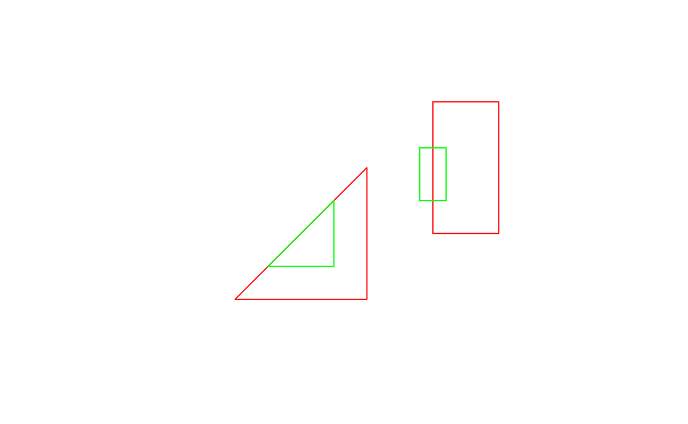

--- 
title: 'Geocomputation with R'
author:
- Robin Lovelace
- Jakub Nowosad
date: '2017-06-09'
knit: bookdown::render_book
site: bookdown::bookdown_site
documentclass: book
bibliography:
  - refs.bib
  - packages.bib
biblio-style: apalike
link-citations: yes
github-repo: Robinlovelace/geocompr
url: http\://robinlovelace.net/geocompr
---


# Welcome {-}

Welcome to **geocompr** the [website](http://robinlovelace.net/geocompr) of our forthcoming book with [CRC Press](https://www.crcpress.com/Chapman--HallCRC-The-R-Series/book-series/CRCTHERSER).

## Development {-}

Inspired by the **bookdown** [R package](https://github.com/rstudio/bookdown) we are developing this book in the open.
We decided to make the book open source to encourage contributions, ensure reproducibility and provide access to the material as it evolves.

We're developing the book in 3 main phases.
We're in phase 1 and focussed on the first 5 main chapters, which we aim to be complete by September.
Drafts of other chapters will be added to this website as they project progresses.

The latest version is hosted at [robinlovelace.net/geocompr](http://robinlovelace.net/geocompr).
This website is kept up-to-date thanks to Travis, a continuous integration (CI) service.
Travis automatically rebuilds the book and finds bugs by reporting the 'build status' after every update.
Currently the build is:

[](https://travis-ci.org/Robinlovelace/geocompr) 

The version of the book you are reading now was built on 2017-06-09 and was built on [Travis](https://travis-ci.org/Robinlovelace/geocompr).
**bookdown** makes editing a book as easy as editing a wiki.
To do so, just click on the 'edit me' icon highlighted in the image below.
Which-ever chapter you are looking at, this will take you to the source [R Markdown](http://rmarkdown.rstudio.com/) file hosted on GitHub. If you have a GitHub account, you'll be able to make changes there and submit a pull request. If you do not, it's time to [sign-up](https://github.com/)! 

[](https://github.com/Robinlovelace/geocompr/edit/master/index.Rmd)

To raise an issue about the book's content (e.g. code not running) or make a feature request, check-out the [issue tracker](https://github.com/Robinlovelace/geocompr/issues).

## Reproducibility {-}

To reproduce the book, you need a recent version of [R](https://cran.r-project.org/) and up-to-date packages.
The following code should install the required packages:


```r
if(!require(devtools)) {
  install.packages("devtools")
}
devtools::install_github("robinlovelace/geocompr")
devtools::install_github("nowosad/spData")
```

To build the book locally, clone or [download](https://github.com/Robinlovelace/geocompr/archive/master.zip) the repo and run the following line from the [project](https://github.com/Robinlovelace/geocompr/blob/master/geocompr.Rproj)'s root directory:


```r
bookdown::render_book("index.Rmd") # to build the book
browseURL("_book/index.html") # to view it
```

For further details see the book's GitHub page at [Robinlovelace/geocompr](https://github.com/Robinlovelace/geocompr#geocomputation-with-r).

## Acknowledgements {-}

<!-- -->


<!--chapter:end:index.Rmd-->


# Introduction {#intro}

This book exists at the intersection between Geography and R (Figure \@ref(fig:venn)).
Suggested titles were *Geography with R* and *R for GIS*, each of which has advantages.
The former conveys the message that it's not just about spatial data: 
non-spatial attribute data are inevitably interwoven with geometry data, and Geography is about more than where something is on the map.
The latter option communicates that this is a book about using R as a *Geographic Information System* (GIS), to perform spatial operations on *geographic data* [@bivand_applied_2013].
However, the term GIS has some negative connotations (see Table \@ref(tab:gdsl)) and fails to communicate one of R's greatest strengths:
its unparalleled ability to seamlessly switch between geographic and non-geographic data processing, modeling and visualization tasks.

<div class="figure" style="text-align: center">

<p class="caption">(\#fig:venn)Venn diagram of the intersection between Geography and R.</p>
</div>

The title was chosen because this book is about more than routine spatial data processing, something that is well captured by the term *geocomputation*.
What defines geocomputation as a development on previous work is the "creative and experimental use of GIS that it entails" [@longley_geocomputation:_1998].
With geocomputation geographic data can be used in new ways.

Another advantage of geocomputation that it conveys the centrality of the concept of algorithms (which can be implemented in R functions) to advanced geographical research. Geocomputation is a relatively
young field^[Geocomputation
has a ~30 year history dating back to the first [conference](http://www.geocomputation.org/) on the subject in 1996 (at the University of Leeds where the concept for this book was dreamt up) which was followed by a flurry of subsequent
publications.]
but methods published under the geocomputational banner have influenced the direction of geographical research, as we will see in subsequent chapters.
Algorithms are powerful tools that can become highly complex.
However, all algorithms are composed of smaller parts.
By teaching these foundations we aim to empower you.
Creating your own solutions to geographic data problems can feel like breaking free from the metaphorical 'glass ceiling' imposed by GUI-based proprietary geographic information systems (see Table \@ref(tab:gdsl) for a definition of GUI).

<!-- todo: what contributions, which will we use, where in the book? -->

While embracing recent developments in the field, we also wanted to pay respects the wider field of Geography, and its 2000 year history [@roller_eratosthenes_2010], of which geocomputation is a part.
Geography has played an important role in explaining and influencing humanity's relationship with the natural world and this book aims to be a part of the 'Geographic tradition'.
Geocomputation in this book therefore means more than simply analyzing geographic data on a computer.
It's about trying to make research which involves making geographic data more reproducible, scientific and socially beneficial.
This book is also part of the movement towards Geographic Data Science (GDS) which differs from GIS in several ways, some of which are outlined in Table \@ref(tab:gdsl).
Inspired by the emphasis of GDS research on reproducibility, this book aims teach how to do geocomputation rather than just think about it.


Table: (\#tab:gdsl)Differences in emphasis between the fields of Geographic Information Systems (GIS) and Geographic Data Science (GDS).

Attribute          GIS                        GDS                              
-----------------  -------------------------  ---------------------------------
Home disciplines   Geography                  Geography, Computing, Statistics 
Software focus     Graphical User Interface   Code                             
Reproduciblility   Minimal                    Maximal                          

## Why Geocomputation with R?

In this book we treat R as a 'tool for the trade'.
Early geographers used a variety of tools including rulers, compasses and sextants to advance knowledge about the world. 
<!--nowadays part-->
It is important to remember that while R is a powerful tool, especially when interfaced with other software such as [GDAL](http://www.gdal.org/) and [PostGIS](http://postgis.net/), other tools may be better for certain tasks.

R is characterised by its flexibility, enabling geographical software developers to extend it in multiple ways.
A good example of this is support for generating interactive maps thanks to **leaflet** [@R-leaflet], which has been subsequently built-on by **tmap** and **mapview** [@R-mapview; @R-tmap].
These packages help overcome the criticism that R has "limited interactive [plotting] facilities" [@bivand_applied_2013].
This is no longer true, as illustrated by the code below which generates Figure \@ref(fig:interactive).


```r
library(leaflet)
popup = c("Robin", "Jakub")
leaflet() %>%
  addProviderTiles("NASAGIBS.ViirsEarthAtNight2012") %>% 
  addAwesomeMarkers(lng = c(-3, 23), lat = c(52, 53), popup = popup)
```

<div class="figure" style="text-align: center">
preservedc0d68da0be916ab
<p class="caption">(\#fig:interactive)World at night imagery from NASA overlaid by the authors' approximate home locations to illustrate interactive mapping with R.</p>
</div>

It would be difficult to produce Figure \@ref(fig:interactive) with only 4 lines of code in another language, let alone embed the results in an interactive html page (the interactive version can be viewed at [robinlovelace.net/geocompr](http://robinlovelace.net/geocompr/intro.html)), illustrating R's flexibility. 

<!-- Other reasons for using R for geocompuation include: -->

R provides a stable language that should behave consistently across multiple computers, free of charge.
The use of R code therefore enables teaching geocomputation with reference to reproducible examples such as that provided in \@ref(fig:interactive) rather than abstract concepts.
But before cracking-on with the action, a few introductory remarks are needed to explain the approach taken here and provide context.

## R's spatial ecosystem

<!-- Ideas here on the history please @nowosad! -->
<!-- short S story - an interface to Fortran and C -->
<!-- even shorter R story - it's rapid development -->
<!-- nowadays R - an interface to GIS (GIS libraries gdal, proj, geos; GIS software GRASS GIS, SAGA, QGIS, ArcGIS; GIS javascript libraries leaflet, etc.) -->

<!-- R spatial story (from spatstat, by maptools, sp, raster, leaflet, to sf) -->

The most important recent evolution in R's spatial ecosystem has without doubt been support for simple features thanks to the **sf** package [@R-sf], described in Chapter \@ref(spatial-class).

<!-- 
- r, rstudio, gdal, proj4, geos, udunits 
- r packages sf, raster, etc.
- datasets 
-->

<!-- ## Introduction to GIS -->

<!-- 
- what's R
- what's GIS
- GIS data models (vector vs raster)
- coordinate reference system - CRS
- GIS data formats
- GDAL, GEOS, PROJ4
- GIS R package
- GIS beyond R 
-->

<!--chapter:end:01-introduction.Rmd-->


# Simple features and plots {#spatial-class}


## Prerequisites {-}

<!--
- classes and methods in R
-->

## An introduction to Simple Features {#intro-sf}

Simple Features is an open standard data model developed and endorsed by the Open Geospatial Consortium ([OGC](http://portal.opengeospatial.org/files/?artifact_id=25355)) to describe how features with geographical and non-geographical features should be represented.
It is a hierarchical data model that simplifies geographic data by condensing the complex range of possible geographic forms (e.g., line, point, polygon, multipolygon forms) into a single geometry class.

<!-- (Figure \@ref(fig:sf-ogc)). -->

<!-- ```{r sf-ogc, fig.cap="The Simple Features class hierarchy, used with permission (on condition of linking to the source) from the Open Geospatial Consortium's document 06-103r4 (see http://www.opengeospatial.org/standards/sfa)", out.width="100%", echo=FALSE} -->
<!-- knitr::include_graphics("figures/simple-feature-class-hierarchy.png") -->
<!-- ``` -->

The R implementation of Simple Features is provided by the **sf** package [@R-sf], which can be installed with the following command:^[The
development version, which may contain new features, can be installed with `devtools::install_github("edzer/sfr")`
]


```r
install.packages("sf")
```

**sf** incorporates the functionality of the 3 main packages of the **sp** paradigm (**sp** [@R-sp] for the class system, **rgdal** [@R-rgdal] for reading and writing data, **rgeos** [@R-rgeos] for spatial operations undertaken by GEOS) in a single, cohesive whole.
This is well-documented in **sf**'s [vignettes](http://cran.rstudio.com/package=sf):


```r
vignette("sf1") # for an introduction to the package
vignette("sf2") # for reading, writing and converting Simple Features
vignette("sf3") # for manipulating Simple Features
```

As the first vignette explains, simple feature objects in R are stored in a data frame, with geographic data occupying special column, a 'list-column'. This column is usually named 'geom' or 'geometry'.
A 'real world' example is loaded by the **spData** package, which loads the `world` object:


```r
library(spData)
data("world")
```

In the above code **spData** silently loaded the `world` dataset (and many other spatial datasets - see [nowosad/spData](https://github.com/Nowosad/spData) for a full list).
The dataset contains spatial and non-spatial information, as shown by the function `names()`, which reports the column headings in data frames. 
This can be seen as the final column name of `world`:


```r
names(world)
#>  [1] "iso_a2"    "name_long" "continent" "region_un" "subregion"
#>  [6] "type"      "area_km2"  "pop"       "lifeExp"   "gdpPercap"
#> [11] "geom"
```

It is the contents of this modest-looking `geom` column, gives `sf` objects their spatial powers.
It's actually a list-column, containing all the coordinates needed to plot the result as a map using the `plot()` method, the results of which are presented in Figure \@ref(fig:world-all).


```r
library(sf) # must be loaded to plot sf objects
#> Linking to GEOS 3.5.0, GDAL 2.1.0, proj.4 4.8.0
plot(world)
#> Warning: plotting the first 9 out of 10 attributes; use max.plot = 10 to
#> plot all
```

<div class="figure" style="text-align: center">

<p class="caption">(\#fig:world-all)A spatial plot of the world using the sf package, with a facet for each attribute.</p>
</div>

Note that instead of creating a single map, as most GIS programs would, the `plot()` command has created multiple maps, one for each variable in the `world` datasets.
This behavior can be useful for exploring the spatial distribution of different variables and is discussed further in @\ref(basic-map) below.

Being able to treat spatial objects as regular data frames with spatial powers has many advantages, especially if you are already used to working with data frames.
We explore such 'attribute operations' in Chapter \@ref(attr).
First, it's worth taking a look at the basic behavior and contents of this simple feature object, which can usefully be thought of as a '**S**patial data**F**rame).

`sf` objects are easy to subset.
The code below shows its first 2 rows and 3 columns.
The output shows 2 major differences compared with a regular `data.frame`: the inclusion of additional geographic data (`geometry type`, `dimension`, `bbox` and CRS information - `epsg (SRID)`, `proj4string`), and the presence of final `geometry` column:


```r
world[1:2, 1:3]
#> Simple feature collection with 2 features and 3 fields
#> geometry type:  MULTIPOLYGON
#> dimension:      XY
#> bbox:           xmin: 11.6401 ymin: -17.93064 xmax: 75.15803 ymax: 38.48628
#> epsg (SRID):    4326
#> proj4string:    +proj=longlat +datum=WGS84 +no_defs
#>   iso_a2   name_long continent                           geom
#> 1     AF Afghanistan      Asia MULTIPOLYGON(((61.210817091...
#> 2     AO      Angola    Africa MULTIPOLYGON(((16.326528354...
```

All this may seem rather complex, especially for a class system that is supposed to be simple.
However, there are good reasons for organizing things this way and using **sf**.

### Exercises

What does the summary of the `geometry` column tell us about the `world` dataset, in terms of:

- The geometry type?
- How many countries there are?
- The coordinate reference system (CRS)?

## Why Simple Features?

There are many advantages of **sf** over **sp**, including:

- Faster reading and writing of data (more than 10 times faster in some cases)
- Better plotting performance
- **sf** objects can be treated as dataframes in most operations
- **sf** functions can be combined using `%>%` operator and works well with the [tidyverse](http://tidyverse.org/) collection of R packages
- **sf** function names are relatively consistent and intuitive (all begin with `st_`) compared with the function names and syntax of the **sp**, **rgdal** and **rgeos** packages that it supersedes.

A broader advantage is that simple features are so well supported by other software products, not least PostGIS, which has heavily influenced the design of **sf**.

A disadvantage you should be aware of, however, is that **sf** is not *feature complete* and that it continues to evolve.
The transition from **sp** to **sf** will likely take many years, and many spatial packages may never switch.
Even if you discover spatial data with R through the **sf** package, it is still worth at least being aware of **sp** classes, even if you rarely use them for everyday geospatial tasks.

Fortunately it is easy to translate between **sp** and **sf** using the `as()` function: 


```r
library(sp)
world_sp = as(object = world, Class = "Spatial")
```

## Basic map making {#basic-map}

Basic maps in **sf** can be created quickly with the base `plot()` function. Unlike **sp**, however, **sf** by default creates a faceted plot, one sub-plot for each variable, as illustrated in the left-hand image in Figure \@ref(fig:sfplot). 


```r
plot(world[3:4])
plot(world["pop"])
```

<div class="figure" style="text-align: center">

<p class="caption">(\#fig:sfplot)Plotting with sf, with multiple variables (left) and a single variable (right).</p>
</div>

As with **sp**, you can add layers to your maps created with `plot()`, with the argument `add = TRUE`.^[In
fact, when you `plot()` an **sf** object, R is calling `sf:::plot.sf()` behind the scenes.
`plot()` is a generic method that behaves differently depending on the class of object being plotted.]
To illustrate this, and prepare for content covered in chapters \@ref(attr) and \@ref(spatial-data-operations) on attribute and spatial data operations, we will subset and combine countries in the `world` object, to create a single object that represents Asia:


```r
asia = world[world$continent == "Asia", ]
asia = st_union(asia)
```

We can now plot the Asian continent over a map of the world.
Note, however, that this only works if the initial plot has only 1 layer:


```r
plot(world["pop"])
plot(asia, add = TRUE, col = "red")
```


This can be very useful for quickly checking the geographic correspondence between two or more layers: 
the `plot()` function is fast to execute and requires few lines of code, but does not create interactive maps with a wide range of options.
For more advanced map making we recommend using a dedicated visualisation package such as **tmap**, **ggplot2**, **mapview**, or **leaflet**.
<!-- TODO: cross reference advanced mapping chapter -->

<!-- 
- plot() function 
- map export 
-->

### Challenge

Using **sf**'s `plot()` command, create a map of Nigeria in context, like the one presented in figure \@ref(fig:nigeria). 

- Hint: this used the `lwd`, `main` and `col` arguments of `plot()`. 
- Bonus: make the country boundaries a dotted grey line.
- Hint: `border` is an additional argument of `plot()` for **sf** objects.

<div class="figure" style="text-align: center">

<p class="caption">(\#fig:nigeria)Map of Nigeria in context illustrating sf's plotting capabilities</p>
</div>

### Further work

**sf** makes R data objects more closely aligned to the data model used in GDAL and GEOS, in theory making spatial data operations faster.
The work here provides a taster of the way that **sf** operates but there is much more to learn (see Chapter \@ref(spatial-data-operations)).
There is a wealth of information that is available in the package's vignettes: these are highly recommended.

As a final exercise, we'll see how to do a spatial overlay in **sf** by first converting the countries of the world into centroids and then subsetting those in Asia.
Because **sf**'s `plot()` builds on the base `plot()` function, you have access to all the base plotting options developed for base plotting.
If you are accustomed to base plotting, this will be useful, as illustrated by the variable circle sizes generated by the `cex` argument in Figure \@ref(fig:africa), which was generated using the code below.


```r
world_centroids = st_centroid(world)
plot(world["continent"])
plot(world_centroids, add = TRUE, cex = world$pop / 1e8, lwd = 3)
```

<div class="figure" style="text-align: center">

<p class="caption">(\#fig:africa)Centroids representing country population, diameter being proportional to population.</p>
</div>

Note: another way of acheiving the same result is with a GEOS function for identifying spatial overlay, which we'll cover in more datail in Chapter \@ref(spatial-data-operations).


```r
sel_asia = st_intersects(world_centroids, asia, sparse = FALSE)
#> although coordinates are longitude/latitude, it is assumed that they are planar
summary(sel_asia)
#>      V1         
#>  Mode :logical  
#>  FALSE:134      
#>  TRUE :43
```

<!-- More appropriate for subsequent chapters. -->
<!-- This shows that there are 43 countries in Asia -->
<!-- We can check if they are the same countries as follows: -->

<!-- ```{r} -->
<!-- africa_centroids2 = world_centroids[sel_africa,] -->
<!-- identical(africa_centroids, africa_centroids2) -->
<!-- ``` -->

### Exercises

- What does the `lwd` argument do in the `plot()` code that generates Figure \@ref(fig:africa). 
- Perform the same operations and map making for another continent of your choice.
- Bonus: Download some global geographic data and add attribute variables assigning them to the continents of the world.


## Simple feature geometries, collections and data frames {#sfg}

To understand new data formats in depth, it often helps to generate them for first principles.
This section walks through vector spatial classes step-by-step, from the simplest simple feature geometry to simple feature objects, with class `sf`, representing complex spatial data.
Before describing each geometry type that the **sf** package supports it is worth taking a step back to understand the building blocks of `sf` objects. 

As stated in section \@ref(intro-sf), simple features are simply dataframes with at least one special column that makes it spatial.
These spatial columns are often called `geom` or `geometry` and can be like non-spatial columns: `world$geom` refers to the spatial element of the `world` object described above.
These geometry columns are 'list columns' of class `sfc`: they are *simple feature collections*.
In turn, `sfc` objects are composed of one or more objects of class `sfg`: simple feature geometries.

To understand how the spatial components of simple features work, it is vital to understand simple feature geometries.
For this reason we cover each type currently supported `sfg` in the next section before moving to describe how they can be combined to form `sfc` and eventually full `sf` objects.


## Simple feature geometries


```r
sfg_point = st_point(c(0, 1))
```


<!-- 
sf data types:
- POINT
- LINESTRING
- POLYGON
- MULTIPOINT
- MULTILINESTRING
- MULTIPOLYGON
- GEOMETRYCOLLECTION
- CIRCULARSTRING
- COMPOUNDCURVE
- CURVEPOLYGON
- MULTICURVE
- MULTISURFACE
- CURVE
- SURFACE
- POLYHEDRALSURFACE
- TIN
- TRIANGLE

- what's sf, sfc, sfg
- methods(class = "sf")

-->

## Raster data

<!-- 
- raster data types 
- RasterLayer
- RasterStack
- RasterBrick
-->

<!--chapter:end:02-spatial-data.Rmd-->


# Attribute data operations {#attr}

## Prerequisites {-}

- This chapter requires **tidyverse** and **sf**:


```r
library(sf)
library(tidyverse)
```

- You must have loaded the `world` and `worldbank_df` data from the **spData** package:


```r
library(spData)
data("world")
data("worldbank_df")
```

## Introduction

Attribute data is non-geographic information associated with geographical data.
In the context of simple features, introduced in the previous chapter, this means a data frame with one row for each of the geographic features stored in the `geom` variables of `sf` objects.
This structure enables multiple columns to represent a range of attributes for thousands of features (one row per feature).

There is a strong overlap between geographical and non-geographical operations:
non-spatial subset, aggregate and join each have their geographical equivalents.
This chapter therefore provides the foundation for next (chapter \@ref(spatial-data-operations)) in terms of structure and input data.
The non-spatial versions of these methods are widely used and (using functions such as `filter()` and `[`) cross-transferable to the trickier tasks of spatial data operations.

Simple features are represented with class `sf`, defined in the **sf** package.
This is shown in the result of the function `class()` applied to the `world` object:
Thus the object behaves in the same way as a `data.frame`, but it contains a special column called `geom`.


```r
class(world)
#> [1] "sf"         "data.frame"
```

The output shows that `sf` objects actually have two classes, `sf` and `data.frame`. 
This duality is central to the concept of simple features:
most of the time `sf` can be treated as and behave like `data.frame`s.
Simple features are, in essence, data frames with a spatial extension.

The trusty `data.frame` (and extensions to it such as the `tibble` class used in the tidyverse) is a workhorse for data analysis in R.
Extending this system to work with spatial data has many advantages,
meaning that all the accumulated know-how in the R community for handling data frames to be applied to geographic data which contain attributes.

Before proceeding to perform various attribute operations of a dataset, it is worth taking time to think about its basic parameters.
In this case, the  `world` object contains 10 non-geographical columns (and one geometry list-column) with data for almost 200 countries.
This can be be checked using base R functions for working with tabular data such as `nrow()` and `ncol()`:


```r
dim(world) # it is a 2 dimensional object, with rows and columns
#> [1] 177  11
nrow(world) # how many rows?
#> [1] 177
ncol(world) # how many columns?
#> [1] 11
```

Extracting the attribute data of an `sf` object is the same as removing the geometry column:


```r
world_df = st_set_geometry(world, NULL)
class(world_df)
#> [1] "data.frame"
```

This can be useful if the geometry column causes problems, e.g. by occupying large amounts of RAM, or when you want to save the non-spatial data.
For most cases, however, there is no harm in keeping the geometry column because non-spatial data operations on `sf` objects act only on the attribute data.
For this reason, being good at working with attribute data in geographic data is the same being proficient at handling data frames in R.
For many applications, the most effective and intuitive way of working with data frames is with the **dplyr** package, as we will see in the next
section.^[
Unlike objects of class `Spatial` defined by the **sp** package, `sf` objects are also compatible with **dplyr** and **data.table** packages, which provide fast and powerful functions for data manipulation (see [Section 6.7](https://csgillespie.github.io/efficientR/data-carpentry.html#data-processing-with-data.table) of @gillespie_efficient_2016).
This chapter focusses on **dplyr** because of its intuitive function names and ability to perform multiple chained operations using the pipe operator.]

## Attribute subsetting

<!-- info about pull (dplyr 0.6): -->
<!-- https://github.com/tidyverse/dplyr/commit/0b9aabf6c06c9cd3b784b155044d497d4b93df3e -->
Because simple feature objects are also data frames, you can use a wide range of functions (from base R and packages) for subsetting them, based on attribute data.
Base R subsetting functions include `[`, `subset()` and  `$`.
**dplyr** subsetting functions include `select()`, `filter()`, and `pull()`.
Most of the functions preserve the geometry column.

You can use the `[` operator to subset rows and columns. 
Two arguments are required, one for rows (observations) and one for columns (variables), e.g. [rows, columns].
These arguments could be either numeric, which indicates a position, or character, which indicates a name of row or column.


```r
world[1:6, ] # subset rows by position
```


```r
world[, 1:3] # subset columns by position
```


```r
world[, c("name_long", "lifeExp")] # subset columns by name
```

You can also subset a `sf` object based on a given condition using (surprise, surprise...) the `subset()` function:


```r
small_countries = subset(world, area_km2 < 10000)
```

The `$` operator retrieves a variable by its name and returns a vector:


```r
world$name_long
```

<!-- , after the package has been loaded: [or - it is a part of tidyverse] -->
**dplyr** makes working with data frames easier and is compatible with `sf` objects.
The main **dplyr** functions that help with attribute subsetting are `select()`, `filter()` and `pull()`.

The `select()` function picks columns by its name.
For example, you could select only two columns - `name_long` and `pop`:


```r
world1 = select(world, name_long, pop)
head(world1, n = 2)
#> Simple feature collection with 2 features and 2 fields
#> geometry type:  MULTIPOLYGON
#> dimension:      XY
#> bbox:           xmin: 11.6401 ymin: -17.93064 xmax: 75.15803 ymax: 38.48628
#> epsg (SRID):    4326
#> proj4string:    +proj=longlat +datum=WGS84 +no_defs
#>     name_long      pop                           geom
#> 1 Afghanistan 31627506 MULTIPOLYGON(((61.210817091...
#> 2      Angola 24227524 MULTIPOLYGON(((16.326528354...
```

This function gives a possibility to select a range of columns with an `:` operator or exclude some columns with an `-` operator:


```r
# all columns between name_long and pop (inclusive)
world2 = select(world, name_long:pop)
head(world2, n = 2)
```


```r
# all columns except subregion and area_km2 (inclusive)
world3 = select(world, -subregion, -area_km2)
head(world3, n = 2)
```

The `select()` function can be also used to both subset and rename columns in a single line, for example:


```r
world4 = select(world, name_long, population = pop)
head(world4, n = 2)
#> Simple feature collection with 2 features and 2 fields
#> geometry type:  MULTIPOLYGON
#> dimension:      XY
#> bbox:           xmin: 11.6401 ymin: -17.93064 xmax: 75.15803 ymax: 38.48628
#> epsg (SRID):    4326
#> proj4string:    +proj=longlat +datum=WGS84 +no_defs
#>     name_long population                           geom
#> 1 Afghanistan   31627506 MULTIPOLYGON(((61.210817091...
#> 2      Angola   24227524 MULTIPOLYGON(((16.326528354...
```

This is more concise than the base R equivalent (which saves the result as an object called `world5` to avoid overriding the `world` dataset created previously):


```r
world5 = world[c("name_long", "pop")] # subset columns by name
names(world5)[3] = "population" # rename column manually
```

The `select()` function works with a number of special functions that help with more complicated selection, such as `contains()`, `starts_with()`, `num_range()`. 
More details could be find on the function help page - `?select`.

The `filter()` function is a **dplyr** alternative to the `subset()` function.
Its role is to keeps rows matching given criteria.


```r
# only countries with a life expectation larger than 82 years
world6 = filter(world, lifeExp > 82)
```

The standard set of comparison operators can be used in the `filter()` function: 


Symbol   Name                  
-------  ----------------------
`==`     Equal to              
`!=`     Not equal to          
`>`      Greater than          
`>=`     Greater than or equal 
`<`      Less than             
`<=`     Less than or equal    
`&`      And                   
|        Or                    
`!`      Not                   

<!-- describe these: ==, !=, >, >=, <, <=, &, | -->
<!-- add warning about = vs == -->
<!-- add info about combination of &, |, ! -->

The *pipe* operator (` %>% `), which passes the output of one function into the first argument of the next function, is commonly used in **dplyr** data analysis workflows.
This works because the fundamental **dplyr** functions (or 'verbs', like `select()`) all take a data frame object in and spit a data frame object out.
Combining many functions together with pipes is called *chaining* or *piping*.
The advantage over base R for complex data processing operations is that this approach prevents nested functions and is easy to read because there is a clear order and modularity to the work (a piped command can be commented out, for example).

The example below shows yet another way of creating the renamed `world` dataset, using the pipe operator:


```r
world7 = world %>%
  select(name_long, continent)
```

Note that this can also be written without the pipe operator because, in the above code, the `world` object is simply 'piped' into the first argument of `select()`.
The equivalent **dplyr** code without the pipe operator is:


```r
world8 = select(world, name_long, continent)
```

The `pull()`function retrieves a variable by its name or position and returns a vector:


```r
world %>% 
  pull(name_long)
```

The pipe operator can be used for many data processing tasks with attribute data.


```r
# 1,000,000,000 could be expressed as 1e9 in the scientific notation 
world %>%
  filter(pop > 1e9) 
#> Simple feature collection with 2 features and 10 fields
#> geometry type:  MULTIPOLYGON
#> dimension:      XY
#> bbox:           xmin: -180 ymin: -90 xmax: 180 ymax: 83.64513
#> epsg (SRID):    4326
#> proj4string:    +proj=longlat +datum=WGS84 +no_defs
#>   iso_a2 name_long continent region_un     subregion              type
#> 1     CN     China      Asia      Asia  Eastern Asia           Country
#> 2     IN     India      Asia      Asia Southern Asia Sovereign country
#>   area_km2      pop lifeExp gdpPercap                           geom
#> 1  9409832 1.36e+09    75.8     12759 MULTIPOLYGON(((110.33918786...
#> 2  3142892 1.30e+09    68.0      5392 MULTIPOLYGON(((77.837450799...
```

This is equivalent to the following base R code (not run to preserve the NAs):^[[Note](https://github.com/Robinlovelace/geocompr/issues/28) NAs do not work for subsetting by inequalities in base R, hence conversion of NAs to 0s in this version)]


```r
# subsetting simple feature rows by values
world$pop[is.na(world$pop)] = 0 # set NAs to 0
world_few_rows = world[world$pop > 1e9,]
```

The ` %>% ` operator works the best for combining many operations.
For example, we want to (1) rename the `name_long` column into a `name` column, (2) picks only `name`, `subregion` and `gdpPercap` and (3) subset countries from "Eastern Asia" with gross domestic product per capita larger than 30,000$:


```r
world %>% 
  select(name = name_long, subregion, gdpPercap) %>% 
  filter(subregion == "Eastern Asia", gdpPercap > 30000)
#> Simple feature collection with 2 features and 3 fields
#> geometry type:  MULTIPOLYGON
#> dimension:      XY
#> bbox:           xmin: -180 ymin: -90 xmax: 180 ymax: 83.64513
#> epsg (SRID):    4326
#> proj4string:    +proj=longlat +datum=WGS84 +no_defs
#>                name    subregion gdpPercap                           geom
#> 1             Japan Eastern Asia     37365 MULTIPOLYGON(((134.63842817...
#> 2 Republic of Korea Eastern Asia     33640 MULTIPOLYGON(((128.34971642...
```

### Exercises

<!-- 
1. Select columns A and B
2. Select columns with "region" -> use contains() 
3. Find all countries that: (few points)
4. Exercises about additional select and filter helper functions (one_of; between, is.na, near, etc.)
 -->

## Attribute data aggregation 

<!-- https://github.com/ropenscilabs/skimr ?? -->

The `summary()` function is used to obtain summary statistics of `sf` objects:


```r
# data summary 
summary(world)
#>     iso_a2           name_long          continent        
#>  Length:177         Length:177         Length:177        
#>  Class :character   Class :character   Class :character  
#>  Mode  :character   Mode  :character   Mode  :character  
#>                                                          
#>                                                          
#>                                                          
#>                                                          
#>   region_un          subregion             type          
#>  Length:177         Length:177         Length:177        
#>  Class :character   Class :character   Class :character  
#>  Mode  :character   Mode  :character   Mode  :character  
#>                                                          
#>                                                          
#>                                                          
#>                                                          
#>     area_km2             pop              lifeExp       gdpPercap     
#>  Min.   :    2417   Min.   :5.63e+04   Min.   :48.9   Min.   :   566  
#>  1st Qu.:   46185   1st Qu.:3.86e+06   1st Qu.:64.3   1st Qu.:  3502  
#>  Median :  185004   Median :1.05e+07   Median :72.8   Median : 10740  
#>  Mean   :  832870   Mean   :4.29e+07   Mean   :70.6   Mean   : 17379  
#>  3rd Qu.:  621860   3rd Qu.:3.08e+07   3rd Qu.:77.1   3rd Qu.: 24375  
#>  Max.   :16989128   Max.   :1.36e+09   Max.   :83.6   Max.   :132120  
#>                     NA's   :9          NA's   :9      NA's   :17      
#>             geom    
#>  MULTIPOLYGON :177  
#>  epsg:4326    :  0  
#>  +proj=long...:  0  
#>                     
#>                     
#>                     
#> 
```

This function role is to give a quick glimpse of data in an interactive mode.
The `summary()` function, however, is not very customizable and should not be used to create new objects.
`summarise()` from the `dplyr` package can be used as an alternative in these cases.
In this function, we need to define what kind of statistics and for which variables we want to calculate.
For example, we could calculate the world's population and number of countries in the world:


```r
# customized data summary
world_summary = world %>% 
  summarise(pop = sum(pop, na.rm = TRUE), country_n = n())
world_summary
#> Simple feature collection with 1 feature and 2 fields
#> geometry type:  MULTIPOLYGON
#> dimension:      XY
#> bbox:           xmin: -180 ymin: -90 xmax: 180 ymax: 83.64513
#> epsg (SRID):    4326
#> proj4string:    +proj=longlat +datum=WGS84 +no_defs
#>        pop country_n                           geom
#> 1 7.21e+09       177 MULTIPOLYGON(((-159.2081835...
```

<!-- ?? open a github issue-->
<!-- ```{r} -->
<!-- plot(world_summary) -->
<!-- ``` -->

The list of useful functions could be find in the helpfile of this function - `?summarise`.
The whole power of `summarise()` is revealed when it is combined with the `group_by()` function.
This allow to summary requested subsets of data.
For example, we want to get the total population and number of countries on every continent:


```r
# data summary by groups
world_continents = world %>% 
  group_by(continent) %>% 
  summarise(pop = sum(pop, na.rm = TRUE), country_n = n())
world_continents
#> Simple feature collection with 8 features and 3 fields
#> geometry type:  GEOMETRY
#> dimension:      XY
#> bbox:           xmin: -180 ymin: -90 xmax: 180 ymax: 83.64513
#> epsg (SRID):    4326
#> proj4string:    +proj=longlat +datum=WGS84 +no_defs
#> # A tibble: 8 x 4
#>    continent      pop country_n              geom
#>        <chr>    <dbl>     <int>  <simple_feature>
#> 1     Africa 1.15e+09        51 <MULTIPOLYGON...>
#> 2 Antarctica 0.00e+00         1 <MULTIPOLYGON...>
#> 3       Asia 4.31e+09        47 <MULTIPOLYGON...>
#> 4     Europe 7.39e+08        39 <MULTIPOLYGON...>
#> # ... with 4 more rows
```

<!-- ?? open a github issue -->
<!-- ```{r} -->
<!-- plot(world_continents) -->
<!-- ``` -->

<!-- should it stay or should it go (?) aka should we present the arrange function?: -->

<!-- ```{r} -->
<!-- # sort variables -->
<!-- ## by name -->
<!-- world_continents %>%  -->
<!--   arrange(continent) -->
<!-- ## by population (in descending order) -->
<!-- world_continents %>%  -->
<!--   arrange(-pop) -->
<!-- ``` -->

### Exercises

<!-- -->

## Attribute data joining 

<!-- https://github.com/dgrtwo/fuzzyjoin -->
<!-- http://r4ds.had.co.nz/relational-data.html -->
<!-- non-unique keys -->

Combining data from different sources is one of the most common task in data preparation. 
It could be done using joins - methods created to work with a pair of tables.
The **dplyr** package has a set of verbs to easily connect `data.frames` - `left_join()`, `right_join()`,  `inner_join()`, `full_join`, `semi_join()` and `anti_join()`. 
They are thoroughly explained in the Relational data chapter in the book R for Data Science [@grolemund_r_2016].

Working with spatial data, however, usually involves a connection between spatial data (`sf` objects) and tables (`data.frame` objects).
Fortunately, the **sf** package has all of the **dplyr** join functions adapted to work with `sf` objects.
The only important difference between combining two `data.frames` and combining `sf` with `data.frame` is a `geom` column.
Therefore, the result of data joins could be either an `sf` or `data.frame` object.

The easiest way to understand the concept of joins is to use a smaller datasets. 
We will use an `sf` object `north_america` with country codes (`iso_a2`), names and geometries, as well as `data.frame` object `wb_north_america` containing information about urban population and unemployment for three countries. It is important to add that the first object has data about Canada, Greenland and United States and the second one has data about Canada, Mexico and United States:


```r
north_america = world %>%
  filter(subregion == "Northern America") %>%
  select(iso_a2, name_long)
north_america
#> Simple feature collection with 3 features and 2 fields
#> geometry type:  MULTIPOLYGON
#> dimension:      XY
#> bbox:           xmin: -180 ymin: -90 xmax: 180 ymax: 83.64513
#> epsg (SRID):    4326
#> proj4string:    +proj=longlat +datum=WGS84 +no_defs
#>   iso_a2     name_long                           geom
#> 1     CA        Canada MULTIPOLYGON(((-63.6645 46....
#> 2     GL     Greenland MULTIPOLYGON(((-46.76379 82...
#> 3     US United States MULTIPOLYGON(((-155.54211 1...
```


```r
plot(north_america[0])
```


```r
wb_north_america = worldbank_df %>% 
  filter(name %in% c("Canada", "Mexico", "United States")) %>%
  select(name, iso_a2, urban_pop, unemploy = unemployment)

wb_north_america
#>            name iso_a2 urban_pop unemploy
#> 1        Canada     CA  29022137     6.91
#> 2        Mexico     MX  99018446     5.25
#> 3 United States     US 259740511     6.17
```

In this book, we focus on spatial data. 
All of the following examples will have a `sf` object as the first argument and a `data.frame` object as the second argument. 
A new `sf` object will be a result of these joins. 
However, the reverse order is also possible and will result in a `data.frame` object.
This is beyond the scope of this book, but we encourage you to try it.

### Left joins

Left join is the most often used type of joins.
The `left_join()` returns all observations from the left object (`north_america`) and the matched observations from the right object (`wb_north_america`). 
In cases, like `Greenland`, when we don't have a data in the right object, `NA` values will be introduced.

To connect two object we need to specify a key.
This is a variable (or variables) that uniquely identifies each observation (row). 
The argument `by` is used to state which variable is the key. 
In simple cases, a single, unique variable exist in both objects, for example `iso_a2` column:


```r
left_join1 = north_america %>% 
  left_join(wb_north_america, by = "iso_a2")
left_join1
#> Simple feature collection with 3 features and 5 fields
#> geometry type:  MULTIPOLYGON
#> dimension:      XY
#> bbox:           xmin: -171.7911 ymin: 18.91619 xmax: -12.20855 ymax: 83.64513
#> epsg (SRID):    4326
#> proj4string:    +proj=longlat +datum=WGS84 +no_defs
#>   iso_a2     name_long          name urban_pop unemploy
#> 1     CA        Canada        Canada  29022137     6.91
#> 2     GL     Greenland          <NA>        NA       NA
#> 3     US United States United States 259740511     6.17
#>                             geom
#> 1 MULTIPOLYGON(((-63.6645 46....
#> 2 MULTIPOLYGON(((-46.76379 82...
#> 3 MULTIPOLYGON(((-155.54211 1...
```

It is also possible to join objects by different variables.
Both of the datasets have variables with names of countries, but they are named differently.
The `north_america` has a `name_long` column and the `wb_north_america` has a `name` column.
In these cases, we can use a named vector to specify the connection, e.g. `c("name_long" = "name")`:


```r
left_join2 = north_america %>% 
  left_join(wb_north_america, by = c("name_long" = "name"))
left_join2
#> Simple feature collection with 3 features and 5 fields
#> geometry type:  MULTIPOLYGON
#> dimension:      XY
#> bbox:           xmin: -171.7911 ymin: 18.91619 xmax: -12.20855 ymax: 83.64513
#> epsg (SRID):    4326
#> proj4string:    +proj=longlat +datum=WGS84 +no_defs
#>   iso_a2.x     name_long iso_a2.y urban_pop unemploy
#> 1       CA        Canada       CA  29022137     6.91
#> 2       GL     Greenland     <NA>        NA       NA
#> 3       US United States       US 259740511     6.17
#>                             geom
#> 1 MULTIPOLYGON(((-63.6645 46....
#> 2 MULTIPOLYGON(((-46.76379 82...
#> 3 MULTIPOLYGON(((-155.54211 1...
```

The new object `left_join2`, however is still not perfectly connected as it has two duplicated variables - `iso_a2.x` and `iso_a2.y`.
To solve this problem we should specify all the keys:


```r
left_join3 = north_america %>% 
  left_join(wb_north_america, by = c("iso_a2", "name_long" = "name"))
left_join3
#> Simple feature collection with 3 features and 4 fields
#> geometry type:  MULTIPOLYGON
#> dimension:      XY
#> bbox:           xmin: -171.7911 ymin: 18.91619 xmax: -12.20855 ymax: 83.64513
#> epsg (SRID):    4326
#> proj4string:    +proj=longlat +datum=WGS84 +no_defs
#>   iso_a2     name_long urban_pop unemploy                           geom
#> 1     CA        Canada  29022137     6.91 MULTIPOLYGON(((-63.6645 46....
#> 2     GL     Greenland        NA       NA MULTIPOLYGON(((-46.76379 82...
#> 3     US United States 259740511     6.17 MULTIPOLYGON(((-155.54211 1...
```

<!-- ```{r} -->
<!-- # error: keeps geom col -->
<!-- left_join4 = wb_north_america %>%  -->
<!--   left_join(north_america, by = c("iso_a2")) -->
<!-- left_join4 -->
<!-- ``` -->

### Right joins

The `right_join()` keeps all observations from the right object (`wb_north_america`), but in the same time preserves a `sf` class from the left object (`north_america`).


```r
right_join1 = north_america %>% 
  right_join(wb_north_america, by = c("iso_a2", "name_long" = "name"))
right_join1
#> Simple feature collection with 3 features and 4 fields (with 1 geometry empty)
#> geometry type:  MULTIPOLYGON
#> dimension:      XY
#> bbox:           xmin: -171.7911 ymin: 18.91619 xmax: -52.6481 ymax: 83.23324
#> epsg (SRID):    4326
#> proj4string:    +proj=longlat +datum=WGS84 +no_defs
#>   iso_a2     name_long urban_pop unemploy                           geom
#> 1     CA        Canada  29022137     6.91 MULTIPOLYGON(((-63.6645 46....
#> 2     MX        Mexico  99018446     5.25                 MULTIPOLYGON()
#> 3     US United States 259740511     6.17 MULTIPOLYGON(((-155.54211 1...
```

You can see that the new object `right_join1` has information about Mexico, but drop information about Greenland.
What's more, our right object, as a `data.frame`, doesn't have a geometry representation of Mexico.
As a result, the `right_join1` object contains only non-spatial data of Mexico.
It could be easily illustrated using the `plot` function:


```r
plot(right_join1[0]) # Canada and United States only
```


<!-- ```{r} -->
<!-- # error: unwanted geom column added -->
<!-- right_join2 = wb_north_america %>%  -->
<!--   right_join(north_america, by = "iso_a2") #%>% plot() -->
<!-- right_join2 -->
<!-- ``` -->

### Inner joins

The `inner_join()` keeps only observations from the left object (`north_america`) where there are matching observations in the right object (`wb_north_america`). 
Additionally, all columns from the left and right object are kept:


```r
inner_join1 = north_america %>% 
  inner_join(wb_north_america, by = c("iso_a2", "name_long" = "name"))
inner_join1
#> Simple feature collection with 2 features and 4 fields
#> geometry type:  MULTIPOLYGON
#> dimension:      XY
#> bbox:           xmin: -171.7911 ymin: 18.91619 xmax: -52.6481 ymax: 83.23324
#> epsg (SRID):    4326
#> proj4string:    +proj=longlat +datum=WGS84 +no_defs
#>   iso_a2     name_long urban_pop unemploy                           geom
#> 1     CA        Canada  29022137     6.91 MULTIPOLYGON(((-63.6645 46....
#> 2     US United States 259740511     6.17 MULTIPOLYGON(((-155.54211 1...
```

<!-- ```{r} -->
<!-- # error: geom column added -->
<!-- inner_join2 =  wb_north_america %>%  -->
<!--   inner_join(north_america, by = "iso_a2")  -->
<!-- inner_join2 -->
<!-- ``` -->

### Semi joins

The `semi_join()` is very similar to the `inner_join()`. 
It also keeps only observations from the left object (`north_america`) where there are matching observations in the right object, but keeping just columns from the left one:
<!-- filtering? -->


```r
semi_join1 = north_america %>% 
  semi_join(wb_north_america, by = "iso_a2")
semi_join1
#> Simple feature collection with 2 features and 2 fields
#> geometry type:  MULTIPOLYGON
#> dimension:      XY
#> bbox:           xmin: -171.7911 ymin: 18.91619 xmax: -52.6481 ymax: 83.23324
#> epsg (SRID):    4326
#> proj4string:    +proj=longlat +datum=WGS84 +no_defs
#>   iso_a2     name_long                           geom
#> 1     CA        Canada MULTIPOLYGON(((-63.6645 46....
#> 2     US United States MULTIPOLYGON(((-155.54211 1...
```

<!-- ```{r} -->
<!-- semi_join2 = wb_north_america %>% -->
<!--   semi_join(north_america, by = "iso_a2") -->
<!-- semi_join2 -->
<!-- ``` -->

### Anti joins

The `anti_join()` returns all rows from the left object that are not matching observations in the right object.
Only columns from the right object are kept:


```r
anti_join1 = north_america %>% 
  anti_join(wb_north_america, by = "iso_a2")
anti_join1
#> Simple feature collection with 1 feature and 2 fields
#> geometry type:  MULTIPOLYGON
#> dimension:      XY
#> bbox:           xmin: -73.297 ymin: 60.03676 xmax: -12.20855 ymax: 83.64513
#> epsg (SRID):    4326
#> proj4string:    +proj=longlat +datum=WGS84 +no_defs
#>   iso_a2 name_long                           geom
#> 1     GL Greenland MULTIPOLYGON(((-46.76379 82...
```


```r
plot(anti_join1[0])
```


<!-- ```{r} -->
<!-- anti_join2 = wb_north_america %>%  -->
<!--   anti_join(north_america, by = "iso_a2") -->
<!-- anti_join2 -->
<!-- ``` -->

### Full joins

The `full_join()` returns all rows and all columns from both the left and right object. 
It also puts `NA` in cases where there are not matching values and returns an empty geometry for cases that only exist in the right object:


```r
full_join1 = north_america %>% 
  full_join(wb_north_america, by = "iso_a2")
full_join1
#> Simple feature collection with 4 features and 5 fields (with 1 geometry empty)
#> geometry type:  MULTIPOLYGON
#> dimension:      XY
#> bbox:           xmin: -171.7911 ymin: 18.91619 xmax: -12.20855 ymax: 83.64513
#> epsg (SRID):    4326
#> proj4string:    +proj=longlat +datum=WGS84 +no_defs
#>   iso_a2     name_long          name urban_pop unemploy
#> 1     CA        Canada        Canada  29022137     6.91
#> 2     GL     Greenland          <NA>        NA       NA
#> 3     US United States United States 259740511     6.17
#> 4     MX          <NA>        Mexico  99018446     5.25
#>                             geom
#> 1 MULTIPOLYGON(((-63.6645 46....
#> 2 MULTIPOLYGON(((-46.76379 82...
#> 3 MULTIPOLYGON(((-155.54211 1...
#> 4                 MULTIPOLYGON()
```

<!-- ```{r} -->
<!-- # error: null geom -->
<!-- full_join2 = wb_north_america %>%  -->
<!--   full_join(north_america, by = "iso_a2") #%>% plot() -->
<!-- full_join2 -->
<!-- ``` -->

### Exercises

<!-- -->

## Attribute data creation
<!-- lubridate? -->

It is often the case when a new column needs to be created based on existing columns.
For example, we want to calculate population density for each country.
We need to divide a `pop` column (population) by a `area_km2` column (unit area in square km).
It could be done this way in base R:


```r
world_new <- world # not to overwrite our original data
world_new$pop_dens = world_new$pop / world_new$area_km2
```

Alternatively, we can use one of **dplyr** functions - `mutate()` or `transmute()`.
`mutate()` adds new columns at second-to-last position in the `sf` object (the last one is reserved for the geometry):


```r
world %>% 
  mutate(pop_dens = pop / area_km2)
```

The difference between `mutate()` and `transmute()` is that the latter do not preserve existing columns:


```r
world %>% 
  transmute(pop_dens = pop / area_km2)
```

<!-- unite ?? -->
<!-- https://github.com/edzer/sfr/issues/378 -->

<!-- ```{r} -->
<!-- world %>%  -->
<!--   unite(con_reg, continent:region_un, sep = ":") -->
<!-- ``` -->

<!-- separate -->

Two helper functions, `rename()` and `set_names` can be used to change columns names.
The first one, `rename()` replace an old name with a new one.
For example, we want to change a name of column from `name_long` to `name`:


```r
world %>% 
  rename(name = name_long)
```

`set_names` can be used to change names of many columns. 
In this function, we do not need to provide old names: 


```r
new_names = c("ISO_A2", "Name", "Continent", "Region", "Subregion", 
              "Country_type", "Area_in_km2", "Population", "Life_Expectancy",
              "GDP_per_capita", "geom")
world %>% 
  set_names(new_names)
```

### Exercises

<!-- calculate gdp -->

## Removing spatial information

Most of the function from **sf** package do not drop a `geometry` column. To extract a data frame `st_geometry()` or `st_set_geometry()` function can be used.


```r
world_st = world
st_geometry(world_st) = NULL
class(world_st)
#> [1] "data.frame"

# OR

world_st2 = world
world_st2 = world_st2 %>% st_set_geometry(NULL)
class(world_st2)
#> [1] "data.frame"
```

<!--chapter:end:03-attribute-operations.Rmd-->


# Spatial data operations

## Prerequisites {-}

- This chapter requires **tidyverse**, **sf**, **units**, and **spData** packages:


```r
library(sf)
library(tidyverse)
library(units)
```

- You must have loaded the `world` data from the spData package:


```r
library(spData)
```

## Introduction

## Spatial subsetting

### Spatial clipping

Spatial clipping is a form of spatial subsetting that involves changes to the `geometry` columns of at least some of the affected features.

Clipping can only apply to features more complex than points: 
lines, polygons and their 'multi' equivalents.
To illustrate the concept we will start with a simple example:
two overlapping circles with a centrepoint 1 unit away from each other and radius of 1:


```r
b = st_sfc(st_point(c(0, 1)), st_point(c(1, 1))) # create 2 points
b = st_buffer(b, dist = 1) # convert points to circles
l = c("x", "y")
plot(b)
text(x = c(-0.5, 1.5), y = 1, labels = l) # add text
```

<div class="figure" style="text-align: center">

<p class="caption">(\#fig:points)Overlapping circles.</p>
</div>

Imagine you want to select not one circle or the other, but the space covered by both `x` *and* `y`.
This can be done using the function `st_intersection()`, illustrated using objects named `x` and `y` which represent the left and right-hand circles:


```r
x = b[1]
y = b[2]
x_and_y = st_intersection(x, y)
plot(b)
plot(x_and_y, col = "lightgrey", add = TRUE) # color intersecting area
```



The subsequent code chunk demonstrate how this works for all combinations of the 'venn' diagram representing `x` and `y`, inspired by [Figure 5.1](http://r4ds.had.co.nz/transform.html#logical-operators) of the book R for Data Science [@grolemund_r_2016].
<!-- Todo: reference r4ds -->

<div class="figure" style="text-align: center">

<p class="caption">(\#fig:venn-clip)Spatial equivalents of logical operators</p>
</div>

To illustrate the relationship between subsetting and clipping spatial data, we will subset points that cover the bounding box of the circles `x` and `y` in Figure \@ref(fig:venn-clip).
Some points will be inside just one circle, some will be inside both and some will be inside neither.
To generate the points will use a function not yet covered in this book, `st_sample()`.


There are two different ways to subset points that fit into combinations of the circles: via clipping and logical operators.
But first we must generate some points.
We will use the *simple random* sampling strategy to sample from a box representing the extent of `x` and `y`, using the code below to generate the situation plotted in Figure \@ref(fig:venn-subset):


```r
bb = st_bbox(st_union(x, y))
pmat = matrix(c(bb[c(1, 2, 3, 2, 3, 4, 1, 4, 1, 2)]), ncol = 2, byrow = TRUE)
box = st_polygon(list(pmat))
set.seed(2017)
p = st_sample(x = box, size = 10)
plot(box)
plot(x, add = T)
plot(y, add = T)
plot(p, add = T)
text(x = c(-0.5, 1.5), y = 1, labels = l)
```

<div class="figure" style="text-align: center">

<p class="caption">(\#fig:venn-subset)Randomly distributed points within the bounding box enclosing circles x and y.</p>
</div>


### Exercises

Write code that subsets points that are contained within `x` *and* `y` (illustrated by the plot in the 2^nd^ row and the 1^st^ column in Figure \@ref(fig:venn-clip)).

- Create a randomly located point with the command `st_point()` (refer back to section \@ref(sfg) to see how to create spatial data 'from scratch').

scattered points with the command 


<!-- TODO? create a series of polygons distributed evenly over the surface of the Earth and clip them. -->

<!-- ```{r} -->
<!-- set.seed(2018) -->
<!-- blob_points = st_sample(x = world, size = 2) -->
<!-- blobs = st_buffer(x = blob_points, dist = 1) -->
<!-- plot(blobs) -->
<!-- ``` -->


## Spatial data aggregation 

## Spatial data joining 

## Spatial data creation


```r
# add a new column
world$area = set_units(st_area(world), value = km^2)
world$pop_density = world$pop / world$area

# OR
world = world %>%
        mutate(area = set_units(st_area(.), value = km^2)) %>%
        mutate(pop_density = pop / area)
```

Note that this has created a attributes for the area and population density variables:


```r
attributes(world$area)
#> $units
#> $numerator
#> [1] "km" "km"
#> 
#> $denominator
#> character(0)
#> 
#> attr(,"class")
#> [1] "symbolic_units"
#> 
#> $class
#> [1] "units"
attributes(world$pop_density)
#> $units
#> $numerator
#> character(0)
#> 
#> $denominator
#> [1] "km" "km"
#> 
#> attr(,"class")
#> [1] "symbolic_units"
#> 
#> $class
#> [1] "units"
```

These can be set to `NULL` as follows:


```r
attributes(world$area) = NULL
attributes(world$pop_density) = NULL
```

<!--chapter:end:04-spatial-operations.Rmd-->


# Geographic data I/O {#read-write}

The previous chapters introduced this book and provided an overview of spatial data classes in R, with a focus on simple features.
This chapter is about getting spatial data onto your computer and then, perhaps after processing it with techniques described in this book, back out to the world.
We include a section (\@ref(visual-outputs)) on visualization because outputting data in a human (not just computer) readable enables non-programmers to benefit from your work.
If your aim is to use geocomputation to improve the world, e.g. by encouraging evidence-based policies, this final stage is vital.

I/O is short for "input/output" which means, in plain English, "reading and writing data".
We use the acronym instead of plain English not to confuse you or to make chapter names short, but because that's the term used in computer science and it is useful to think of data import and export from a computing perspective.^[
Concepts such as computational efficiency, hard disk space and 'idempotence' are useful when thinking about reading and writing geographic datasets, which can become large and difficult to handle.
Loading/saving data is yet another way of saying the same thing.
]

<!-- todo: check we mention computational efficiency, disk-space and 'idempotence' -->

<!-- Old intro to this chapter - can we salvage anything from this? -->
<!-- Reading, writing and plotting are 3 of the most important initial stages in geocomputation. -->
<!-- If you cannot load your data, it's not even worth starting. -->
<!-- If you cannot write your processed data, it will make it hard to collaborate with others. -->
<!-- Furthermore, an often-overlooked issue is that if you cannot create visuals of your spatial data, it will be hard to understand. -->
<!-- For this reason this introductory chapter also has a section on basic map making. -->

## Data Input (I)

To efficiently read data into R, it helps to have an understanding of what happens 'under the hood'.
Executing commands such as `sf::st_read` (the main function we use for loading spatial data, from the **sf** package) or `readr::read_csv` silently sets-off a chain of events that loads spatial objects.
"Loading" in this context means loading the data into R or, more precisely, assigning objects to your workspace, stored in RAM accessible from the `.GlobalEnv` of your current R session.
<!-- coud add a footnote here mentioning `.GlobalEnv` -->

Spatial data comes in a wide variety of file formats, and **sf** is adept at handling them, via the command `st_read`.
This function uses GDAL behind the scenes, enabling a very wide range of spatial data formats to be imported.
The first arguement of `st_read` is `file`, which should be a text string or an object containing a single text string:


```r
library(sf)
#> Linking to GEOS 3.5.0, GDAL 2.1.0, proj.4 4.8.0
f = system.file("shapes/world.gpkg", package = "spData")
world = st_read(f)
#> Reading layer `wrld.gpkg' from data source `/home/travis/R/Library/spData/shapes/world.gpkg' using driver `GPKG'
#> Simple feature collection with 177 features and 10 fields
#> geometry type:  MULTIPOLYGON
#> dimension:      XY
#> bbox:           xmin: -180 ymin: -90 xmax: 180 ymax: 83.64513
#> epsg (SRID):    4326
#> proj4string:    +proj=longlat +datum=WGS84 +no_defs
```

**Tip**: `read_sf()` and `write_sf()` can be used as easy-to-remember alternatives to `st_read()` and `st_write()`. Remember they hide information about the data source and overwrite existing data, though..


A major advantage of **sf** is that it is fast.
To demonstrate this, we will use a function to compare `st_read` with it's **sp** equivalent, `rgdal::readOGR`:


```r
bench_read = function(file, n) {
  m = microbenchmark(times = n,
                     rgdal::readOGR(f),
                     st_read(f)
  )
  mean(m$time[1:n]) / mean(m$time[(n + 1):(n * 2)])
}
```

This function takes as arguments an input file (`file`) and a number of times to run each command (`n`) and returns how many times faster `st_read()` is than `readOGR()`.
Let's run the benchmark for the `world.gpkg` file represented by the object `f`:
We as illustrated in the benchmark below:


```r
library(microbenchmark)
read_world_gpkg = bench_read(file = f, n = 5)
```


```r
read_world_gpkg
#> [1] 2.37
```

The results demonstrate that **sf** was around 2 times faster than **rgdal** at reading-in the world countries shapefile.
The relative performance of `st_read()` compared with other functions will vary depending on file format and the nature of the data.
To illustrate this point, we performed the same operation on a geojson file and found a greater speed saving:


```r
f = system.file("shapes/lnd.geojson", package = "spData")
read_lnd_geojson = bench_read(file = f, n = 5)
```


```r
read_lnd_geojson
#> [1] 3.09
```

In this case **sf** was around 3 times faster than **rgdal**.

The full range of file-types supported by **sf** is reported by `st_drivers()`, the first 2 of which are shown below:


```r
sf_drivers = st_drivers()
head(sf_drivers, n = 2)
#>          name                  long_name write  copy is_raster is_vector
#> PCIDSK PCIDSK       PCIDSK Database File  TRUE FALSE      TRUE      TRUE
#> netCDF netCDF Network Common Data Format  TRUE  TRUE      TRUE      TRUE
```

## Data output (O)


```r
st_write(obj = world, dsn = "world.gpkg")
#> Writing layer `world.gpkg' to data source `world.gpkg' using driver `GPKG'
#> features:       177
#> fields:         10
#> geometry type:  Multi Polygon
```

**Note**: if you try write to the same data source again will fail.
This is demonstrated in the code below for a modified version of the world in which the population doubles in all countries (don't worry about the `dplyr` code for now, this is covered in Chapter \@ref(attr)):


```r
world_mod = dplyr::mutate(world, pop = pop * 2)
```


```
#> [1] TRUE
```


```r
st_write(obj = world_mod, dsn = "world.gpkg")
##   GDAL Error 1: Layer world.gpkg already exists, CreateLayer failed.
## Use the layer creation option OVERWRITE=YES to replace it.
```

The error message provides some information about why it failed, some of which is provided in the comments.
It is an issue at the GDAL level.
This is clear from the statement `GDAL Error 1`.
A further clue is provided by suggestion to use `OVERWRITE=YES`: this is not an option in `st_write`, but can be added with the argument `layer_options`:


```r
st_write(obj = world_mod, dsn = "world.gpkg", layer_options = "OVERWRITE=YES")
```

Another solution to this issue is to use the argument `delete_layer` that deletes the previous layers in the data source before attempting to write (note there is also a `delete_dsn` argument).
Setting this argument to `TRUE` makes the rewrite operation work:


```r
st_write(obj = world_mod, dsn = "world.gpkg", delete_layer = TRUE)
#> Deleting layer `world.gpkg' using driver `GPKG'
#> Updating layer `world.gpkg' to data source `/home/travis/build/Robinlovelace/geocompr/world.gpkg' using driver `GPKG'
#> features:       177
#> fields:         10
#> geometry type:  Multi Polygon
```

This can also be done with the function `write_sf()`, which is equivalent to (technically an *alias* for) `st_write()`, except that it has `delete_layer = TRUE` and `quiet = TRUE` by default.
This enables spatial data to be overwritten more concisely and with less output going to screen:


```
#> [1] TRUE
```


```r
write_sf(obj = world_mod, dsn = "world.gpkg")
```

A blunter way to update file-based geographic data sources such as `.gpkg` files is to simply delete them.
This is not generally recommended, as it will not work for multi-file data sources such as `.shp` files:


```r
file.remove("world.gpkg")
#> [1] TRUE
```

The counterpart of `st_read()` is `st_write()`. This allows writing to a range of geographic vector file types, including the common formats `.geojson`, `.shp` and `.gpkg`. `st_read()` will decide which driver to use automatically, based on the file name, as illustrated in the benchmark below demonstrating write speeds for each format.


```r
system.time(st_write(world, "world.geojson", quiet = TRUE))
#>    user  system elapsed 
#>   0.060   0.004   0.064
system.time(st_write(world, "world.shp", quiet = TRUE)) 
#>    user  system elapsed 
#>   0.012   0.000   0.013
system.time(st_write(world, "world.gpkg", quiet = TRUE))
#>    user  system elapsed 
#>   0.020   0.008   0.028
```


## File formats

## Visual outputs

## Exercises


1. Name three differences between `write_sf()` and the more well-known function `st_write()`.

1. What are the default arguments of `read_sf()` and `write_sf()` that enable two of these differences?


<!-- ## Vector -->

<!-- 
- sf package 
- st_drivers
- st_read, read_sf
- st_write, write_sf
- text files 
- WKT, WKB, sp (st_as_sf)
-->

<!-- ## Raster -->

<!-- 
- raster package 
- raster
-->

<!--chapter:end:05-read-write-plot.Rmd-->


# References

<!--chapter:end:references.Rmd-->

